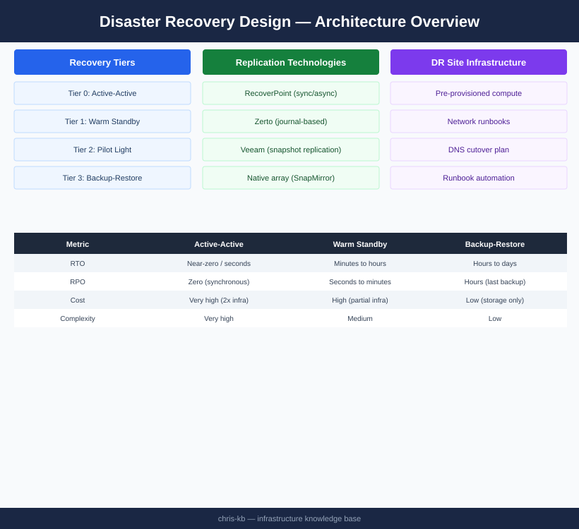
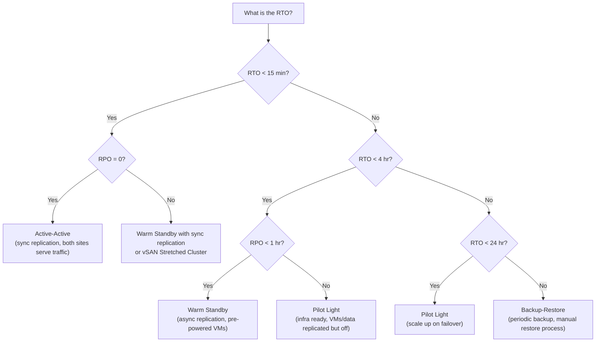

# Disaster Recovery Design


<div class="kb-summary">

</div>

## Overview

Disaster Recovery (DR) design defines how business services are restored after a major disruptive event — site-level failure, ransomware, catastrophic data corruption, or any scenario that renders the primary environment unusable. DR is the complement to HA: while HA prevents or masks individual component failures, DR handles scenarios where an entire site, facility, or system is lost.

Effective DR design requires explicit decisions about recovery objectives, replication technology, site topology, network strategy, and testing cadence. A DR plan that has never been tested is not a DR plan — it is a hypothesis.

---

## RTO / RPO Matrix by Service Tier

RTO (Recovery Time Objective) is the maximum acceptable downtime. RPO (Recovery Point Objective) is the maximum acceptable data loss expressed as a time window. These must be agreed with the business and documented as Service Level Agreements, not assumed by the infrastructure team.

| Tier | Service Examples | Target RTO | Target RPO | DR Strategy | Replication Frequency |
|------|----------------|-----------|-----------|-------------|----------------------|
| 0 | Core banking, 911 dispatch, trading | <15 min | 0 (synchronous) | Active-Active | Synchronous (real-time) |
| 1 | ERP, patient records, e-commerce | <1 hr | <15 min | Warm Standby / Active-Passive | Asynchronous, <15 min lag |
| 2 | Analytics, internal portals, HR | <4 hr | <1 hr | Pilot Light | Scheduled replication, 1 hr |
| 3 | Dev/test, batch workloads | <24 hr | <24 hr | Backup-Restore | Daily backup |
| 4 | Non-critical, archival | Best effort | <1 week | Backup-Restore (tape/cloud) | Weekly |

These targets drive technology selection. An RTO of 15 minutes with RPO=0 mandates synchronous replication and pre-provisioned compute at the DR site — not a Veeam restore job.

---

## DR Strategy Selection

Four canonical DR strategies exist, differing in cost, complexity, and recovery speed. Selecting the wrong strategy is the most common DR design error.


```
┌─────────────────────────────── Architecture — Disaster Recovery Design ───────────────────────────────┐
│                                                                                                       │
│   ┌───────────────────────────────────────────────────────────────────────────────────────────────┐   │
│   │        DR design: select site topology and replication pattern to meet RPO/RTO targets        │   │
│   │          Tiers: hot standby (< 1 min RTO), warm (< 4h), cold (> 4h, data only backup)         │   │
│   │       Replication: synchronous (zero RPO, latency cost) vs async (small RPO, no latency)      │   │
│   └───────────────────────────────────────────────────────────────────────────────────────────────┘   │
│                                                                                                       │
│                          ▼                                                 ▼                          │
│                                                                                                       │
│   ┌──────────────────────────────────────────────┐  ┌─────────────────────────────────────────────┐   │
│   │                   DR Tiers                   │  │             Replication Options             │   │
│   │      ─────────────────────────────────       │  │      ─────────────────────────────────      │   │
│   │             Hot: always-on sync              │  │           Sync: zero RPO; ≤ 100km           │   │
│   │            Warm: replicated async            │  │              Async: RPO minutes             │   │
│   │              Cold: backup only               │  │             SRM / Zerto / vVols             │   │
│   │             DR site sizing: N+x              │  │          Storage-level replication          │   │
│   │            Test annually minimum             │  │           App-consistent snapshots          │   │
│   └──────────────────────────────────────────────┘  └─────────────────────────────────────────────┘   │
│                                                                                                       │
│   │       Tier       │       RPO        │        RTO        │       Cost       │    Technology    │   │
│   │ ──────────────── │ ──────────────── │ ───────────────── │ ──────────────── │──────────────────│   │
│   │   Hot standby    │    Near zero     │      < 15 min     │     Highest      │     Sync rep     │   │
│   │   Warm standby   │     < 15 min     │     1-4 hours     │      Medium      │    Async rep     │   │
│   │   Cold standby   │    < 24 hours    │     > 4 hours     │      Lowest      │   Backup/tape    │   │
│                                                                                                       │
│    Key terms:                                                                                         │
│                                                                                                       │
│    RPO          = Recovery Point Objective; max acceptable data loss; drives replication freq         │
│    RTO          = Recovery Time Objective; max acceptable downtime; drives DR tier selection          │
│    Synchronous  = Write confirmed only after replica ACK; zero data loss; limited by distance         │
│    Asynchronous = Write confirmed locally; replica slightly behind; RPO = replication interval        │
│    SRM          = VMware Site Recovery Manager; orchestrates VM failover between vCenter sites        │
│    BCP          = Business Continuity Plan; broader than DR; includes people, process, comms          │
│                                                                                                       │
└───────────────────────────────────────────────────────────────────────────────────────────────────────┘
```

**Design decisions for DR site topology:**

| Decision | Recommendation |
|---------|---------------|
| Bandwidth to DR site | Size for peak replication throughput + 20% headroom; SRDF/A uses WAN optimizer or dedicated dark fiber |
| Compute pre-provisioning | Tier 0: 100% standby capacity; Tier 1: 50–75%; Tier 2: minimal (pilot light) |
| Licensing at DR site | Confirm vendor licensing allows DR site activation — VMware, Oracle, and Microsoft all have DR-specific licensing policies |
| Storage at DR site | Match primary array family for SRDF; mixed arrays require RecoverPoint or Veeam |
| VLAN / IP addressing | Maintain identical IP scheme where possible; design re-IP playbooks where stretched VLANs are not feasible |

---

## Network Considerations for DR

### Stretched VLAN vs. Re-IP

| Approach | Mechanism | Pros | Cons |
|---------|-----------|------|------|
| Stretched VLAN (L2 extension) | VXLAN overlay (NSX), OTV (Cisco), MPLS VPLS | No IP change, no DNS updates required | Spanning tree risk, broadcast domain across WAN, higher complexity |
| Re-IP at DR | Update IP via DR automation scripts | Simpler WAN; no broadcast stretch | Application configs, firewall rules, and DNS must all update on failover |
| Hybrid (NSX Stretched + re-IP for some tiers) | NSX Federation for Tier 0/1; manual re-IP for Tier 2 | Balance of complexity and coverage | Requires disciplined IPAM and DNS TTL management |

**Recommendation:** Use VXLAN/NSX stretched networking for Tier 0/1 workloads where re-IP automation is not mature. For Tier 2/3, invest in re-IP automation and test it in every DR drill.

### DNS Cutover

DNS TTL management is critical. Long TTLs prevent fast client failover; short TTLs increase DNS query load.

- Set TTL to 300 seconds (5 min) for all externally resolved A/CNAME records 72 hours before a planned DR test
- Use split-horizon DNS to serve different A records at primary vs. DR
- For automated failover, use Route 53 / Azure Traffic Manager health-routed DNS records
- Validate DNS propagation with `dig +trace` from multiple global vantage points

---

## DR Runbook Structure

Every DR-protected service must have a documented runbook. Runbooks that live only in engineers' heads fail during actual disasters because the people who know the steps may be unavailable.

A standard DR runbook contains the following sections:

1. **Service description** — name, tier, business owner, technical owner
2. **Dependencies** — upstream services, databases, AD/LDAP, DNS names, load balancer VIPs
3. **RTO / RPO targets** — agreed figures with business sign-off date
4. **Failover trigger criteria** — who declares DR, what conditions justify activation
5. **Pre-failover checklist** — confirm replication lag, notify stakeholders, create incident ticket
6. **Failover steps** — ordered, numbered, with expected output at each step; no ambiguity
7. **Validation steps** — how to confirm the service is healthy at DR site before declaring recovery complete
8. **Failback procedure** — how to return to primary site; this step is often omitted and always critical
9. **Contact list** — escalation path including vendor support numbers (storage vendor, network vendor, hypervisor support)
10. **Change log** — date, author, description of each runbook revision

---

## DR Testing Schedule

A DR plan that is not tested is not a DR plan.

| Test Type | Scope | Frequency | Impact |
|-----------|-------|-----------|--------|
| Tabletop exercise | Review runbooks with all stakeholders; walk through failover steps verbally | Quarterly | None |
| Component test | Test individual replication failover of a single non-production VM | Monthly | Minimal |
| Application failover test | Fail over a full application stack (with test traffic) to DR site | Every 6 months | Planned maintenance window |
| Full site failover (fire drill) | Simulate complete site loss; execute all runbooks; validate RTO/RPO | Annually | Significant; requires business sign-off |
| Backup restore test | Restore a random selection of VMs and data from backup | Quarterly | None (restore to isolated environment) |

All test results must be documented: actual RTO achieved vs. target, issues encountered, corrective actions, retest dates.

---

## Common DR Design Pitfalls

| Pitfall | Description | Mitigation |
|---------|-------------|------------|
| Untested runbooks | Runbooks written once, never validated in practice | Mandatory test schedule; gate DR sign-off on test results |
| Forgetting dependencies | Failing over App Tier without failing over the database it depends on | Dependency mapping; failover automation that respects boot order |
| Short TTL neglect | DNS records with 24-hour TTLs causing extended client impact | Enforce 5-min TTL policy; verify before every drill |
| Licensing gaps | Production licenses not valid at DR site | Audit vendor licensing clauses; obtain DR/standby license entitlements |
| Replication lag ignored | Assuming RPO=0 for async replication | Instrument and alert on replication lag; include lag in RTO/RPO SLA calculations |
| Failback not planned | Runbook covers failover only; failback is improvised | Write and test failback procedure as part of every DR drill |
| Management plane at primary only | vCenter, Ansible, monitoring all located in the DC being recovered | Deploy management services to DR site or cloud; use vCenter Enhanced Linked Mode |
| Backup stored on-site only | Ransomware or fire destroys primary backup repository | Enforce 3-2-1 rule: 3 copies, 2 media types, 1 off-site |
| Insufficient DR bandwidth | Replication queue builds during peak hours; RPO breached | Capacity plan replication bandwidth; configure QoS to protect replication traffic |

---

## DR Design Validation Checklist

### Replication
- [ ] Replication configured and healthy for all Tier 0–2 services
- [ ] Replication lag monitored with alerts set at 50% of RPO threshold
- [ ] Application consistency groups defined (database VMs replicated together, not independently)
- [ ] Replication failover tested in isolation (without a full site exercise) in the last 90 days

### Infrastructure at DR Site
- [ ] Compute capacity validated for the expected Tier 0/1 VM footprint
- [ ] Storage target verified accessible and within capacity thresholds
- [ ] Network VLANs / VXLANs pre-configured at DR site
- [ ] Firewall rules at DR site mirror primary site (or are dynamically synchronized via Panorama / NSX)
- [ ] Load balancer VIPs configured and tested at DR site
- [ ] Domain controllers / DNS servers running at DR site or replicated

### Process
- [ ] DR runbooks reviewed and updated within the last 6 months
- [ ] Business owner has signed off on RTO/RPO targets
- [ ] Escalation contacts verified (including vendor support contracts)
- [ ] Full DR test conducted and documented within the last 12 months
- [ ] Backup restore verified within the last 90 days
- [ ] 3-2-1 backup rule validated: off-site copy confirmed retrievable
