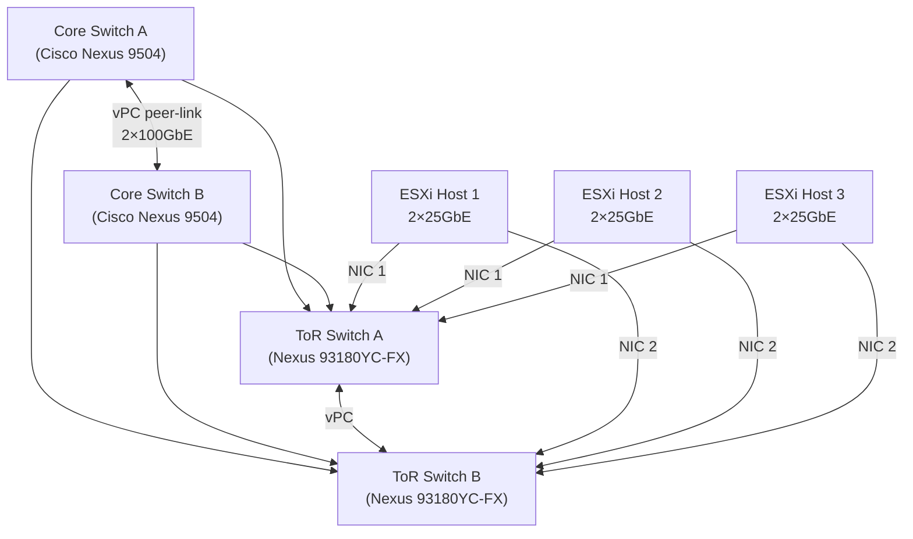

# High Availability Design


<div class="kb-summary">

</div>

## Overview

High availability (HA) is the discipline of engineering systems so that service disruptions — whether caused by hardware failure, software faults, planned maintenance, or network events — are either invisible to end users or resolved within a predetermined recovery window. Enterprise HA design is not a single technique; it is a layered strategy that must be applied consistently across compute, storage, networking, and application tiers.

This guide covers the architectural patterns, failure domain analysis, technology choices, and validation steps required to design HA into enterprise infrastructure from the ground up.

---

## HA Tier Model

Not all services require the same level of redundancy. Applying the highest-cost HA pattern uniformly is wasteful; under-protecting critical workloads creates unacceptable risk. Define service tiers first, then map them to HA patterns.

| Tier | Label | Target Availability | Max Planned Downtime/Year | Max Unplanned Downtime/Year | Typical Workloads |
|------|-------|--------------------|--------------------------|-----------------------------|-------------------|
| 0 | Mission-Critical | 99.999% (5 nines) | 0 min | ~5 min | Core banking, trading platforms, 911 dispatch |
| 1 | Business-Critical | 99.99% (4 nines) | 30 min | ~52 min | ERP, patient records, e-commerce checkout |
| 2 | Business-Important | 99.9% (3 nines) | 4 hr | ~8.7 hr | Internal portals, analytics, dev/test |
| 3 | Standard | 99.5% | 8 hr | ~43 hr | Batch jobs, low-priority apps |

RTO and RPO targets must be defined at tier assignment. Refer to the [Disaster Recovery Design](../disaster-recovery-design/index.md) guide for RPO/RTO tables.

---

## HA Redundancy Patterns

### N+1 (Single Spare)
One extra component exists to absorb a single failure. Cost-effective for Tier 2/3 workloads. After a failure, the system is in a degraded (N+0) state until the failed component is replaced.

- Example: 3-node vSAN cluster (2N = capacity needed, +1 host for failure tolerance)
- Example: Dual PSU in a server

### N+N (Full Duplication)
Every active component has an identical standby. After one failure, full capacity is maintained. Used for Tier 0/1 compute and network paths.

- Example: Dual Cisco Nexus 9000 core switches in vPC
- Example: Dual-site active-passive with identical hardware footprint

### Active-Active
Both instances serve traffic simultaneously. Load is distributed across all nodes; any single node failure is absorbed by the remaining nodes without a failover event. Requires stateless application design or distributed session management.

- Example: NSX-T Edge nodes in ECMP active-active forwarding
- Example: NLB cluster with session persistence at the load balancer layer

### Active-Passive (Standby)
The passive node is warm and ready but does not serve traffic until a failover event occurs. Simpler to implement than active-active but wastes standby capacity and introduces a brief failover window.

- Example: vSphere HA restarting VMs on surviving hosts
- Example: SQL Server Always On Availability Groups with synchronous replica

---

## Failure Domain Design

A failure domain is the set of components that share a single point of failure. HA design means distributing workloads across independent failure domains so that no single event takes down a complete service.

```mermaid
graph TD
    Site["Site Failure Domain"]
    PDU_A["PDU A"]
    PDU_B["PDU B"]
    Rack_A["Rack A"]
    Rack_B["Rack B"]
    Rack_C["Rack C (different PDU)"]
    SW_ToR_A["ToR Switch A"]
    SW_ToR_B["ToR Switch B"]
    Host1["ESXi Host 1"]
    Host2["ESXi Host 2"]
    Host3["ESXi Host 3"]

    Site --> PDU_A
    Site --> PDU_B
    PDU_A --> Rack_A
    PDU_A --> Rack_B
    PDU_B --> Rack_C
    Rack_A --> SW_ToR_A
    Rack_B --> SW_ToR_B
    SW_ToR_A --> Host1
    SW_ToR_A --> Host2
    SW_ToR_B --> Host3
```text
┌─────────────────────────────── Architecture — High Availability Design ───────────────────────────────┐
│                                                                                                       │
│   ┌───────────────────────────────────────────────────────────────────────────────────────────────┐   │
│   │         HA design: eliminate single points of failure; automate detection and failover        │   │
│   │        Layers: compute (vSphere HA), storage (multi-path/RAID), network (bonding/LACP)        │   │
│   │        Rule: every component has a redundant path; failure triggers automatic recovery        │   │
│   └───────────────────────────────────────────────────────────────────────────────────────────────┘   │
│                                                                                                       │
│                          ▼                                                 ▼                          │
│                                                                                                       │
│   ┌──────────────────────────────────────────────┐  ┌─────────────────────────────────────────────┐   │
│   │                 HA Patterns                  │  │              Redundancy Layers              │   │
│   │      ─────────────────────────────────       │  │      ─────────────────────────────────      │   │
│   │          Active-active: both serve           │  │              Compute: N+1 hosts             │   │
│   │        Active-passive: auto failover         │  │           Storage: dual paths MPIO          │   │
│   │           N+1 / N+2 host capacity            │  │           Network: bonding / LACP           │   │
│   │             Anti-affinity rules              │  │            Power: dual PSU + PDU            │   │
│   │             Heartbeat monitoring             │  │             Site: AZ or DC pair             │   │
│   └──────────────────────────────────────────────┘  └─────────────────────────────────────────────┘   │
│                                                                                                       │
│    Key terms:                                                                                         │
│                                                                                                       │
│    SPOF         = Single Point of Failure; any component whose failure stops the service              │
│    MPIO         = Multi-Path I/O; multiple physical paths to storage; path failure is transparent     │
│    LACP         = Link Aggregation Control Protocol; bonds multiple NICs into one logical link        │
│    vSphere HA   = Restarts VMs on surviving hosts within minutes of host failure                      │
│    Fencing      = Isolate a failed node before failover to prevent split-brain                        │
│    Quorum       = Cluster consensus mechanism; majority of nodes must agree on cluster state          │
│                                                                                                       │
└───────────────────────────────────────────────────────────────────────────────────────────────────────┘
```

**vSAN Stretched Cluster requirements:**
- Intersite latency: ≤5 ms RTT (synchronous replication)
- Bandwidth: size for peak write throughput × 2 (all writes cross both sites)
- Witness host: 4 vCPU, 16 GB RAM per 750 VM components
- Storage Policy: FTT=1, RAID-1, stretched — ensures one copy per site

---

## Network High Availability

### NIC Bonding (LACP / 802.3ad)

All production ESXi hosts should have a minimum of 2 × 25 GbE NICs bonded in LACP across two upstream ToR switches. Configure the vSphere Distributed Switch (vDS) uplink team with **Route based on IP hash** or **Route based on physical NIC load** (enhanced LACP) teaming policy.

Separate traffic types onto dedicated VMkernel ports with dedicated uplinks:

| Traffic Type | Recommended Bandwidth | VLAN Assignment |
|-------------|----------------------|-----------------|
| VM Network (Production) | Shared 25 GbE bond | VLAN 100–199 |
| vMotion | Dedicated 25 GbE (or 10 GbE) | VLAN 200 |
| vSAN / Storage | Dedicated 25 GbE (or 10 GbE) | VLAN 300 |
| Management (ESXi/vCenter) | Shared or dedicated 1 GbE | VLAN 400 |
| Backup / Replication | Shared or dedicated 10 GbE | VLAN 500 |
| FT Logging | Dedicated 10 GbE | VLAN 600 |

### Dual Top-of-Rack Topology



Cisco vPC (Virtual Port Channel) enables both ToR switches to present a single logical port channel to each host, eliminating Spanning Tree blocking. Both uplinks carry traffic simultaneously.

### ECMP for Layer 3 Redundancy

For environments using routed access (no Layer 2 between hosts), configure ECMP (Equal Cost Multi-Path) at the distribution and core layers. NSX-T with BGP edge uplinks supports ECMP across 8 paths. This provides both redundancy and horizontal bandwidth scaling.

---

## Application-Layer High Availability

### Load Balancers

Deploy load balancers in HA pairs (active-standby or active-active) at each tier boundary.

| Product | Mode | Protocol | Typical Use |
|---------|------|----------|------------|
| F5 BIG-IP (physical) | Active-standby | L4/L7, SSL offload | Tier 0/1 external-facing |
| NSX Advanced Load Balancer (Avi) | Active-active (SE cluster) | L4/L7 | Cloud-native, VMware-integrated |
| HAProxy | Active-passive (Keepalived) | L4/L7 | Internal, cost-sensitive |
| AWS ALB / Azure Application Gateway | Managed, multi-AZ | L7 | Cloud workloads |

Ensure load balancer health checks accurately reflect application health, not just TCP reachability. A web server listening on port 443 but returning 500 errors is not healthy.

### Database Clustering

| Database | HA Mechanism | Failover Time | Notes |
|---------|-------------|--------------|-------|
| SQL Server | Always On AG (sync replica) | 15–30 s automatic | Requires Windows Server Failover Cluster |
| Oracle | Data Guard (sync) / RAC | <30 s (DG) / ~0 (RAC) | RAC requires shared storage |
| PostgreSQL | Patroni + etcd | 10–30 s | Open source; etcd quorum critical |
| MySQL | InnoDB Cluster (Group Replication) | 5–10 s | Built-in; 3 nodes minimum |

---

## RTO Targets by HA Mechanism

| HA Mechanism | Typical RTO | RPO | Notes |
|-------------|------------|-----|-------|
| vSphere FT | ~0 s | 0 | Lockstep; no data loss |
| VRRP / HSRP (network gateway) | <1 s | N/A | Gateway failover |
| vSphere HA VM restart | 30–120 s | In-flight I/O | Host must be declared failed first |
| Storage multipath failover | 1–10 s | 0 | Transparent to OS |
| SQL Always On AG (sync) | 15–30 s | 0 | Automatic failover |
| vSAN Stretched Cluster | 30–60 s | 0 | Site-level failure |
| DNS failover (health-routed) | 30–300 s | Varies | TTL-dependent |
| Backup restore | Hours–days | Hours–days | Last resort |

---

## HA Design Checklist

Use this checklist at design review and again during pre-production validation.

### Compute
- [ ] All Tier 0/1 VMs assigned to a vSphere HA-enabled cluster with admission control configured
- [ ] Cluster sized for N+1 host failure without breaching admission control threshold
- [ ] Heartbeat datastores configured (minimum 2, on separate storage paths)
- [ ] FT enabled for all Tier 0 VMs (if vCPU ≤ 8)
- [ ] VM restart priority set correctly (Tier 0 = highest, Tier 3 = low)
- [ ] DRS enabled and set to "Fully Automated" for load balancing after HA restart
- [ ] Anti-affinity rules applied so HA pairs do not run on the same host

### Storage
- [ ] All datastores accessible via at least 2 independent paths (2 HBAs, 2 fabrics)
- [ ] MPIO path selection policy configured (Round Robin or vendor plugin)
- [ ] vSAN health check passes with zero critical alerts
- [ ] vSAN stretched cluster witness host accessible from both sites
- [ ] Snapshot schedules do not consume more than 20% of datastore capacity

### Network
- [ ] All hosts dual-homed to independent ToR switches
- [ ] LACP / port-channel configured on both host NICs and upstream switches
- [ ] vPC / MLAG configured on ToR pair to eliminate STP blocking
- [ ] Traffic types separated onto dedicated VMkernel / VLAN segments
- [ ] Management network reachable even if production uplink fails

### Application
- [ ] Load balancer HA pair tested — active failover verified
- [ ] Database HA mechanism tested with forced failover
- [ ] Health check endpoints respond correctly and reflect real application state
- [ ] Connection timeouts and retry logic validated in application code/config

### Process
- [ ] Failure scenario runbooks documented for each HA tier
- [ ] Failover test results recorded and signed off by service owner
- [ ] Monitoring and alerting configured for all HA state changes
- [ ] HA test schedule defined (minimum: annually for Tier 1, quarterly for Tier 0)
