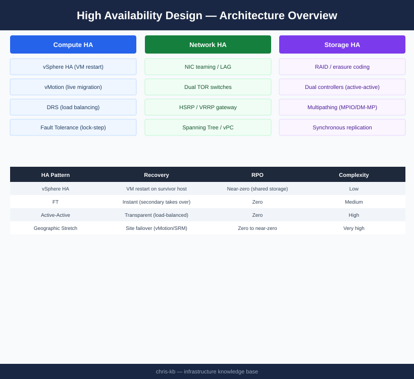
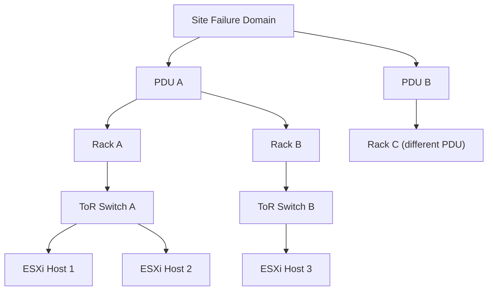
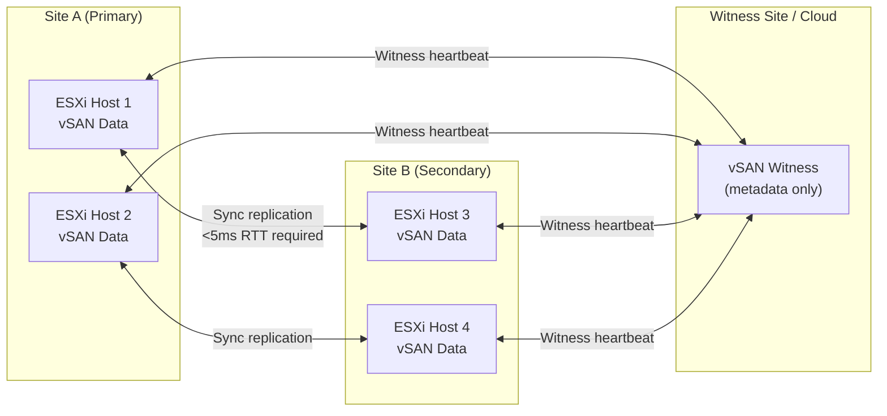
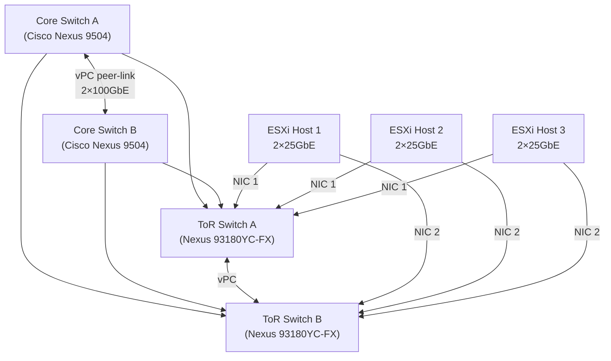

# High Availability Design



## Overview

High availability (HA) is the discipline of engineering systems so that service disruptions — whether caused by hardware failure, software faults, planned maintenance, or network events — are either invisible to end users or resolved within a predetermined recovery window. Enterprise HA design is not a single technique; it is a layered strategy that must be applied consistently across compute, storage, networking, and application tiers.

This guide covers the architectural patterns, failure domain analysis, technology choices, and validation steps required to design HA into enterprise infrastructure from the ground up.

---

## HA Tier Model

Not all services require the same level of redundancy. Applying the highest-cost HA pattern uniformly is wasteful; under-protecting critical workloads creates unacceptable risk. Define service tiers first, then map them to HA patterns.

| Tier | Label | Target Availability | Max Planned Downtime/Year | Max Unplanned Downtime/Year | Typical Workloads |
|------|-------|--------------------|--------------------------|-----------------------------|-------------------|
| 0 | Mission-Critical | 99.999% (5 nines) | 0 min | ~5 min | Core banking, trading platforms, 911 dispatch |
| 1 | Business-Critical | 99.99% (4 nines) | 30 min | ~52 min | ERP, patient records, e-commerce checkout |
| 2 | Business-Important | 99.9% (3 nines) | 4 hr | ~8.7 hr | Internal portals, analytics, dev/test |
| 3 | Standard | 99.5% | 8 hr | ~43 hr | Batch jobs, low-priority apps |

RTO and RPO targets must be defined at tier assignment. Refer to the [Disaster Recovery Design](../disaster-recovery-design/index.md) guide for RPO/RTO tables.

---

## HA Redundancy Patterns

### N+1 (Single Spare)
One extra component exists to absorb a single failure. Cost-effective for Tier 2/3 workloads. After a failure, the system is in a degraded (N+0) state until the failed component is replaced.

- Example: 3-node vSAN cluster (2N = capacity needed, +1 host for failure tolerance)
- Example: Dual PSU in a server

### N+N (Full Duplication)
Every active component has an identical standby. After one failure, full capacity is maintained. Used for Tier 0/1 compute and network paths.

- Example: Dual Cisco Nexus 9000 core switches in vPC
- Example: Dual-site active-passive with identical hardware footprint

### Active-Active
Both instances serve traffic simultaneously. Load is distributed across all nodes; any single node failure is absorbed by the remaining nodes without a failover event. Requires stateless application design or distributed session management.

- Example: NSX-T Edge nodes in ECMP active-active forwarding
- Example: NLB cluster with session persistence at the load balancer layer

### Active-Passive (Standby)
The passive node is warm and ready but does not serve traffic until a failover event occurs. Simpler to implement than active-active but wastes standby capacity and introduces a brief failover window.

- Example: vSphere HA restarting VMs on surviving hosts
- Example: SQL Server Always On Availability Groups with synchronous replica

---

## Failure Domain Design

A failure domain is the set of components that share a single point of failure. HA design means distributing workloads across independent failure domains so that no single event takes down a complete service.



**Failure domain layers and design decisions:**

| Layer | Failure Event | Design Response |
|-------|--------------|-----------------|
| Server NIC | Single NIC failure | LACP bonding (802.3ad) across dual NICs |
| ToR Switch | Switch failure or upgrade | Dual ToR per rack; hosts dual-home to both |
| PDU | PDU breaker trip | Distribute racks across PDU A and PDU B; dual PSU per server |
| Rack | Rack power loss or cooling | Spread HA pairs across multiple racks |
| Row/Room | Room-level CRAC failure | Separate rows fed by independent cooling |
| Site | Site-level disaster | DR replication to secondary site (see DR Design guide) |

Rule: no two nodes that form an HA pair should share the same PDU and the same ToR switch.

---

## VMware vSphere HA Design

vSphere HA provides automatic VM restart on surviving hosts when a host fails. It is the baseline Tier 1/2 compute HA mechanism in VMware environments.

### vSphere HA Key Design Decisions

**Admission Control Policy**
Set admission control to reserve capacity for N host failures. For a 6-host cluster tolerating 1 failure, reserve 1/6 of total cluster resources (CPU + memory).

```text
Reserved capacity = (1 / total_hosts) × cluster_resources
```

For variable host sizes, use the "percentage of cluster resources" policy rather than "host failures cluster tolerates" to get accurate reservations.

**Heartbeat Datastores**
Configure at least 2 datastore heartbeat targets on separate storage paths to prevent false-positive host isolation events. Use non-vSAN datastores (NFS or VMFS on external storage) as heartbeat targets in vSAN clusters to avoid circular dependency.

**Isolation Response**
Default: "Leave powered on" — appropriate when the network, not the host, has failed. Set to "Shut down and restart" only when storage fencing ensures split-brain cannot occur (e.g., vSAN witness ensures quorum).

**Host Monitoring**
Enable host monitoring. Set the PDL (Permanent Device Loss) response to "Power off and restart VMs" for vSAN clusters — PDL indicates the storage fabric, not just a transient path failure.

### vSphere Fault Tolerance (FT)

FT provides zero-downtime protection (RTO ~0) for single VMs. Use cases are narrow due to cost and constraints.

| Attribute | vSphere HA | vSphere FT |
|-----------|-----------|------------|
| RTO | 30–180 s (restart) | ~0 s (lockstep) |
| RPO | Loss of in-flight transactions | 0 |
| vCPU limit | No limit | 8 vCPU per VM |
| Memory limit | No limit | No official limit (practical: <128 GB) |
| Cost | Included in vSphere | Requires dedicated CPU reservation |
| Use case | All Tier 1/2 VMs | Tier 0: core network services, license servers |

FT requires a dedicated 10 GbE or 25 GbE logging network segment, isolated from vMotion traffic.

---

## Storage High Availability

### RAID and Local Redundancy

| RAID Level | Min Drives | Failure Tolerance | Write Penalty | Use Case |
|-----------|-----------|------------------|---------------|----------|
| RAID-1 | 2 | 1 drive | 2× | OS/boot volumes, small critical data |
| RAID-5 | 3 | 1 drive | 4× | General purpose (not recommended for >4 TB drives) |
| RAID-6 | 4 | 2 drives | 6× | Archive, large spinning disk arrays |
| RAID-10 | 4 | 1 per mirrored pair | 2× | OLTP, high I/O databases |
| RAID-50 | 6 | 1 per RAID-5 set | 4× | Balanced capacity and performance |

For flash arrays (Dell PowerMax, Pure Storage, NetApp AFF), vendor-specific RAID-DP or parity schemes replace traditional RAID. Validate the effective drive failure tolerance with the vendor before deployment.

### Multipath I/O (MPIO)

Always configure multipath for SAN-attached storage. Two independent paths are the minimum for HA; four paths (two HBAs × two fabrics) are standard for Tier 0/1.

**Path selection policies:**
- **Round Robin** — distributes I/O across all active paths; preferred for uniform path speeds
- **Fixed (preferred)** — all I/O on one path; others are standby; used when paths have unequal bandwidth
- **MRU (Most Recently Used)** — stays on one path until it fails; least optimal; avoid for production

For VMware with Dell PowerMax: use VMware Native Multipathing (NMP) with the PowerPath/VE plugin and `RoundRobin` with I/O operations limit set to 1 (IOPS-based switching rather than byte-count switching).

### vSAN Stretched Cluster

vSAN Stretched Cluster extends a single cluster across two sites with a witness host in a third location (or vCenter). It provides RPO=0 and RTO measured in seconds for site-level failures.



**vSAN Stretched Cluster requirements:**
- Intersite latency: ≤5 ms RTT (synchronous replication)
- Bandwidth: size for peak write throughput × 2 (all writes cross both sites)
- Witness host: 4 vCPU, 16 GB RAM per 750 VM components
- Storage Policy: FTT=1, RAID-1, stretched — ensures one copy per site

---

## Network High Availability

### NIC Bonding (LACP / 802.3ad)

All production ESXi hosts should have a minimum of 2 × 25 GbE NICs bonded in LACP across two upstream ToR switches. Configure the vSphere Distributed Switch (vDS) uplink team with **Route based on IP hash** or **Route based on physical NIC load** (enhanced LACP) teaming policy.

Separate traffic types onto dedicated VMkernel ports with dedicated uplinks:

| Traffic Type | Recommended Bandwidth | VLAN Assignment |
|-------------|----------------------|-----------------|
| VM Network (Production) | Shared 25 GbE bond | VLAN 100–199 |
| vMotion | Dedicated 25 GbE (or 10 GbE) | VLAN 200 |
| vSAN / Storage | Dedicated 25 GbE (or 10 GbE) | VLAN 300 |
| Management (ESXi/vCenter) | Shared or dedicated 1 GbE | VLAN 400 |
| Backup / Replication | Shared or dedicated 10 GbE | VLAN 500 |
| FT Logging | Dedicated 10 GbE | VLAN 600 |

### Dual Top-of-Rack Topology



Cisco vPC (Virtual Port Channel) enables both ToR switches to present a single logical port channel to each host, eliminating Spanning Tree blocking. Both uplinks carry traffic simultaneously.

### ECMP for Layer 3 Redundancy

For environments using routed access (no Layer 2 between hosts), configure ECMP (Equal Cost Multi-Path) at the distribution and core layers. NSX-T with BGP edge uplinks supports ECMP across 8 paths. This provides both redundancy and horizontal bandwidth scaling.

---

## Application-Layer High Availability

### Load Balancers

Deploy load balancers in HA pairs (active-standby or active-active) at each tier boundary.

| Product | Mode | Protocol | Typical Use |
|---------|------|----------|------------|
| F5 BIG-IP (physical) | Active-standby | L4/L7, SSL offload | Tier 0/1 external-facing |
| NSX Advanced Load Balancer (Avi) | Active-active (SE cluster) | L4/L7 | Cloud-native, VMware-integrated |
| HAProxy | Active-passive (Keepalived) | L4/L7 | Internal, cost-sensitive |
| AWS ALB / Azure Application Gateway | Managed, multi-AZ | L7 | Cloud workloads |

Ensure load balancer health checks accurately reflect application health, not just TCP reachability. A web server listening on port 443 but returning 500 errors is not healthy.

### Database Clustering

| Database | HA Mechanism | Failover Time | Notes |
|---------|-------------|--------------|-------|
| SQL Server | Always On AG (sync replica) | 15–30 s automatic | Requires Windows Server Failover Cluster |
| Oracle | Data Guard (sync) / RAC | <30 s (DG) / ~0 (RAC) | RAC requires shared storage |
| PostgreSQL | Patroni + etcd | 10–30 s | Open source; etcd quorum critical |
| MySQL | InnoDB Cluster (Group Replication) | 5–10 s | Built-in; 3 nodes minimum |

---

## RTO Targets by HA Mechanism

| HA Mechanism | Typical RTO | RPO | Notes |
|-------------|------------|-----|-------|
| vSphere FT | ~0 s | 0 | Lockstep; no data loss |
| VRRP / HSRP (network gateway) | <1 s | N/A | Gateway failover |
| vSphere HA VM restart | 30–120 s | In-flight I/O | Host must be declared failed first |
| Storage multipath failover | 1–10 s | 0 | Transparent to OS |
| SQL Always On AG (sync) | 15–30 s | 0 | Automatic failover |
| vSAN Stretched Cluster | 30–60 s | 0 | Site-level failure |
| DNS failover (health-routed) | 30–300 s | Varies | TTL-dependent |
| Backup restore | Hours–days | Hours–days | Last resort |

---

## HA Design Checklist

Use this checklist at design review and again during pre-production validation.

### Compute
- [ ] All Tier 0/1 VMs assigned to a vSphere HA-enabled cluster with admission control configured
- [ ] Cluster sized for N+1 host failure without breaching admission control threshold
- [ ] Heartbeat datastores configured (minimum 2, on separate storage paths)
- [ ] FT enabled for all Tier 0 VMs (if vCPU ≤ 8)
- [ ] VM restart priority set correctly (Tier 0 = highest, Tier 3 = low)
- [ ] DRS enabled and set to "Fully Automated" for load balancing after HA restart
- [ ] Anti-affinity rules applied so HA pairs do not run on the same host

### Storage
- [ ] All datastores accessible via at least 2 independent paths (2 HBAs, 2 fabrics)
- [ ] MPIO path selection policy configured (Round Robin or vendor plugin)
- [ ] vSAN health check passes with zero critical alerts
- [ ] vSAN stretched cluster witness host accessible from both sites
- [ ] Snapshot schedules do not consume more than 20% of datastore capacity

### Network
- [ ] All hosts dual-homed to independent ToR switches
- [ ] LACP / port-channel configured on both host NICs and upstream switches
- [ ] vPC / MLAG configured on ToR pair to eliminate STP blocking
- [ ] Traffic types separated onto dedicated VMkernel / VLAN segments
- [ ] Management network reachable even if production uplink fails

### Application
- [ ] Load balancer HA pair tested — active failover verified
- [ ] Database HA mechanism tested with forced failover
- [ ] Health check endpoints respond correctly and reflect real application state
- [ ] Connection timeouts and retry logic validated in application code/config

### Process
- [ ] Failure scenario runbooks documented for each HA tier
- [ ] Failover test results recorded and signed off by service owner
- [ ] Monitoring and alerting configured for all HA state changes
- [ ] HA test schedule defined (minimum: annually for Tier 1, quarterly for Tier 0)
