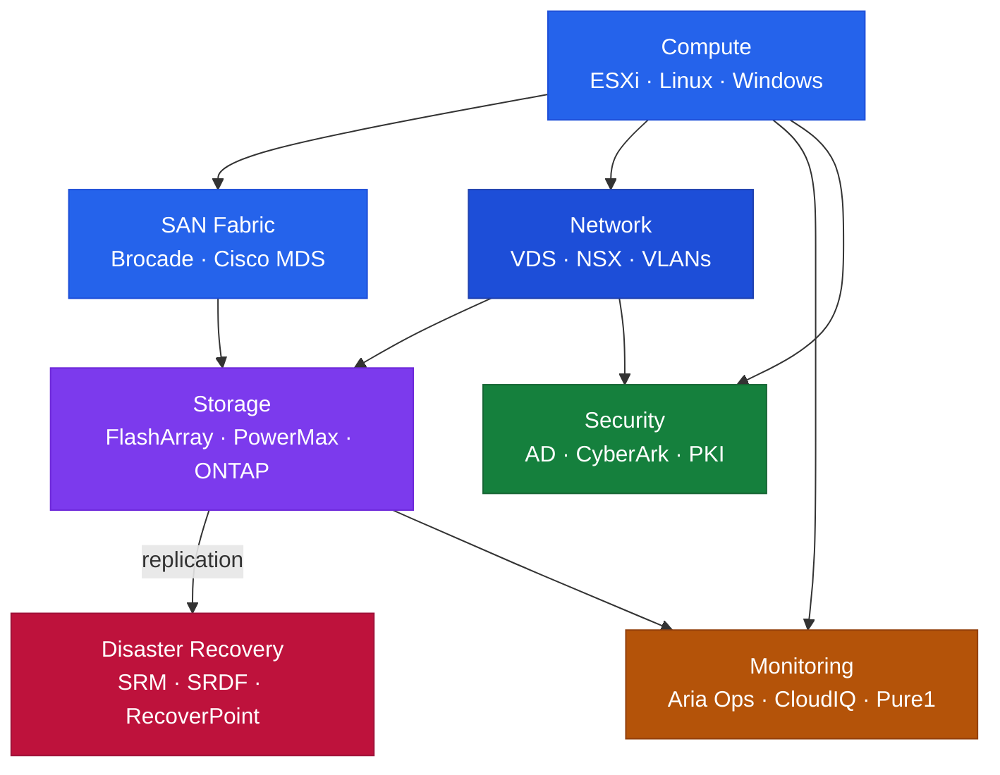

# Architecture

<div class="kb-summary">
Enterprise infrastructure architecture design guides covering high availability patterns, storage tiering, network topology, and disaster recovery design principles.
</div>

## Articles

<div class="kb-grid kb-grid-3">
<a class="kb-card" href="disaster-recovery-design/">
  <strong>Disaster Recovery Design</strong>
  <span>RPO/RTO targets, site topology, failover patterns, and DR architecture decision frameworks.</span>
</a>

<a class="kb-card" href="high-availability/">
  <strong>High Availability</strong>
  <span>Redundancy patterns, clustering options, failover design, and availability SLA considerations.</span>
</a>

<a class="kb-card" href="network-design/">
  <strong>Network Design</strong>
  <span>Topology, segmentation, routing, and naming standards for enterprise network architecture.</span>
</a>

<a class="kb-card" href="storage-design/">
  <strong>Storage Design</strong>
  <span>Tiering strategy, protocol selection, capacity planning, and array placement principles.</span>
</a>
</div>


```
┌─────────────────────────────────────────────────────────────────────┐
│                    Enterprise Infrastructure Overview               │
│                                                                     │
│  ┌──────────────────────┐        ┌──────────────────────────────┐   │
│  │   On-Premises DC      │        │        Cloud Platforms       │  │
│  │  ┌────────────────┐  │        │  ┌────────────┐ ┌─────────┐ │    │
│  │  │ ESXi / vSphere │  │        │  │    AWS     │ │  Azure  │ │    │
│  │  │  vSAN + NSX-T  │  │        │  │ EC2/EBS/S3 │ │  VMs    │ │    │
│  │  │   VxRail HCI   │  │        │  └────────────┘ └─────────┘ │    │
│  │  └───────┬────────┘  │        └──────────────┬───────────────┘   │
│  │          │            │                       │                   │
│  │  ┌───────▼────────┐  │   ExpressRoute/        │                   │
│  │  │  Integration   │◄─┼──────DX Connect────────┘                  │
│  │  │  Auth · Certs  │  │                                           │
│  │  │  NTP · DNS     │  │        ┌──────────────────────────────┐   │
│  │  └───────┬────────┘  │        │          Monitoring          │   │
│  │          │            │        │  Aria Ops · Pure1 · CloudIQ  │  │
│  │  ┌───────▼────────┐  │        └──────────────────────────────┘   │
│  │  │ DR / Backup    │  │                                           │
│  │  │ SRM · SRDF     │  │                                           │
│  │  │ Veeam · RP     │  │                                           │
│  │  └────────────────┘  │                                           │
│  └──────────────────────┘                                           │
└─────────────────────────────────────────────────────────────────────┘
```

## Enterprise Architecture Overview


