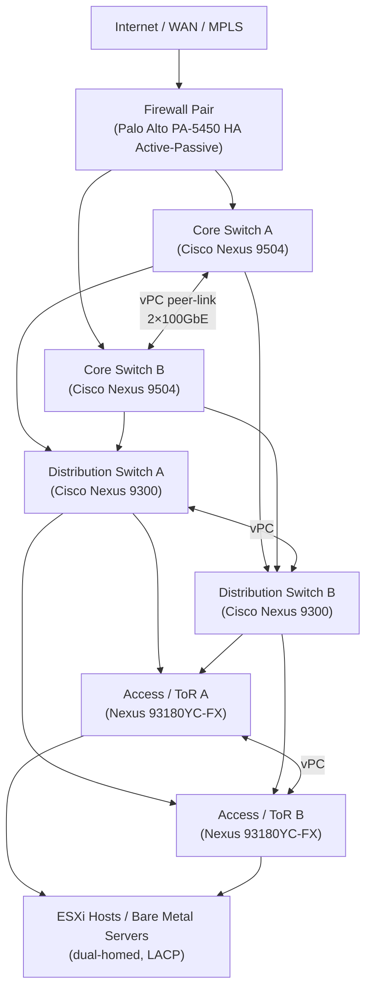
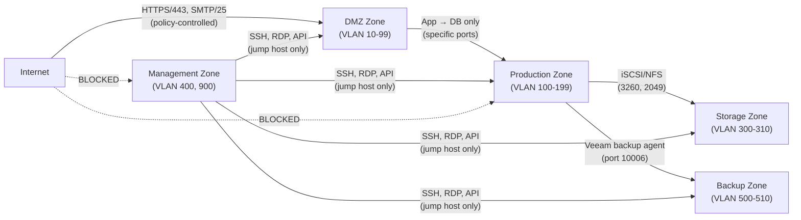
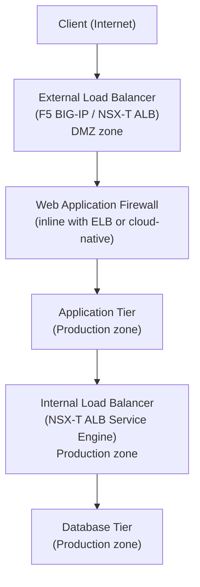

# Network Design

```
┌─────────────────────────────────────────────────────────────────────┐
│                    Enterprise Network Design                        │
│                                                                     │
│   Internet / WAN                                                    │
│        │                                                            │
│   ┌────▼────────────────────────────────────────────────────┐       │
│   │              Core (Cisco Nexus 9504 vPC pair)           │       │
│   └────┬────────────────────────┬────────────────────────────┘      │
│        │  OSPF/BGP              │                                   │
│   ┌────▼────────┐        ┌──────▼──────┐                            │
│   │Distribution │        │Distribution │  ◄── VLAN aggregation      │
│   │   Sw A      │◄──────►│   Sw B      │                            │
│   └────┬────────┘  vPC   └──────┬──────┘                            │
│        │                        │                                   │
│   ┌────▼────────┐        ┌──────▼──────┐                            │
│   │  ToR A      │◄──────►│  ToR B      │  ◄── Access / LACP         │
│   └─────┬───────┘  vPC   └──────┬──────┘                            │
│         │   LACP (802.3ad)      │                                   │
│   ┌─────▼───────────────────────▼──────┐                            │
│   │  ESXi Hosts  (NIC A ──── NIC B)    │                            │
│   │  VLANs: VM·vMotion·vSAN·Mgmt·Bkp  │                             │
│   └────────────────────────────────────┘                            │
│                                                                     │
│  Overlay: NSX-T (VXLAN micro-segmentation + DFW)                    │
└─────────────────────────────────────────────────────────────────────┘
```


## Overview

Enterprise network design establishes the framework for how compute, storage, users, and external services communicate reliably, securely, and at scale. A well-architected network is deterministic in its behavior, resilient to single and double failures, segmented by trust zone, and observable at every layer.

This guide covers the hierarchical design model, VLAN segmentation strategy, routing architecture, redundancy patterns, firewall zoning, load balancer placement, cloud connectivity, and storage network considerations applicable to VMware-based data centre environments with Cisco switching infrastructure.

---

## Enterprise Network Tier Model

The three-tier (core / distribution / access) model remains the reference architecture for large data centres. Smaller environments may collapse distribution into the core (two-tier / spine-leaf), but the design principles are identical.



### Tier Responsibilities

| Tier | Layer | Devices | Responsibilities |
|------|-------|---------|-----------------|
| Core | L3 | Nexus 9504, 9516, Catalyst 9600 | Default gateway for VLANs, inter-VLAN routing (SVIs), WAN edge handoff, BGP to firewalls |
| Distribution | L2/L3 boundary | Nexus 9300, 9332, Catalyst 9300X | VLAN aggregation, access policy enforcement, QoS marking boundary |
| Access / ToR | L2 | Nexus 93180YC-FX, 9236C, Catalyst 9200 | Host port provisioning, VLAN trunking, LACP port-channel to hosts |

In spine-leaf designs (common in hyper-converged or cloud-native DCs), spines replace core+distribution. Every leaf connects to every spine; no leaf-to-leaf links exist. This provides uniform hop count and predictable latency across all server pairs.

---

## VLAN Segmentation Strategy

Traffic separation is a fundamental security and operational control. Mixing production VM traffic with storage or management traffic on the same VLAN creates broadcast domain pollution, reduces performance predictability, and creates security risks.

| VLAN ID (Example) | Name | Traffic Type | MTU | Routing | Notes |
|------------------|------|-------------|-----|---------|-------|
| 10–99 | External / DMZ | Internet-facing services | 1500 | Routed via FW | ACL/FW policy enforced at ingress |
| 100–199 | Production VMs | Application workloads | 1500 | Inter-VLAN via core SVI | Sub-divided by application (VLAN 100 = App1, 110 = App2) |
| 200 | vMotion | VMware vMotion traffic | 9000 (jumbo) | Isolated; no external routing | Dedicated VMkernel port; low latency critical |
| 300 | vSAN / iSCSI Storage | Hyperconverged storage traffic | 9000 (jumbo) | Isolated; no external routing | Must have jumbo MTU end-to-end; no firewall in path |
| 310 | NFS Storage | NFS datastore traffic | 9000 (jumbo) | Routed to NAS only | Separate from iSCSI if both protocols used |
| 400 | Management | ESXi mgmt, BMC/iDRAC, vCenter | 1500 | Restricted routing; VPN access only | Out-of-band BMC network preferred |
| 500 | Backup | Veeam proxy traffic, backup jobs | 1500 | Routed to backup repository only | Isolate to prevent backup saturation affecting production |
| 510 | Replication | SRDF, RecoverPoint, vSphere Replication | 9000 (jumbo) | WAN-bound via dedicated circuit | QoS prioritised; bandwidth-capped to protect production |
| 600 | FT Logging | vSphere Fault Tolerance logging | 9000 (jumbo) | Isolated; host-local only | Must not share uplinks with vMotion |
| 700 | Voice / Unified Comms | VoIP, video conferencing | 1500 | QoS DSCP EF marking | Separated from data VLANs for QoS |
| 900 | OOB / IPMI | iDRAC, iLO, IPMI, console | 1500 | Strictly isolated; jump host access only | No routing to production; only via bastion host |

**VLAN design rules:**
- Never allow the default VLAN (VLAN 1) to carry production traffic
- Prune VLANs on trunk ports — only allow the VLANs actually needed on each trunk
- Use private VLANs (PVLAN) within the DMZ to prevent lateral movement between DMZ hosts
- Document each VLAN in IPAM (e.g., Netbox) with owner, purpose, review date

---

## Routing Design

### Intra-DC Routing (OSPF)

Use OSPF for intra-data-centre routing. It is mature, widely supported, and converges fast enough for most DC workloads.

**OSPF area design:**

| Area | Scope | Type |
|------|-------|------|
| Area 0 (backbone) | Core switches and distribution | Normal |
| Area 1 | DC1 access layer | Stub or NSSA |
| Area 2 | DC2 (DR site) access layer | Stub or NSSA |
| Area 10 | DMZ / perimeter | NSSA (external routes injected by firewall) |

Configure OSPF with BFD (Bidirectional Forwarding Detection) on all transit links for sub-second failure detection (BFD timers: 300 ms × 3 = 900 ms failover vs. OSPF dead interval default of 40 s).

Use route redistribution carefully — redistribute only what is necessary between OSPF processes and into BGP. Summarise at area boundaries to keep the routing table clean.

### WAN and Cloud Routing (BGP)

Use BGP for all external routing: MPLS provider handoff, internet peering, and cloud connectivity (AWS Direct Connect / Azure ExpressRoute).

**BGP design decisions:**

| Decision | Recommendation |
|---------|---------------|
| AS numbering | Use a private ASN (64512–65534) for internal; obtain a public ASN if multihoming to multiple ISPs |
| Route filtering | Apply strict prefix-lists inbound from provider — never accept a full internet table unless running a route reflector |
| Default route | Accept a default route from MPLS provider and/or internet upstream; do not redistribute full BGP table into OSPF |
| Communities | Use BGP communities to tag routes by site, priority, or traffic type for policy-based routing |
| BFD | Enable BFD on BGP sessions for fast failure detection on point-to-point WAN links |

### ECMP (Equal-Cost Multi-Path)

Configure ECMP on core switches for load distribution across redundant uplinks. Cisco Nexus supports up to 64 ECMP paths. Use `ip load-sharing address source-dest-port` hashing for optimal distribution of TCP flows.

---

## Redundancy Patterns

### LACP Port-Channel (Host-to-Switch)

All production servers and ESXi hosts connect to the network via LACP (802.3ad) port-channels, with one NIC port to each ToR switch. This provides:
- Active-active bandwidth aggregation
- Automatic failover on NIC or switch port failure (sub-second on modern hardware)
- Simplified cabling and configuration compared to traditional NIC teaming

**Configuration example (Cisco NX-OS):**
```
interface port-channel 10
  description ESXi-Host-01
  switchport mode trunk
  switchport trunk allowed vlan 100,200,300,400,500
  vpc 10

interface Ethernet1/1
  description ESXi-Host-01 NIC1
  channel-group 10 mode active
```

On the ESXi side, create a vDS uplink port group with **LACP Active** mode on each vDS uplink team.

### vPC / MLAG (Switch-to-Switch)

Cisco vPC (Virtual Port Channel) or equivalent MLAG (Multi-chassis Link Aggregation) allows two physical switches to present as a single logical switch to downstream devices. This eliminates Spanning Tree blocking on redundant uplinks.

**vPC design requirements:**
- Dedicated vPC peer-link: minimum 2 × 40 GbE or 2 × 100 GbE between the two switches
- Dedicated vPC peer-keepalive link: 1 GbE out-of-band (mgmt0 port) for split-brain detection
- Both switches must be in the same vPC domain with matching domain ID
- Verify vPC consistency parameters (STP, allowed VLANs, MTU) are identical on both peers

### Dual-Homed Uplinks (Distribution to Core)

Connect each distribution switch to both core switches with individual L3 routed links (not port-channels at L3 boundary). Run OSPF across all four links. ECMP distributes traffic across all equal-cost paths; any single link or switch failure leaves three surviving paths.

---

## Firewall Zone Model

Zone-based firewall design enforces the principle of least-privilege routing between network segments. Traffic is permitted only when explicitly required; default inter-zone action is deny.



**Zone definitions:**

| Zone | Description | Default Inbound Policy |
|------|-------------|----------------------|
| Untrust (Internet) | Public internet, untrusted external | Block all; explicit allow only |
| DMZ | Reverse proxies, public-facing APIs | Allow from Untrust on published ports only |
| Production | Application and database servers | Allow from DMZ on specific ports; deny internet direct |
| Management | ESXi management, vCenter, jump hosts | Allow only from authorised admin subnets / VPN |
| Storage | Storage arrays, NAS heads | Allow only from Production and Backup; deny all others |
| Backup | Backup repositories, media servers | Allow from Production (agent traffic); deny internet |

---

## Load Balancer Placement



- Place external LBs in the DMZ with VIPs on the DMZ subnet; real servers in the production zone
- Place internal LBs within the production zone for service-to-service load distribution
- Use NSX Advanced Load Balancer (Avi) for VMware-native environments — it integrates with vCenter and NSX for automatic pool member discovery
- Enable connection persistence (source IP or cookie-based) for stateful applications
- Configure health monitors that verify application-layer health, not just TCP handshake

---

## Cloud Connectivity

### AWS Direct Connect

| Option | Bandwidth | Use Case | Notes |
|--------|-----------|----------|-------|
| Dedicated Connection | 1, 10, 100 Gbps | Production workloads, large data transfer | Ordered directly with AWS; months lead time |
| Hosted Connection | 50 Mbps – 10 Gbps | Smaller workloads, quicker provisioning | Ordered via Direct Connect Partner |
| Transit Gateway | Aggregates multiple VPCs | Hub-and-spoke multi-VPC | Use with Direct Connect Gateway for multi-region |

### Azure ExpressRoute

| SKU | Bandwidth | Peering Options |
|-----|-----------|----------------|
| Standard | 50 Mbps – 10 Gbps | Azure public + private peering |
| Premium | 50 Mbps – 10 Gbps | Global reach; all regions via one circuit |
| ExpressRoute Direct | 10 or 100 Gbps | Port-level allocation; no partner needed |

**Routing from on-premises to cloud:**
- Advertise on-premises prefixes to cloud via BGP over Direct Connect / ExpressRoute
- Do not advertise a default route from on-premises unless intentionally forcing cloud egress through on-premises (hair-pin routing); this has latency and bandwidth implications
- Use Route Server (Azure) or Transit Gateway (AWS) to simplify route management when connecting multiple on-premises sites

---

## MTU and Jumbo Frame Considerations

Jumbo frames (MTU 9000) are mandatory for storage and vMotion networks. Mismatched MTU is a leading cause of intermittent performance degradation and difficult-to-diagnose connectivity issues.

| Network | Recommended MTU | Justification |
|---------|----------------|---------------|
| Production VMs | 1500 | Internet compatibility; avoid fragmentation at WAN edge |
| vMotion | 9000 | Large memory transfer; reduces CPU overhead and improves throughput |
| vSAN / iSCSI | 9000 | Reduces per-I/O overhead; improves storage throughput |
| NFS | 9000 | Same as iSCSI; jumbo reduces NFS overhead at high I/O |
| FT Logging | 9000 | Continuous memory mirroring; bandwidth-sensitive |
| Replication (SRDF, RecoverPoint) | 9000 | Inter-site bulk data transfer |
| Management | 1500 | Compatibility; management traffic is low-bandwidth |

**MTU validation procedure:**
1. Enable jumbo frames on all switch interfaces in the storage VLAN (`mtu 9216` on Nexus NX-OS — note: switch MTU must be set to 9216 to pass 9000-byte frames with headers)
2. Configure MTU 9000 on all VMkernel ports (vMotion, vSAN, iSCSI) in vCenter
3. Validate with `ping` with DF-bit set: `vmkping -I vmk2 -d -s 8972 <target_IP>` (8972 = 9000 − 28 bytes IP+ICMP header)
4. A successful ping at 8972 bytes confirms end-to-end 9000 MTU; any failure indicates a switch or NIC misconfiguration

---

## Network Design Validation Checklist

### Physical Layer
- [ ] All host NICs dual-homed to independent ToR switches
- [ ] LACP port-channels confirmed active on both host and switch (show port-channel summary)
- [ ] vPC/MLAG peer-link operational; peer-keepalive reachable
- [ ] Uplink capacity verified: ToR-to-distribution and distribution-to-core bandwidth meets calculated demand

### VLAN and Trunking
- [ ] All VLANs defined in IPAM with owner and purpose
- [ ] VLAN pruning applied — trunk ports carry only required VLANs
- [ ] VLAN 1 not used for any production traffic
- [ ] Private VLANs configured in DMZ to prevent lateral movement

### Routing
- [ ] OSPF neighbour relationships verified on all transit links
- [ ] BFD enabled on all OSPF and BGP sessions on production links
- [ ] BGP sessions to WAN/cloud providers established and route counts validated
- [ ] Route summarisation applied at OSPF area boundaries
- [ ] No default route leaking from WAN into OSPF without explicit policy intent

### Security / Firewall
- [ ] Zone model implemented; inter-zone deny-by-default verified
- [ ] Firewall rule audit completed; no "any/any" permit rules in production zones
- [ ] Management zone accessible only via jump host or VPN
- [ ] VLAN 900 (OOB/BMC) has no routing to production or internet

### Storage Network
- [ ] Jumbo frames (MTU 9000) enabled on all storage VLANs end-to-end
- [ ] MTU validated with vmkping DF-bit test from each ESXi host
- [ ] Storage VLANs carry no non-storage traffic
- [ ] Dedicated uplinks assigned to vSAN / iSCSI VMkernel ports (not shared with VM traffic)

### Cloud Connectivity
- [ ] Direct Connect / ExpressRoute circuits active and BGP sessions established
- [ ] Advertised prefixes verified — no unintended routes propagated to cloud
- [ ] Failover path (internet VPN) tested for continuity if private circuit fails

### Documentation
- [ ] Network diagram current and stored in version control
- [ ] IPAM records complete for all subnets and VLANs
- [ ] Change process defined for VLAN additions / firewall rule changes
- [ ] Monitoring configured for interface errors, BGP session state, and bandwidth utilisation
