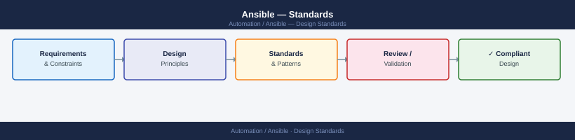

---
tags:
  - ansible
  - architecture
---
# Ansible — Standards


<div class="kb-summary">
Ansible design standards: directory layout, role naming, variable precedence rules, vault encryption policy, and idempotency requirements for production playbooks.

*Applies to: Ansible 2.x*
</div>



```d2
direction: down

project_layout: "Project Layout" {shape: rectangle}
module_standards: "Module Standards" {shape: rectangle}
variable_management: "Variable Management" {shape: rectangle}
error_handling: "Error Handling" {shape: rectangle}
tags: "Tags" {shape: rectangle}
testing_with_molecule: "Testing with Molecule" {shape: rectangle}

project_layout -> module_standards: hardens
module_standards -> variable_management: hardens
variable_management -> error_handling: hardens
error_handling -> tags: hardens
tags -> testing_with_molecule: hardens
```

## Project Layout


## Module Standards

### Always Use FQCN

```yaml
# Correct
ansible.builtin.package:
community.vmware.vmware_guest:
amazon.aws.ec2_instance:

# Incorrect — short names are deprecated
package:
vmware_guest:
```

### Prefer Declarative Over Imperative

```yaml
# Declarative — idempotent
- name: Ensure nginx is installed
  ansible.builtin.package:
    name: nginx
    state: present

# Imperative — avoid unless no module exists
- name: Install nginx
  ansible.builtin.command:
    cmd: yum install -y nginx
  args:
    creates: /usr/sbin/nginx  # idempotency guard required
```

### shell/command Rules

```yaml
# Always add changed_when or creates/removes guards
- name: Initialize app database
  ansible.builtin.command:
    cmd: /opt/app/bin/db-init
    creates: /opt/app/.db-initialized
  changed_when: true

- name: Get app version (read-only)
  ansible.builtin.command:
    cmd: /opt/app/bin/app --version
  register: app_version
  changed_when: false
  check_mode: false
```

## Variable Management

### Vault File Structure

```yaml
# group_vars/prod/vault.yml (encrypted)
vault_db_password: "prod-db-pass"
vault_api_key: "prod-api-key"

# group_vars/prod/main.yml (plaintext references)
db_password: "{{ vault_db_password }}"
api_key: "{{ vault_api_key }}"
```

### Precedence Design Rules

| Layer | When to Use |
|---|---|
| `role/defaults/main.yml` | Safe defaults, always overridable |
| `group_vars/all/` | Org-wide settings (NTP, DNS, log servers) |
| `group_vars/<group>/` | Per-environment or per-tier settings |
| `host_vars/<host>/` | Host-specific overrides — use sparingly |
| `--extra-vars` | CI/CD inject version numbers, run IDs |

## Error Handling

```yaml
- name: Deploy application
  block:
    - name: Pull container image
      community.docker.docker_image:
        name: "myapp:{{ deploy_version }}"
        source: pull
    - name: Start container
      community.docker.docker_container:
        name: myapp
        image: "myapp:{{ deploy_version }}"
        state: started
  rescue:
    - name: Alert on failure
      community.general.slack:
        token: "{{ vault_slack_token }}"
        channel: "#alerts"
        msg: "Deployment failed on {{ inventory_hostname }}"
  always:
    - name: Clean up temp files
      ansible.builtin.file:
        path: /tmp/deploy_{{ deploy_version }}.tar.gz
        state: absent
```

## Tags

```yaml
# Standard taxonomy
tags:
  - packages    # installs/removes
  - config      # config file changes
  - service     # service restarts
  - security    # security tasks
  - never       # skip by default (risky tasks)

# Usage
# ansible-playbook site.yml --tags packages,config
# ansible-playbook site.yml --tags never --limit web01
```

## Testing with Molecule

```bash
molecule test           # full cycle
molecule converge       # apply playbook
molecule verify         # run assertions
molecule login          # SSH into instance
```

## Code Review Checklist

| Item | Check |
|---|---|
| All modules use FQCN | `ansible.builtin.` prefix |
| No plaintext secrets | None in task args |
| Vault vars prefixed `vault_` | `vault_db_password` pattern |
| Tasks have meaningful names | Not just module names |
| Idempotency verified | Second run: `changed=0` |
| `no_log: true` on sensitive tasks | Credential tasks suppressed |
| `changed_when` on command/shell | Not left at default |
| Check mode compatible | `--check` doesn't error |

---

## See also

- [Ansible — Deploy](../../deploy/)
