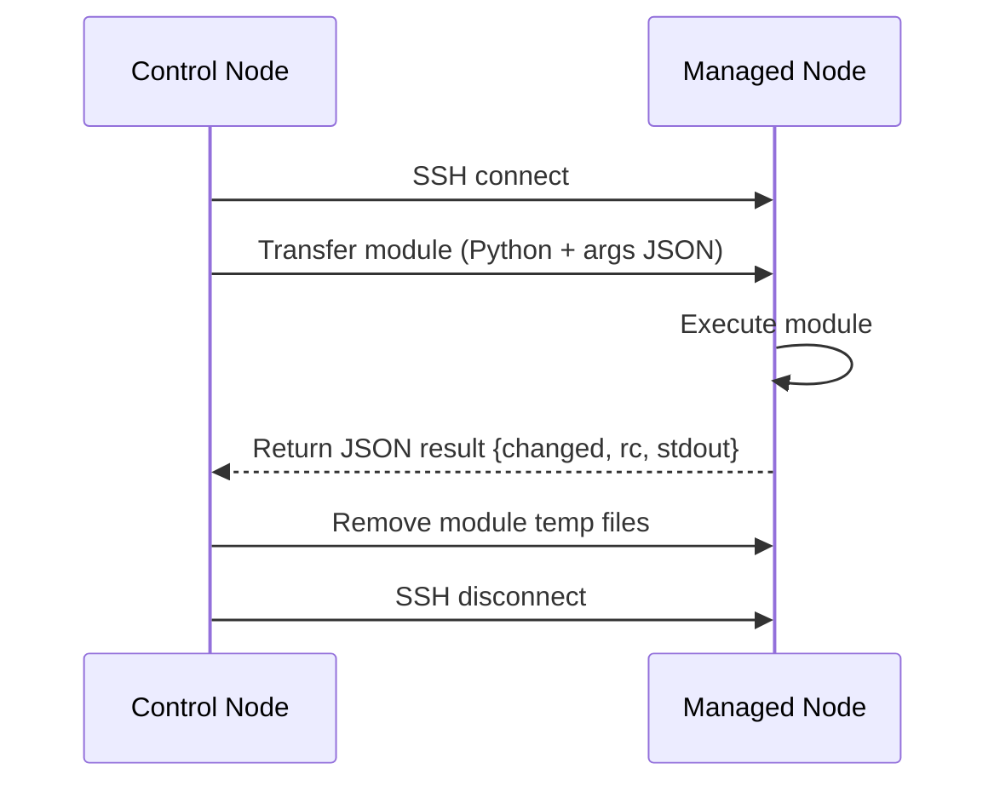
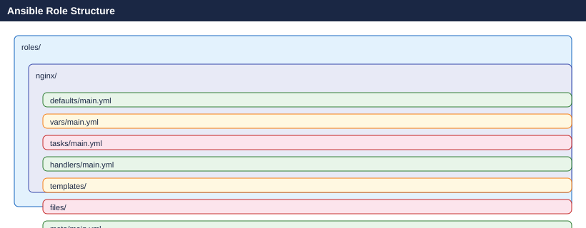

---
tags:
  - ansible
  - architecture
description: "Ansible is an agentless IT automation engine that automates provisioning, configuration management, application deployment, orchestration, and many other..."
---
# Ansible — How It Works

<div class="kb-summary">
Ansible is an agentless IT automation engine that automates provisioning, configuration management, application deployment, orchestration, and many other IT processes.

*Applies to: Ansible 2.x*
</div>

 It uses SSH (or WinRM for Windows) to communicate with managed nodes, pushing small programs called modules to execute tasks, then removing them when complete. No agent daemon is required on any managed node.

---

## The Agentless Model

| Property | Agentless (Ansible) | Agent-Based (Puppet/Chef) |
|---|---|---|
| Node prerequisite | SSH + Python (or WinRM) | Agent installed and running |
| Control plane overhead | Minimal | Agent check-ins + CA infrastructure |
| Network exposure | Outbound SSH from control node | Inbound from nodes to master |
| Bootstrapping | Works on fresh OS installs immediately | Agent must be provisioned first |
| Update surface | Only the control node | Every single managed node |
| Latency per task | SSH handshake per batch | Persistent connection |

```d2
direction: right

CN: "Control Node\nAnsible installed" {shape: rectangle}
MN1: "Linux Host" {shape: rectangle}
MN2: "Network Device\nCisco / Juniper" {shape: rectangle}
MN3: "Windows Host" {shape: rectangle}
MN4: "Cloud API\nAWS / Azure / vSphere" {shape: rectangle}
MN5: "Linux Host" {shape: rectangle}

CN -> MN1
CN -> MN2
CN -> MN3
CN -> MN4
CN -> MN5
```

---

## Module Execution

Ansible transfers a Python script (or PowerShell for Windows) to the managed node, executes it, collects the JSON output, and removes it.



---

## Roles

Roles provide a structured, reusable packaging format bundling tasks, handlers, variables, templates, and files.



---

## Collections

| Collection | Purpose |
|---|---|
| `ansible.builtin` | Core modules shipped with ansible-core |
| `community.general` | Broad community module library |
| `ansible.posix` | POSIX-specific modules |
| `community.vmware` | VMware vSphere automation |
| `amazon.aws` | AWS resource management |
| `azure.azcollection` | Azure resource management |
| `kubernetes.core` | Kubernetes / OpenShift automation |

---

## Execution Flow

```d2
direction: right

A: "ansible-playbook site.yml -i inventory/" {shape: rectangle}
B: "Parse Inventory\nResolve hosts and groups" {shape: rectangle}
C: "Load Variables\ngroup_vars host_vars extra_vars" {shape: rectangle}
D: "Gather Facts\nsetup module on each host" {shape: rectangle}
E: "Execute Play 1\nhosts: webservers" {shape: rectangle}
F: "Task: Install nginx" {shape: rectangle}
G: "G" {shape: rectangle}
H: "Notify handler: restart nginx" {shape: rectangle}
I: "Task: Deploy config file" {shape: rectangle}
J: "Task: Ensure service running" {shape: rectangle}
K: "Run notified handlers once" {shape: rectangle}
L: "Execute Play 2\nhosts: databases" {shape: rectangle}
M: "Playbook complete" {shape: rectangle}

A -> B
B -> C
C -> D
D -> E
E -> F
G -> H
G -> I
I -> J
J -> K
K -> L
L -> M
```

---

## Ansible CLI vs AWX vs AAP

| Feature | Ansible CLI | AWX (open source) | AAP (Red Hat) |
|---|---|---|---|
| Interface | CLI only | Web UI + REST API | Web UI + REST API |
| RBAC | None | Yes | Yes — enterprise LDAP/SAML |
| Scheduling | External cron | Built-in scheduler | Built-in scheduler |
| Credential storage | Ansible Vault files | Encrypted database | Encrypted DB + EE isolation |
| Audit log | Local stdout/log | Activity stream | Activity stream + SIEM integration |
| Execution Environments | Via ansible-navigator | Yes (AWX 21+) | First-class EE support |
| Certified content | No | No | Red Hat certified collections |

---

## Execution Environments

Since Ansible Automation Platform 2.0, Ansible runs inside container images called Execution Environments (EEs). EEs bundle ansible-core, Python dependencies, and collection dependencies into an immutable image.

```bash
ansible-navigator run site.yml \
  --eei registry.redhat.io/ansible-automation-platform-24/ee-supported-rhel9:latest \
  --mode stdout

ansible-builder build \
  --file execution-environment.yml \
  --tag my-org/custom-ee:1.0
```


```text title="Expected output"
PLAY [all] *********************************************************************

TASK [Gathering Facts] *********************************************************
ok: [localhost]

TASK [Install packages] ********************************************************
changed: [localhost]

TASK [Configure services] ******************************************************
ok: [localhost]

PLAY RECAP *********************************************************************
localhost                  : ok=3    changed=1    unreachable=0    failed=0    skipped=0    rescued=0    ignored=0

Running command: podman build -t my-org/custom-ee:1.0 -f Containerfile.base .
STEP 1/8: FROM quay.io/ansible/creator-base:v0.1.0
STEP 2/8: ADD _build /tmp/_build
STEP 3/8: RUN /tmp/_build/install-pip-packages.sh
Collecting ansible-core==2.14.3
Successfully installed ansible-core-2.14.3
STEP 4/8: RUN /tmp/_build/install-galaxy-collections.sh
Installing collection community.general
STEP 8/8: COMMIT my-org/custom-ee:1.0
Successfully tagged my-org/custom-ee:1.0
```

!!! warning "Common errors"
    **`ERROR! the role 'common' was not found on 'localhost'`** — Verify the role exists in your roles/ directory or install it via ansible-galaxy install.
    **`podman: command not found`** — Install podman or docker and ensure it is in your PATH; ansible-builder requires a container runtime.
    **`Error validating execution-environment.yml: 'version' is a required property`** — Add a `version:` field to your execution-environment.yml file (e.g., `version: 1`).
---

## See also

- [Ansible — Design Standards](../design-standards/)
- [Ansible — Integrations](../integrations/)
- [Ansible — Deploy](../../deploy/)
