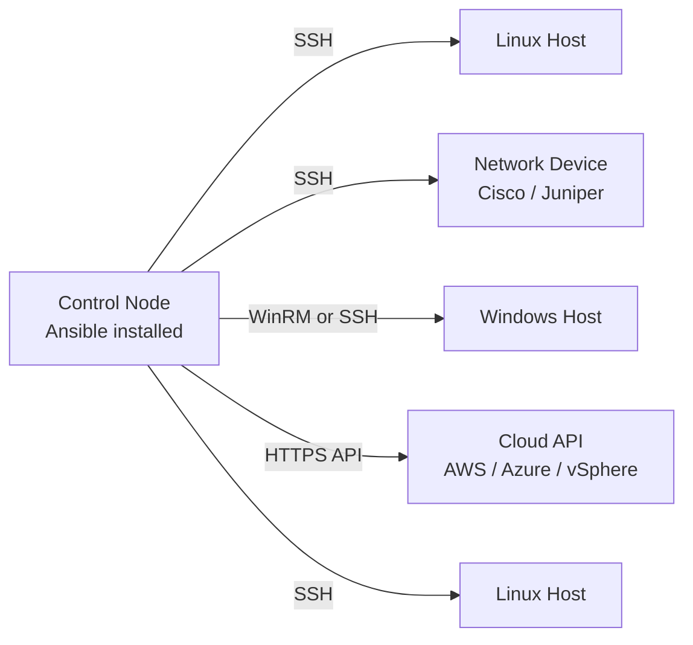
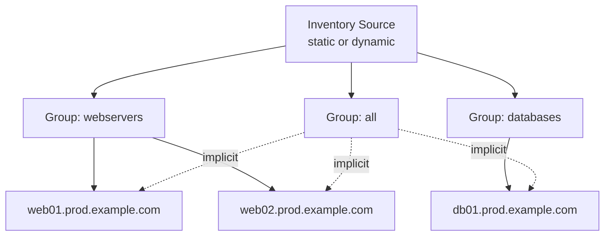
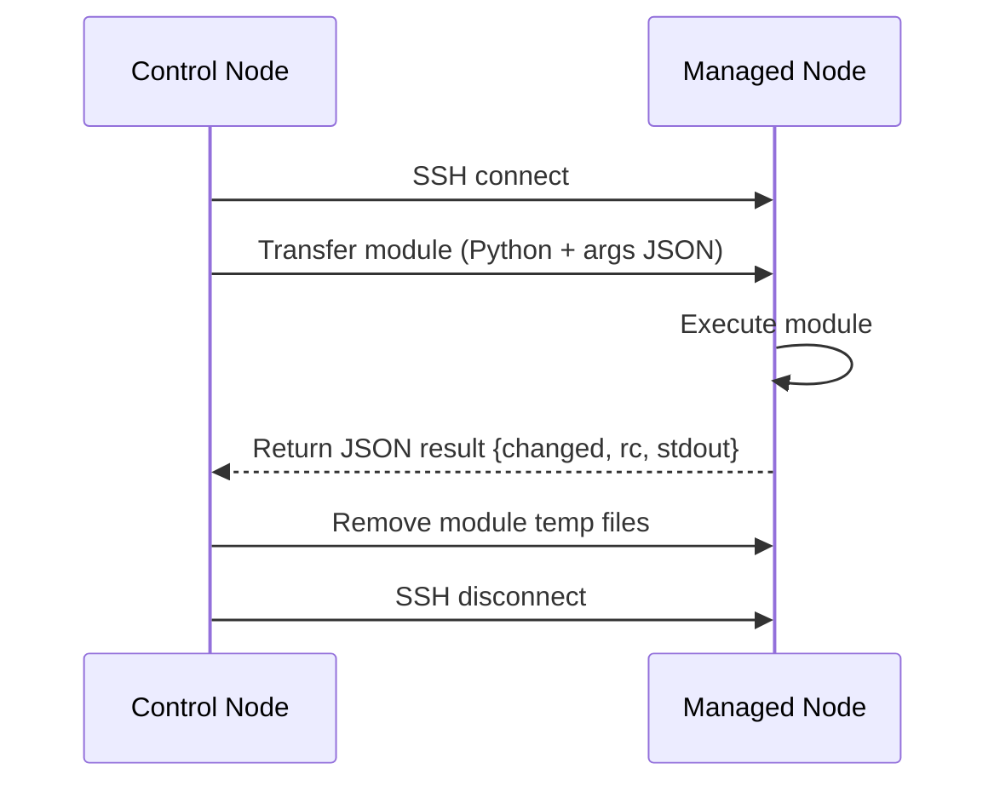
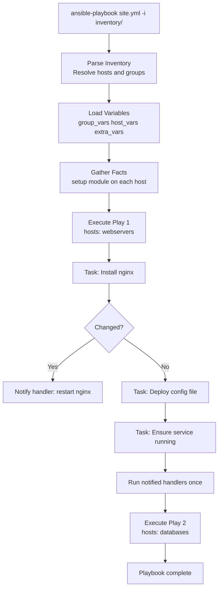

# Ansible — How It Works

Ansible is an agentless IT automation engine that automates provisioning, configuration management, application deployment, orchestration, and many other IT processes. It uses SSH (or WinRM for Windows) to communicate with managed nodes, pushing small programs called modules to execute tasks, then removing them when complete. No agent daemon is required on any managed node.

---

## The Agentless Model

| Property | Agentless (Ansible) | Agent-Based (Puppet/Chef) |
|---|---|---|
| Node prerequisite | SSH + Python (or WinRM) | Agent installed and running |
| Control plane overhead | Minimal | Agent check-ins + CA infrastructure |
| Network exposure | Outbound SSH from control node | Inbound from nodes to master |
| Bootstrapping | Works on fresh OS installs immediately | Agent must be provisioned first |
| Update surface | Only the control node | Every single managed node |
| Latency per task | SSH handshake per batch | Persistent connection |



---

## Control Node

The control node is the machine where Ansible is installed and all automation is initiated.

Requirements:

- Python 3.10+ (ansible-core 2.16+ requirement)
- Linux, macOS, or WSL2 — Windows is not supported natively as a control node
- SSH client available in PATH
- Network path to managed nodes on port 22 (or configured alternative)

## Managed Nodes

| OS Family | Connection Method | Python Required on Node |
|---|---|---|
| Linux / Unix | SSH | Yes — Python 2.7 or 3.5+ |
| Windows | WinRM or SSH | No — PowerShell used instead |
| Network devices (NX-OS, IOS-XE, EOS) | SSH or HTTPAPI | No — modules run on control node |
| Cloud APIs (AWS, Azure, GCP) | HTTPS | No — API calls, no SSH needed |

---

## Inventory

The inventory is the source of truth for which hosts exist and how they are grouped. Ansible supports static files in INI or YAML formats, and dynamic inventory plugins that query external systems at runtime.



```ini
[webservers]
web01.prod.example.com
web02.prod.example.com

[databases]
db01.prod.example.com ansible_user=postgres

[prod:children]
webservers
databases
```

---

## Playbooks

Playbooks are YAML files that define ordered sets of plays. Each play maps a set of hosts to a list of tasks.

```yaml
- name: Configure web tier
  hosts: webservers
  become: true
  roles:
    - common
    - nginx

- name: Configure database tier
  hosts: databases
  become: true
  roles:
    - common
    - postgresql
```

---

## Module Execution

Ansible transfers a Python script (or PowerShell for Windows) to the managed node, executes it, collects the JSON output, and removes it.



---

## Roles

Roles provide a structured, reusable packaging format bundling tasks, handlers, variables, templates, and files.

```
roles/
└── nginx/
    ├── defaults/main.yml
    ├── vars/main.yml
    ├── tasks/main.yml
    ├── handlers/main.yml
    ├── templates/
    ├── files/
    ├── meta/main.yml
    └── molecule/
```

---

## Collections

| Collection | Purpose |
|---|---|
| `ansible.builtin` | Core modules shipped with ansible-core |
| `community.general` | Broad community module library |
| `ansible.posix` | POSIX-specific modules |
| `community.vmware` | VMware vSphere automation |
| `amazon.aws` | AWS resource management |
| `azure.azcollection` | Azure resource management |
| `kubernetes.core` | Kubernetes / OpenShift automation |

---

## Execution Flow



---

## Ansible CLI vs AWX vs AAP

| Feature | Ansible CLI | AWX (open source) | AAP (Red Hat) |
|---|---|---|---|
| Interface | CLI only | Web UI + REST API | Web UI + REST API |
| RBAC | None | Yes | Yes — enterprise LDAP/SAML |
| Scheduling | External cron | Built-in scheduler | Built-in scheduler |
| Credential storage | Ansible Vault files | Encrypted database | Encrypted DB + EE isolation |
| Audit log | Local stdout/log | Activity stream | Activity stream + SIEM integration |
| Execution Environments | Via ansible-navigator | Yes (AWX 21+) | First-class EE support |
| Certified content | No | No | Red Hat certified collections |

---

## Execution Environments

Since Ansible Automation Platform 2.0, Ansible runs inside container images called Execution Environments (EEs). EEs bundle ansible-core, Python dependencies, and collection dependencies into an immutable image.

```bash
ansible-navigator run site.yml \
  --eei registry.redhat.io/ansible-automation-platform-24/ee-supported-rhel9:latest \
  --mode stdout

ansible-builder build \
  --file execution-environment.yml \
  --tag my-org/custom-ee:1.0
```
