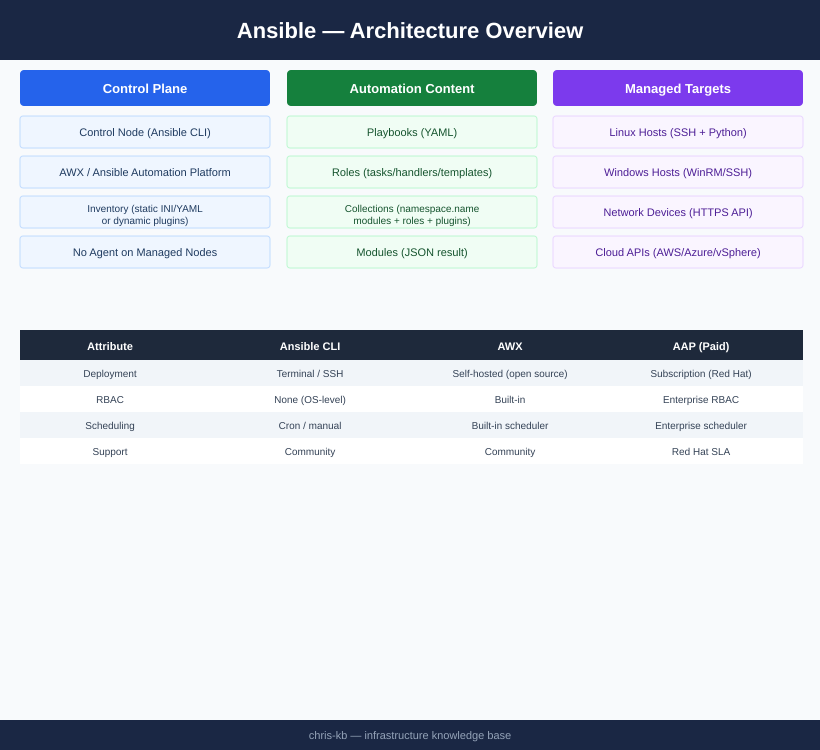

---
tags:
  - ansible
  - architecture
---
# Ansible — Architecture

Agentless IT automation over SSH/WinRM; the control node pushes modules to managed nodes, executes tasks, and removes them; organised via inventory, playbooks, roles, and collections; enterprise scale via AWX/AAP and Execution Environments.

*Applies to: Ansible 2.x*

<a class="kb-card" href="how-it-works/">
  <strong>How It Works</strong>
  Agentless model, inventory, playbooks, modules, roles, collections, and execution flow.
</a>

<a class="kb-card" href="integrations/">
  <strong>Integrations</strong>
  Integration with other platforms and external systems.
</a>

<a class="kb-card" href="design-standards/">
  <strong>Design Standards</strong>
  Sizing guidelines, design standards, and best practices.
</a>

## Core Components

| Component | Purpose |
|---|---|
| Control Node | Ansible installed here; all automation initiated; no agent on managed nodes |
| Managed Node | Target host or device; requires only SSH + Python (or WinRM for Windows) |
| Inventory | Source of truth for hosts and group membership (static INI/YAML or dynamic plugins) |
| Playbook | YAML file defining ordered plays; maps host groups to task lists |
| Module | Unit of work; transferred to managed node, executed, result returned as JSON |
| Role | Structured, reusable bundle of tasks, handlers, vars, templates, and files |
| Collection | Distribution format for modules, roles, plugins, namespaced under `<ns>.<name>` |
| AWX / AAP | Web UI + REST API + RBAC + scheduling layer on top of Ansible CLI |

## Agentless Execution Model

