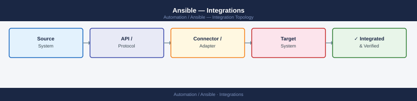

---
tags:
  - ansible
  - architecture
---
# Ansible — Integrations



```bash
ansible-galaxy collection install community.vmware
pip install PyVmomi vsphere-automation-sdk-python
```

```bash
ansible-galaxy collection install community.hashi_vault
pip install hvac
```
```yaml
vars:
  db_password: "{{ lookup('community.hashi_vault.hashi_vault', 'secret/data/prod/db:password') }}"
  api_token:   "{{ lookup('community.hashi_vault.hashi_vault', 'secret/data/api:token') }}"
```
```yaml
# .github/workflows/deploy.yml
- name: Run Ansible playbook
  run: |
    ansible-playbook -i inventory/prod/ site.yml \
      --extra-vars "version=${{ github.sha }}"
  env:
    ANSIBLE_HOST_KEY_CHECKING: "False"
    ANSIBLE_VAULT_PASSWORD_FILE: ~/.vault_pass
```
```groovy
// Jenkins Pipeline
withCredentials([sshUserPrivateKey(credentialsId: 'ansible-key', keyFileVariable: 'KEY')]) {
  sh "ansible-playbook -i inventory/prod/ site.yml --private-key $KEY"
}
```
```bash
ansible-galaxy collection install servicenow.itsm
```
```yaml
- name: Open change request
  servicenow.itsm.change_request:
    instance:
      host: https://example.service-now.com
      username: "{{ snow_user }}"
      password: "{{ snow_password }}"
    state: new
    type: standard
    short_description: "Automated patching — {{ ansible_date_time.date }}"
    assignment_group: "Linux Operations"
  register: change_request

- name: Close change request
  servicenow.itsm.change_request:
    instance:
      host: https://example.service-now.com
      username: "{{ snow_user }}"
      password: "{{ snow_password }}"
    sys_id: "{{ change_request.record.sys_id }}"
    state: closed
    close_code: successful
    close_notes: "Completed successfully"
```
```ini
# inventory
[ios_routers]
router01 ansible_host=10.0.0.1 ansible_network_os=cisco.ios.ios ansible_connection=network_cli

[eos_switches]
switch01 ansible_host=10.0.1.1 ansible_network_os=arista.eos.eos ansible_connection=httpapi ansible_httpapi_use_ssl=true
```
```yaml
- name: Backup IOS running config
  cisco.ios.ios_config:
    backup: true
    backup_options:
      dir_path: /srv/ansible/network-backups/
      filename: "{{ inventory_hostname }}-{{ ansible_date_time.date }}.cfg"
```
```yaml
- name: Create AD computer object
  community.windows.win_domain_computer:
    name: "{{ inventory_hostname_short }}"
    dns_hostname: "{{ ansible_fqdn }}"
    ou: "OU=Servers,DC=example,DC=com"
    state: present
  delegate_to: dc01.example.com

- name: Join Linux host to AD
  ansible.builtin.command:
    cmd: "realm join --user={{ ad_join_user }} {{ ad_domain }}"
  environment:
    PASSWD: "{{ ad_join_password }}"
  no_log: true
```
```yaml
- name: Schedule Nagios downtime before maintenance
  community.general.nagios:
    action: downtime
    start: "{{ ansible_date_time.epoch }}"
    minutes: 60
    host: "{{ inventory_hostname }}"
    services: all
    author: ansible
    comment: "Automated maintenance window"
```

---

```d2
direction: right

center: "Ansible" {shape: hexagon}
component_a: "Component A" {shape: rectangle}
component_b: "Component B" {shape: rectangle}
component_c: "Component C" {shape: rectangle}

center -> component_a
center -> component_b
center -> component_c
```

## See also

- [Ansible — Design Standards](../design-standards/)
