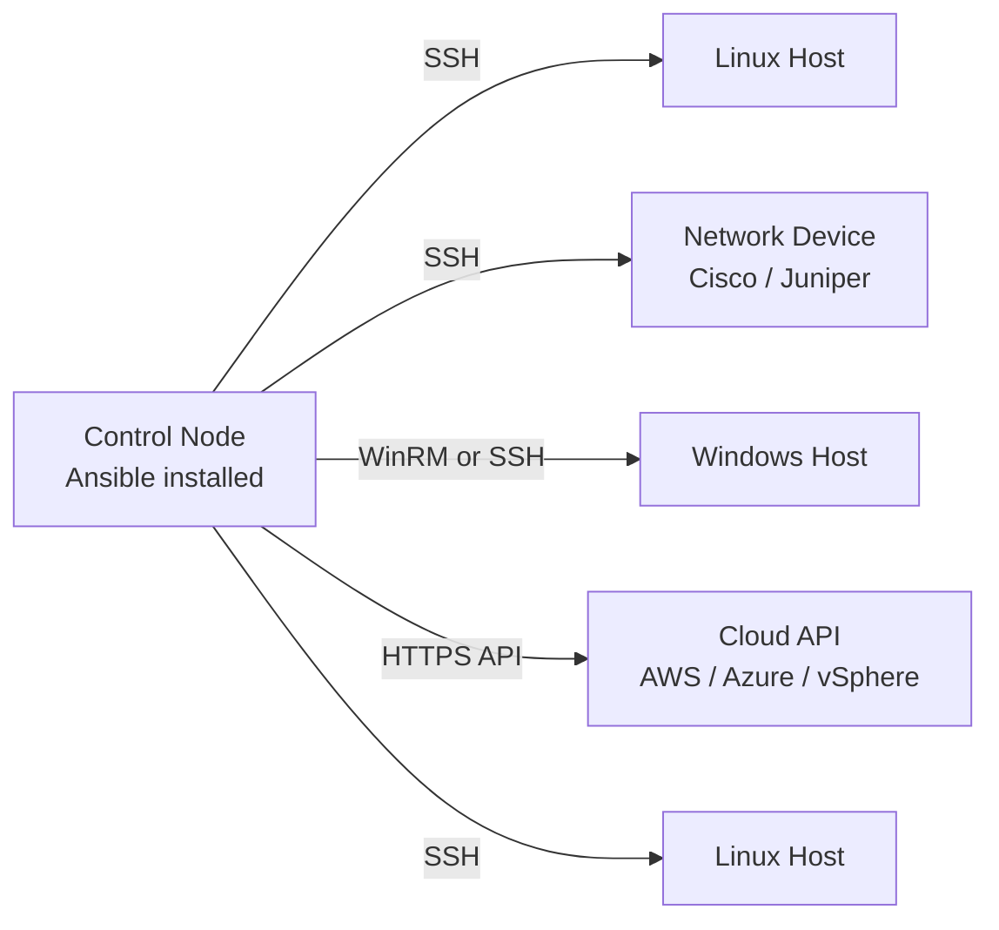
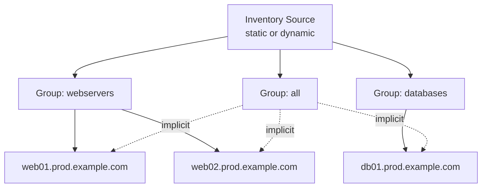
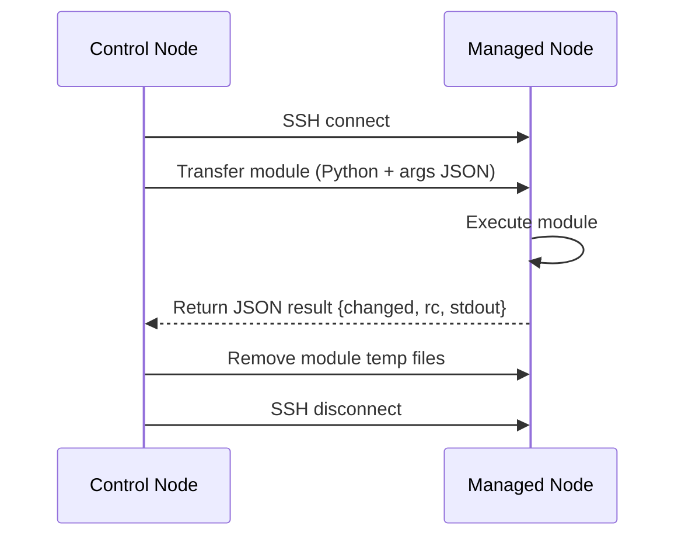
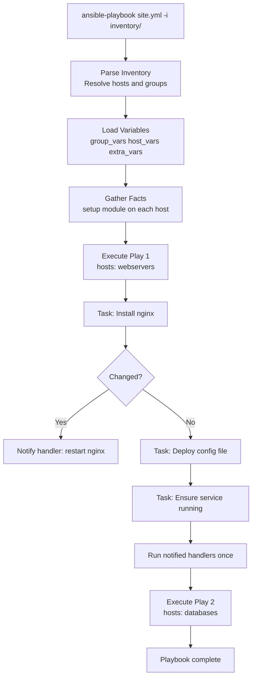

# Ansible Architecture Overview

Ansible is an agentless IT automation engine that automates provisioning, configuration management, application deployment, orchestration, and many other IT processes. It uses SSH (or WinRM for Windows) to communicate with managed nodes, pushing small programs called modules to execute tasks, then removing them when complete. No agent daemon is required on any managed node.

## The Agentless Model

Unlike Chef or Puppet, Ansible requires no persistent agent on managed nodes. This has significant operational implications:

| Property | Agentless (Ansible) | Agent-Based (Puppet/Chef) |
|---|---|---|
| Node prerequisite | SSH + Python (or WinRM) | Agent installed and running |
| Control plane overhead | Minimal | Agent check-ins + CA infrastructure |
| Network exposure | Outbound SSH from control node | Inbound from nodes to master |
| Bootstrapping | Works on fresh OS installs immediately | Agent must be provisioned first |
| Update surface | Only the control node | Every single managed node |
| Latency per task | SSH handshake per batch | Persistent connection |

The agentless model means you can immediately target any reachable host — including network devices, storage arrays, and cloud APIs — without a pre-installation step.



## Core Architectural Components

### Control Node

The control node is the machine where Ansible is installed and all automation is initiated. It can be:

- A developer workstation for ad-hoc use
- A dedicated automation server
- An AWX/AAP controller pod for enterprise use

**Requirements:**

- Python 3.10+ (ansible-core 2.16+ requirement)
- Linux, macOS, or WSL2 — Windows is not supported natively as a control node
- SSH client available in PATH
- Network path to managed nodes on port 22 (or configured alternative)

### Managed Nodes

Managed nodes are the systems Ansible automates. No Ansible software is required on them.

| OS Family | Connection Method | Python Required on Node |
|---|---|---|
| Linux / Unix | SSH | Yes — Python 2.7 or 3.5+ |
| Windows | WinRM or SSH | No — PowerShell used instead |
| Network devices (NX-OS, IOS-XE, EOS) | SSH or HTTPAPI | No — modules run on control node |
| Cloud APIs (AWS, Azure, GCP) | HTTPS | No — API calls, no SSH needed |

!!! note "Python on managed nodes"
    For Linux targets, Ansible transfers Python modules to the node and executes them remotely. The `ansible_python_interpreter` variable controls which Python binary to use. For network devices and cloud APIs, the modules run entirely on the control node using local libraries.

### Inventory

The inventory is the source of truth for which hosts exist and how they are grouped. Ansible supports static files in INI or YAML formats, and dynamic inventory plugins that query external systems at runtime.



Static INI inventory example:

```ini
[webservers]
web01.prod.example.com
web02.prod.example.com

[databases]
db01.prod.example.com ansible_user=postgres

[prod:children]
webservers
databases
```

### Playbooks

Playbooks are YAML files that define ordered sets of plays. Each play maps a set of hosts to a list of tasks. A playbook can contain multiple plays, allowing orchestration across different host groups in a single run.

```yaml
# site.yml — top-level playbook
- name: Configure web tier
  hosts: webservers
  become: true
  roles:
    - common
    - nginx

- name: Configure database tier
  hosts: databases
  become: true
  roles:
    - common
    - postgresql
```

### Modules

Modules are the units of work. Ansible transfers a Python script (or PowerShell for Windows) to the managed node, executes it, collects the JSON output, and removes it. There are over 6,000 modules available across ansible-core and community and certified collections.



### Roles

Roles provide a structured, reusable packaging format. A role bundles tasks, handlers, variables, templates, and files into a standardized directory layout that can be shared via Ansible Galaxy or internal repositories.

```
roles/
└── nginx/
    ├── defaults/main.yml    # lowest priority defaults
    ├── vars/main.yml        # higher priority role vars
    ├── tasks/main.yml       # primary task list
    ├── handlers/main.yml    # triggered handlers
    ├── templates/           # Jinja2 .j2 templates
    ├── files/               # static files to copy
    ├── meta/main.yml        # Galaxy metadata + dependencies
    └── molecule/            # Molecule test scenarios
```

### Collections

Collections are the modern distribution format for Ansible content, introduced in Ansible 2.10. A collection can contain modules, roles, playbooks, and plugins, all namespaced under `<namespace>.<collection_name>`.

| Collection | Purpose |
|---|---|
| `ansible.builtin` | Core modules shipped with ansible-core |
| `community.general` | Broad community module library |
| `ansible.posix` | POSIX-specific modules |
| `community.vmware` | VMware vSphere automation |
| `amazon.aws` | AWS resource management |
| `azure.azcollection` | Azure resource management |
| `kubernetes.core` | Kubernetes / OpenShift automation |

Collections are installed via `ansible-galaxy collection install` or declared in a `requirements.yml` file.

### Plugins

Plugins extend Ansible's core functionality:

| Plugin Type | Purpose | Examples |
|---|---|---|
| Connection | How Ansible connects to nodes | ssh, winrm, local, docker, kubectl |
| Inventory | Dynamic host source adapters | aws_ec2, azure_rm, vmware_vm_inventory |
| Lookup | Fetch external data at template time | env, file, hashi_vault, password, aws_ssm |
| Filter | Transform Jinja2 data | json_query, selectattr, regex_replace |
| Callback | Customize output and reporting | json, yaml, slack, junit, splunk |
| Vars | Load variables dynamically | host_group_vars, community.sops |

## Execution Flow



1. **Inventory parsing** — Ansible resolves all hosts and group memberships.
2. **Variable loading** — Variables merge from all sources in defined precedence order.
3. **Fact gathering** — The `setup` module collects system facts from each host.
4. **Task execution** — Tasks run in declared order; each module call is independent.
5. **Handler execution** — Handlers run once per play end if notified by any task.

## Ansible CLI vs AWX vs AAP

| Feature | Ansible CLI | AWX (open source) | AAP (Red Hat) |
|---|---|---|---|
| Interface | CLI only | Web UI + REST API | Web UI + REST API |
| RBAC | None | Yes | Yes — enterprise LDAP/SAML |
| Scheduling | External cron | Built-in scheduler | Built-in scheduler |
| Credential storage | Ansible Vault files | Encrypted database | Encrypted DB + EE isolation |
| Audit log | Local stdout/log | Activity stream | Activity stream + SIEM integration |
| Execution Environments | Via ansible-navigator | Yes (AWX 21+) | First-class EE support |
| Certified content | No | No | Red Hat certified collections |
| Support | Community | Community | Red Hat subscription |

!!! tip "AWX vs AAP"
    AWX is the upstream open-source project. AAP is the downstream Red Hat supported product built from AWX. New features appear in AWX first. For production enterprise use, AAP provides certified content, Execution Environments, and an official support contract.

## Execution Environments

Since Ansible Automation Platform 2.0, Ansible runs inside container images called Execution Environments (EEs). EEs bundle ansible-core, Python dependencies, and collection dependencies into an immutable image.

```bash
# Run a playbook inside a specific Execution Environment
ansible-navigator run site.yml \
  --eei registry.redhat.io/ansible-automation-platform-24/ee-supported-rhel9:latest \
  --mode stdout

# Build a custom EE using ansible-builder
ansible-builder build \
  --file execution-environment.yml \
  --tag my-org/custom-ee:1.0
```

!!! warning "Python version drift without EEs"
    Without Execution Environments, different control nodes or developer workstations can have different Python and collection versions, leading to subtle behavior differences. EEs enforce consistent versions across all execution contexts.
