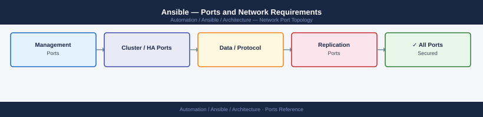

---
tags:
  - ansible
  - automation
  - networking
  - firewall
  - ports
---
# Ansible — Ports and Network Requirements

<div class="kb-summary">
Firewall port reference for Ansible and Ansible Automation Platform (AAP). Ansible is agentless — it connects outbound from the control node or execution environment to managed hosts. The only listening ports are on AAP (the management UI/API) and on managed targets.

*Applies to: Ansible Core 2.15+ / Ansible Automation Platform 2.x*
</div>


## Before you begin

- Ansible control node (or AAP execution environment) has NO inbound ports required for automation — all connections are outbound to targets
- The only inbound ports needed are for AAP (the web UI/API platform) accessed by admins and CI/CD pipelines
- SSH keys or passwords are used for Linux targets; WinRM certificates or Kerberos for Windows targets
- Network devices (Cisco, Arista, Juniper) are managed via SSH (22) or REST APIs (443)

---

## Inbound — Admin to Ansible Automation Platform (AAP)

| Port | Protocol | Source | Purpose |
|---|---|---|---|
| 443 | TCP | Admin browsers, CI/CD pipelines, REST API clients | AAP web UI (Automation Controller), API, and webhook receivers |
| 80 | TCP | Clients | HTTP — redirects to 443 |
| 22 | TCP | Jump hosts | SSH — AAP appliance OS management |

---

## Control Node / Execution Environment to Linux Managed Hosts

| Port | Protocol | Source | Destination | Purpose |
|---|---|---|---|---|
| 22 | TCP | AAP / Ansible control node | Linux managed hosts | SSH — playbook execution, module transfer, fact gathering |

---

## Control Node to Windows Managed Hosts

| Port | Protocol | Source | Destination | Purpose |
|---|---|---|---|---|
| 5985 | TCP | AAP / Ansible control node | Windows managed hosts | WinRM HTTP (unencrypted — for lab/non-production only) |
| 5986 | TCP | AAP / Ansible control node | Windows managed hosts | WinRM HTTPS (production — required for Kerberos or cert auth) |

---

## Control Node to Network Devices

| Port | Protocol | Source | Destination | Purpose |
|---|---|---|---|---|
| 22 | TCP | AAP / Ansible control node | Network switches, routers, firewalls | SSH — network device CLI operations (Cisco IOS, Arista EOS, Juniper JunOS) |
| 443 | TCP | AAP / Ansible control node | Network devices with REST APIs | REST API access (NX-API, eAPI, Junos REST) |

---

## Control Node to Cloud / Platform APIs

| Port | Protocol | Source | Destination | Purpose |
|---|---|---|---|---|
| 443 | TCP | AAP / Ansible control node | vCenter, NSX, NetApp, Pure, AWS, Azure, GCP | REST API — cloud and infrastructure module calls |

---

## AAP Internal Services

| Port | Protocol | Between | Purpose |
|---|---|---|---|
| 27199 | TCP | Automation Controller ↔ Execution Nodes | Receptor — job execution mesh |
| 443 | TCP | Controller → Private Automation Hub | Content download (collections, EE images) |
| 5432 | TCP | Controller → PostgreSQL | AAP configuration database |

---

## Outbound — AAP to External Services

| Port | Protocol | Destination | Purpose |
|---|---|---|---|
| 443 | TCP | cloud.redhat.com, console.redhat.com | AAP subscription and content sync |
| 443 | TCP | automation.redhat.com | Automation Hub collection sync |
| 443 | TCP | registry.redhat.io | Execution Environment (container) image pulls |
| 443 | TCP | *.galaxy.ansible.com | Community content (Ansible Galaxy) |
| 25 | TCP | SMTP relay | Job notification emails |

---

## Firewall Zone Summary

| From | To | Ports | Notes |
|---|---|---|---|
| Admin clients | AAP | 443 | UI and API — only inbound needed |
| AAP / control node | Linux hosts | 22 | SSH — all Linux-targeted playbooks |
| AAP / control node | Windows hosts | 5986 | WinRM HTTPS — Windows playbooks |
| AAP / control node | Network devices | 22, 443 | CLI and REST API |
| AAP / control node | Cloud/platform APIs | 443 | REST API modules |
| AAP | cloud.redhat.com | 443 | Subscription sync (outbound) |

---

## Verify

```bash
# From AAP / control node — test SSH to a Linux managed host
ssh -o BatchMode=yes ansible@<linux-host> echo ok

# From AAP / control node — test WinRM to a Windows host
python3 -c "
import winrm
s = winrm.Session('<windows-host>', auth=('user', 'pass'), transport='ntlm')
print(s.run_cmd('ipconfig', ['/all']).std_out.decode()[:100])
"

# From AAP / control node — test API target
curl -sk -o /dev/null -w "%{http_code}" https://<vcenter-fqdn>/rest/com/vmware/cis/session

# From AAP UI — test job execution
# Create a simple ping playbook, run against a host, verify it completes
```

---

## See also

- [Ansible — Architecture](how-it-works/)
- [Ansible — Deploy](../deploy/)
- [Ansible — Operations](../operations/)
- [Terraform — Ports](../../terraform/architecture/ports.md)
