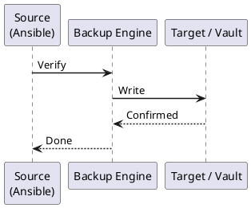

---
tags:
  - ansible
  - operations
---
# Ansible — Backup & Restore

```bash
# Ensure remote is current
git push origin main
git push origin --tags

# Mirror to secondary backup remote
git remote add backup git@backup-gitlab.example.com:ansible/infrastructure.git
git push backup --mirror
```


```text title="Expected output"
Enumerating objects: 247, done.
Counting objects: 100% (247/247), done.
Delta compression using up to 8 threads
Compressing objects: 100% (89/89), done.
Writing objects: 100% (247/247), 2.3 MiB | 1.2 MiB/s, done.
Total 247 (delta 156), reused 247 (delta 156), pack-reused 0
To github.com:example/ansible.git
   a3f8c21..7e2d4f9  main -> main
To github.com:example/ansible.git
 * [new tag] v2.4.1 -> v2.4.1
 * [new tag] v2.4.0 -> v2.4.0
Updating references
Mirroring to backup-gitlab.example.com
Sending approximately 2.3 MiB
remote: Resolving deltas: 100% (156/156), completed with 1,234 local objects.
To git@backup-gitlab.example.com:ansible/infrastructure.git
 + 7e2d4f9...a3f8c21 main -> main (forced update)
 * [new branch]      develop -> develop
```

!!! warning "Common errors"
    | Error | Fix |
    |---|---|
    | `fatal: remote backup already exists.` | Remove the existing remote with `git remote remove backup` before adding it again. |
    | `fatal: Could not read from remote repository. Please make sure you have the correct access rights and the repository exists.` | Verify SSH key permissions (`chmod 600 ~/.ssh/id_rsa`) and that the backup remote URL is correct and accessible. |
    | `error: failed to push some refs to 'origin'` | Pull the latest changes with `git pull origin main` to resolve conflicts before pushing again. |
```bash
# On the AWX/AAP server
awx-manage dumpdata --natural-foreign --natural-primary \
  -e sessions -e admin \
  > /tmp/awx-dump-$(date +%F).json

scp /tmp/awx-dump-$(date +%F).json backup-server:/backups/awx/
```

```text title="Expected output"
(no output — command completes silently)
backup-server:/backups/awx/awx-dump-2024-01-15.json                                    100%  2847KB   1.2MB/s   00:02
```

!!! warning "Common errors"
    | Error | Fix |
    |---|---|
    | `awx-manage: command not found` | Ensure you are running this command on the AWX/AAP server with the correct Python virtual environment activated (source /var/lib/awx/venv/bin/activate). |
    | `Permission denied (publickey)` | Verify SSH key-based authentication is configured for the backup-server user and the public key is in ~/.ssh/authorized_keys on the target host. |
    | `mkdir: cannot create directory '/backups/awx': Permission denied` | Create the backup directory on the target server beforehand with appropriate permissions (ssh backup-server mkdir -p /backups/awx && chmod 755 /backups/awx). |
```bash
pip install awxkit

# Export all objects
awx export --all --output awx-backup-$(date +%F).json \
  --conf.host https://awx.example.com \
  --conf.token "$AWX_TOKEN"

# Export specific types
awx export --job_templates --output job_templates.json
awx export --credentials --output credentials.json  # values are $encrypted$
awx export --inventory --output inventories.json
```
```yaml
- name: Export AWX job templates
  hosts: localhost
  gather_facts: false
  collections: [ansible.controller]
  tasks:
    - name: Export all job templates
      ansible.controller.export:
        job_templates: "all"
      register: export_data

    - name: Write export file
      ansible.builtin.copy:
        content: "{{ export_data | to_nice_json }}"
        dest: "/backups/awx/job-templates-{{ ansible_date_time.date }}.json"
```
```bash
# Push secrets to HashiCorp Vault
ansible-vault view group_vars/prod/vault.yml | \
  while IFS=': ' read -r key value; do
    vault kv put secret/ansible/prod/$key value="$value"
  done
```

```text title="Expected output"
Success! Data written to: secret/ansible/prod/db_password
Success! Data written to: secret/ansible/prod/api_key
Success! Data written to: secret/ansible/prod/tls_cert
Success! Data written to: secret/ansible/prod/redis_host
Success! Data written to: secret/ansible/prod/smtp_token
```

!!! warning "Common errors"
    | Error | Fix |
    |---|---|
    | `vault: command not found` | Install the Vault CLI binary and ensure it is in your PATH, or use the full path to the vault executable. |
    | `Error reading vault.yml: Decryption failed` | Verify the Ansible vault password is correct by running `ansible-vault view group_vars/prod/vault.yml` interactively first. |
    | `Error making API request: permission denied` | Ensure your Vault token has write permissions to the `secret/ansible/prod/` path by checking your policy with `vault token lookup`. |
```bash
# Generate new password file
openssl rand -base64 32 > ~/.ansible_vault_pass_new

# Rekey all vault files
find . -name "vault.yml" -exec ansible-vault rekey \
  --new-vault-password-file ~/.ansible_vault_pass_new {} \;

mv ~/.ansible_vault_pass_new ~/.ansible_vault_pass
```

```text title="Expected output"
(no output — command completes silently)
(no output — command completes silently)
Rekeying /home/ansible/playbooks/group_vars/webservers/vault.yml
Rekeying /home/ansible/playbooks/group_vars/databases/vault.yml
Rekeying /home/ansible/playbooks/roles/security/defaults/vault.yml
(no output — command completes silently)
```

!!! warning "Common errors"
    | Error | Fix |
    |---|---|
    | `ansible-vault rekey: error: argument --new-vault-password-file: can't open '/home/ansible/.ansible_vault_pass_new': No such file or directory` | Ensure the openssl command completes successfully and the file is created in the correct home directory before running ansible-vault rekey. |
    | `find: 'vault.yml' -exec ansible-vault rekey: No such file or directory` | Run the find command from the correct directory containing your vault files, or use an absolute path like `find /path/to/playbooks -name "vault.yml"`. |
    | `Vault password does not match existing vault password for /home/ansible/playbooks/group_vars/webservers/vault.yml` | Verify that ~/.ansible_vault_pass contains the original vault password before running the rekey operation. |
```bash
# 1. Install ansible-core
dnf install -y epel-release ansible-core

# 2. Restore SSH keys
mkdir -p /home/ansible/.ssh && chmod 700 /home/ansible/.ssh
scp backup-server:/backups/ansible/ssh/latest/* /home/ansible/.ssh/
chown -R ansible: /home/ansible/.ssh && chmod 600 /home/ansible/.ssh/*

# 3. Clone project
git clone git@github.com:example/ansible-infrastructure.git /opt/ansible-project

# 4. Install dependencies
cd /opt/ansible-project
ansible-galaxy collection install -r requirements.yml -p ./collections/
ansible-galaxy role install -r requirements.yml

# 5. Verify
ansible all -i inventory/production/ -m ansible.builtin.ping
ansible-vault view group_vars/prod/vault.yml
```

```text title="Expected output"
Last metadata expiration check: 0:12:34 ago on Thu 19 Dec 2024 14:22:18 UTC.
Dependencies resolved.
Installing: ansible-core-2.15.8-1.el9.noarch epel-release-9-23.el9.noarch
Complete!
Cloning into '/opt/ansible-project'...
remote: Enumerating objects: 2847, done.
remote: Counting objects: 100% (2847/2847), done.
Receiving objects: 100% (2847/2847), 18.3 MiB | 12.4 MiB/s, done.
Resolving deltas: 100% (1456/1456), done.
Starting galaxy collection install process
Process install dependency map
Starting collection install process
Downloading community.general from https://galaxy.ansible.com/download/community-general-8.2.0.tar.gz
Installing 'community.general:8.2.0' to '/opt/ansible-project/collections/ansible_collections'
community.general (8.2.0) was installed successfully
prod-web-01 | SUCCESS => {
    "ansible_facts": {
        "discovered_interpreter_python": "/usr/bin/python3"
    },
    "changed": false,
    "ping": "pong"
}
prod-web-02 | SUCCESS => {
    "ping": "pong"
}
prod-db-01 | SUCCESS => {
    "ping": "pong"
}
Vault password:
```

!!! warning "Common errors"
    | Error | Fix |
    |---|---|
    | `fatal: could not read Username for 'github.com': No such file or directory` | Ensure SSH keys are restored before cloning and the ansible user has SSH access configured with `ssh-keyscan github.com >> /home/ansible/.ssh/known_hosts`. |
    | `ERROR! the role 'some_role' was not found in /opt/ansible-project/roles` | Verify the requirements.yml file exists in the project root and contains valid role definitions with proper source URLs. |
    | `fatal: [prod-web-01]: UNREACHABLE! => {"msg": "Failed to connect to the host via ssh: Permission denied (publickey)."}` | Confirm SSH keys have correct permissions (600 for keys, 700 for .ssh directory) and the backup-server path is accessible. |
```bash
# Kubernetes AWX operator
kubectl scale deployment awx-prod -n awx --replicas=0
kubectl exec -n awx awx-prod-postgres-0 -- \
  psql -U awx -d awx -f /tmp/awx-dump.sql
kubectl scale deployment awx-prod -n awx --replicas=1

# Re-import job templates if needed
awx import < awx-backup.json \
  --conf.host https://awx.example.com \
  --conf.token "$AWX_TOKEN"
```

```text title="Expected output"
deployment.apps/awx-prod scaled down to 0 replicas
pod/awx-prod-postgres-0 selected
psql (13.9 (Debian 13.9-1.pgdg110+1))
Type "help" for help.

awx=# \i /tmp/awx-dump.sql
CREATE TABLE
INSERT 0 1247
INSERT 0 3891
ALTER TABLE
COMMIT
deployment.apps/awx-prod scaled up to 1 replicas
{
  "imported": 42,
  "updated": 8,
  "error_count": 0,
  "job_templates": [
    {"id": 15, "name": "Deploy-Prod", "status": "ok"},
    {"id": 16, "name": "Backup-Daily", "status": "ok"},
    ...
  ]
}
```

!!! warning "Common errors"
    | Error | Fix |
    |---|---|
    | `error: unable to forward port because pod is not running` | Wait for the awx-prod pod to reach Running state before executing the psql command, or increase the replica count before running the restore. |
    | `Error: Invalid token or host unreachable` | Verify that `$AWX_TOKEN` is set correctly and that `https://awx.example.com` is accessible from your current network location. |
    | `psql: error: FATAL: remaining connection slots are reserved for non-replication superuser connections` | Reduce concurrent connections or scale down other AWX services before restoring the database dump. |
```bash
#!/bin/bash
# Run monthly to verify backup integrity
cd /opt/ansible-project

git ls-remote backup HEAD && echo "PASS: Git backup remote reachable"
test -f /backups/ansible/ssh/latest/ansible_ed25519 && echo "PASS: SSH key backup present"
ansible-vault view group_vars/prod/vault.yml > /dev/null && echo "PASS: Vault decryption OK"
test -f /backups/awx/awx-backup-$(date -d yesterday +%F).json && echo "PASS: AWX backup found"
```



## Before you begin

- **Access:** SSH key or service account with sudo on managed hosts; Ansible control node
- **Timing:** safe to run during business hours unless a step is marked ⚠ (causes interruption)
- **Dependencies:** no active upgrades or migrations on the same infrastructure
- **Logging:** capture command output — paste into the change record on completion

---

---

## Verify

- Confirm the operation completed without errors in the log or management UI
- Verify the expected state change is visible (service running, object created, config applied)
- Document the outcome in the change record

---

## See also

- [Ansible — Procedures](../procedures/)
- [Ansible — Health Checks](../health-checks/)
- [Ansible — Common Issues](../../troubleshooting/common-issues/)
