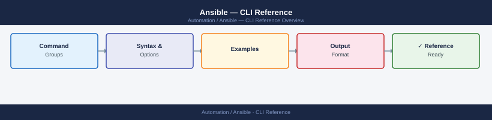
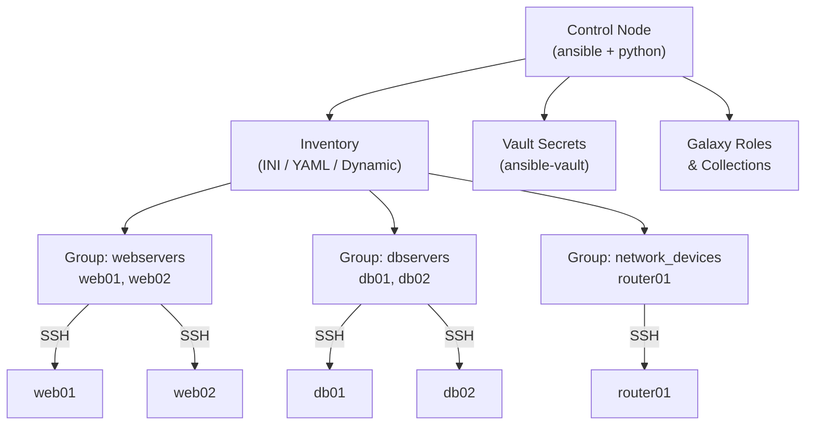

---
tags:
  - ansible
  - operations
---
# Ansible — CLI Reference


<div class="kb-summary">
Ansible CLI reference: `ansible`, `ansible-playbook`, `ansible-vault`, `ansible-galaxy`, `ansible-inventory`, and `ansible-doc` command syntax with common flags.

*Applies to: Ansible 2.14+*
</div>



> Part of the [Ansible Operations](../index.md) reference.

Ansible is an agentless automation tool — it connects to remote hosts over SSH and runs tasks defined in YAML playbooks. There's nothing to install on the managed hosts. The control node (where you run `ansible` and `ansible-playbook`) needs Python and the Ansible package.

> Install with `pip install ansible` or your distro's package manager. Requires SSH access to managed hosts and a valid inventory file.

```d2
direction: right

center: "Ansible" {shape: rectangle}
control_node_and_inventory_topology: "Control Node and Inventory Topology" {shape: rectangle}
ansibleplaybook: "ansible-playbook" {shape: rectangle}
ansibleinventory: "ansible-inventory" {shape: rectangle}
ansiblegalaxy: "ansible-galaxy" {shape: rectangle}
ansiblevault: "ansible-vault" {shape: rectangle}
tools_lint_config: "Tools, Lint & Config" {shape: rectangle}

center -> control_node_and_inventory_topology
center -> ansibleplaybook
center -> ansibleinventory
center -> ansiblegalaxy
center -> ansiblevault
center -> tools_lint_config
```

## Before you begin

- **Access:** SSH key or service account with sudo on managed hosts; Ansible control node
- **Timing:** safe to run during business hours unless a step is marked ⚠ (causes interruption)
- **Dependencies:** no active upgrades or migrations on the same infrastructure
- **Logging:** capture command output — paste into the change record on completion

---

## Control Node and Inventory Topology




---

## ansible-playbook

Run a playbook against an inventory. Playbooks are YAML files that define a sequence of tasks. Use check mode to preview changes before applying them.

```bash
# Run a playbook
ansible-playbook playbook.yml
ansible-playbook -i inventory.ini playbook.yml

# Dry run (check mode)
ansible-playbook playbook.yml --check
ansible-playbook playbook.yml --check --diff

# Limit to specific hosts / groups
ansible-playbook playbook.yml --limit webservers
ansible-playbook playbook.yml --limit host1,host2

# Extra variables
ansible-playbook playbook.yml -e "env=prod"
ansible-playbook playbook.yml -e "@vars.yml"

# Tags
ansible-playbook playbook.yml --tags deploy
ansible-playbook playbook.yml --skip-tags cleanup
ansible-playbook playbook.yml --list-tags

# Step through tasks
ansible-playbook playbook.yml --step
ansible-playbook playbook.yml --start-at-task "task name"

# Verbosity
ansible-playbook playbook.yml -v
ansible-playbook playbook.yml -vvv

# Become / privilege escalation
ansible-playbook playbook.yml --become
ansible-playbook playbook.yml --become-user root

# List tasks / hosts
ansible-playbook playbook.yml --list-tasks
ansible-playbook playbook.yml --list-hosts
```

---

## ansible-inventory

Inspect your inventory — list all hosts, view group membership, and show variables assigned to specific hosts. Essential for debugging inventory plugin configurations.

```bash
# List all hosts and groups in JSON
ansible-inventory -i inventory.ini --list

# Tree view of groups and hosts
ansible-inventory -i inventory.ini --graph

# Show all variables for a specific host
ansible-inventory -i inventory.ini --host <hostname>

# YAML output (easier to read than JSON)
ansible-inventory -i inventory.ini --list --yaml
```

---

## ansible-galaxy

Install and manage roles and collections from Ansible Galaxy (the community hub) or private Automation Hub.

```bash
# Install role
ansible-galaxy install <author>.<role>
ansible-galaxy install -r requirements.yml

# Install collection
ansible-galaxy collection install <namespace>.<collection>
ansible-galaxy collection install -r requirements.yml

# List installed roles / collections
ansible-galaxy list
ansible-galaxy collection list

# Init new role
ansible-galaxy init <role_name>

# Search
ansible-galaxy search <keyword>
ansible-galaxy role info <author>.<role>
```

---

## ansible-vault

Encrypt sensitive data (passwords, API keys, certificates) in playbooks and variable files. Vault-encrypted content can be stored safely in version control.

```bash
# Create encrypted file
ansible-vault create secrets.yml

# Encrypt existing file
ansible-vault encrypt secrets.yml

# Decrypt
ansible-vault decrypt secrets.yml

# View without decrypting to disk
ansible-vault view secrets.yml

# Edit in place
ansible-vault edit secrets.yml

# Encrypt a string inline
ansible-vault encrypt_string 'mysecret' --name 'db_password'

# Rekey (change password)
ansible-vault rekey secrets.yml

# Run playbook with vault
ansible-playbook playbook.yml --ask-vault-pass
ansible-playbook playbook.yml --vault-password-file ~/.vault_pass
```

---

## Tools, Lint & Config

Supporting tools for code quality, documentation, and configuration inspection.

### ansible-lint

Checks playbooks and roles for best-practice violations and common mistakes. Run before committing playbook changes.

```bash
# Lint a playbook
ansible-lint playbook.yml

# Lint a role
ansible-lint roles/myrole/

# List rules
ansible-lint --list-rules

# Skip specific rules
ansible-lint playbook.yml --skip-list rule-id-1,rule-id-2
```

### ansible-doc

Browse built-in module documentation from the command line — no browser needed.

```bash
# Show module documentation
ansible-doc copy
ansible-doc package
ansible-doc yum

# List all available modules
ansible-doc -l

# Filter by type
ansible-doc -t connection -l
ansible-doc -t lookup -l
```

### ansible-config

Inspect Ansible's effective configuration — useful when troubleshooting unexpected behavior.

```bash
# Show current config
ansible-config view
ansible-config dump

# Show non-default settings
ansible-config dump --only-changed

# List all config options
ansible-config list
```

### Common Patterns

```bash
# Test connectivity before running
ansible all -m ping && ansible-playbook site.yml

# Run with SSH key
ansible-playbook playbook.yml --private-key ~/.ssh/id_ed25519

# Use specific user
ansible-playbook playbook.yml -u admin

# Parallel execution (default is 5 forks)
ansible-playbook playbook.yml -f 20

# CI/CD pattern
ansible-playbook playbook.yml \
  -i inventory.ini \
  --vault-password-file ~/.vault_pass \
  --check --diff
```

---

## Verify

- Confirm the operation completed without errors in the log or management UI
- Verify the expected state change is visible (service running, object created, config applied)
- Document the outcome in the change record

---

## See also

- [Ansible — Procedures](../procedures/)
- [Ansible — Scripts](../scripts/)
- [Ansible — Health Checks](../health-checks/)
