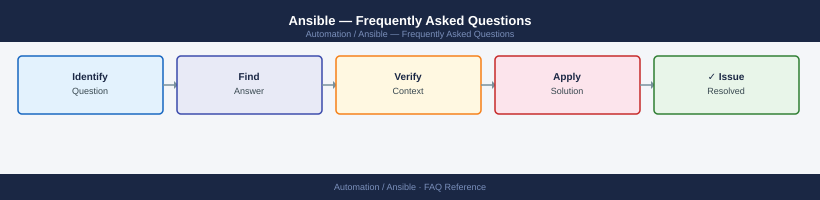

---
tags:
  - ansible
  - faq
  - operations
---
# Ansible — Frequently Asked Questions

Common questions about Ansible operations, configuration, and troubleshooting. For step-by-step procedures, see the <a href="index.md">Operations</a> section.

## General

**Q: What version of Ansible is recommended for enterprise deployments?**
A: Ansible 2.15+ (the current stable branch) is recommended. Avoid 2.9.x for new deployments; it lacks many modern collection features. Run `ansible --version` to check.

**Q: How do I check the current Ansible version?**
A: `ansible --version`

## Configuration

**Q: What is the default inventory format and when should it be changed?**
A: INI format is the default. Switch to YAML inventory when you need groups-of-groups, host vars inline, or dynamic inventory merging — YAML is easier to read at scale.

**Q: How do I enable fact caching to speed up large playbooks?**
A: Set `fact_caching = jsonfile` and `fact_caching_connection = /tmp/ansible_facts` in `ansible.cfg`. Facts are cached per host for `fact_caching_timeout` seconds (default 86400).

## Operations

**Q: How do I perform a rolling upgrade without downtime?**
A: Use `serial: 1` (or a percentage like `serial: 20%`) in your play definition. Combined with `max_fail_percentage: 0`, this ensures Ansible aborts on the first host failure before continuing.

**Q: What is the correct procedure to add a new managed host?**
A: Add the hostname to inventory, ensure SSH key is distributed (`ssh-copy-id`), then run `ansible hostname -m ping` to verify connectivity before including it in playbook runs.

## Troubleshooting

**Q: Ansible shows 'DEPRECATION WARNING: Distribution Ubuntu 20.04 on host X should use /usr/bin/python3'. What does it mean?**
A: The `ansible_python_interpreter` is not set explicitly. Add `ansible_python_interpreter=/usr/bin/python3` to host_vars or inventory group_vars to suppress and ensure correct interpreter.

**Q: Performance is slow on large inventories — where do I start?**
A: Check `forks` in `ansible.cfg` (default 5, raise to 20-50). Enable pipelining (`pipelining = True`). Enable fact caching. Use `--limit` to scope runs. Profile with `PROFILE_TASKS` callback.

## Backup and Recovery

**Q: How often should I back up Ansible inventory and playbooks?**
A: Store everything in Git. Commit after every change. For AWX/Tower, export job templates and credentials via `awx export` weekly and store in version control.

**Q: Can I restore a single role without a full repository restore?**
A: Yes — use `git checkout <commit> -- roles/rolename/` to restore a specific role from history without touching other files.

## See Also

- [Ansible Operations](index.md)
- [Ansible Troubleshooting](../../troubleshooting//)
