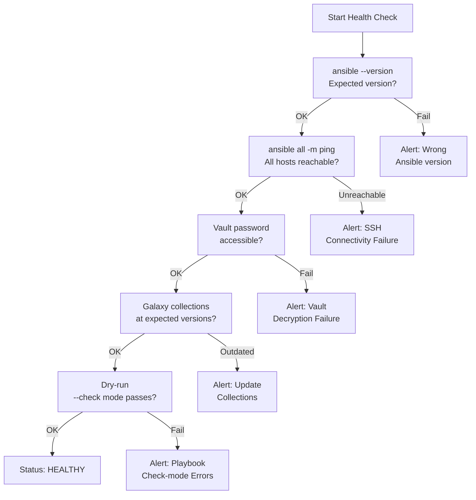

# Ansible — Health Checks

> Part of the [Ansible Operations](../index.md) reference.

---

## Ansible Health Check Flow


┌─────────────────────────────────────── Ansible — Health Checks ───────────────────────────────────────┐
│   ┌───────────────────────────────────────────────────────────────────────────────────────────────┐   │
│   │ Ansible health checks: verify control node, AWX services, connectivity, and job success rates │   │
│   │     Control node: check ansible version, Python version, SSH connectivity to managed nodes    │   │
│   │         AWX: check service pods (Kubernetes), job queue depth, credential expiry dates        │   │
│   └───────────────────────────────────────────────────────────────────────────────────────────────┘   │
│                                                                                                       │
│   ┌──────────────────────────────────────────────┐  ┌─────────────────────────────────────────────┐   │
│   │             Control Node Checks              │  │                  AWX Checks                 │   │
│   │              ansible --version               │  │           kubectl get pods -n awx           │   │
│   │       ansible all -m ping (all hosts)        │  │         AWX UI: Dashboard job stats         │   │
│   │       ansible-inventory --list --graph       │  │        awx jobs list --status failed        │   │
│   │       Check Vault password accessible        │  │        Check credential expiry dates        │   │
│   │         Verify EE images are current         │  │         AWX capacity: forks headroom        │   │
│   └──────────────────────────────────────────────┘  └─────────────────────────────────────────────┘   │
│                                                                                                       │
│   ┌───────────────────────────────────────────────────────────────────────────────────────────────┐   │
│   │ansible all -m ping   = fastest connectivity check; returns pong on success, unreachable on fai│   │
│   │      Job success rate      = AWX dashboard; alert if >5% failure rate over rolling 7 days     │   │
│   │      EE freshness          = execution environment images; rebuild if base OS CVEs exist      │   │
│   └───────────────────────────────────────────────────────────────────────────────────────────────┘   │
└───────────────────────────────────────────────────────────────────────────────────────────────────────┘
```
