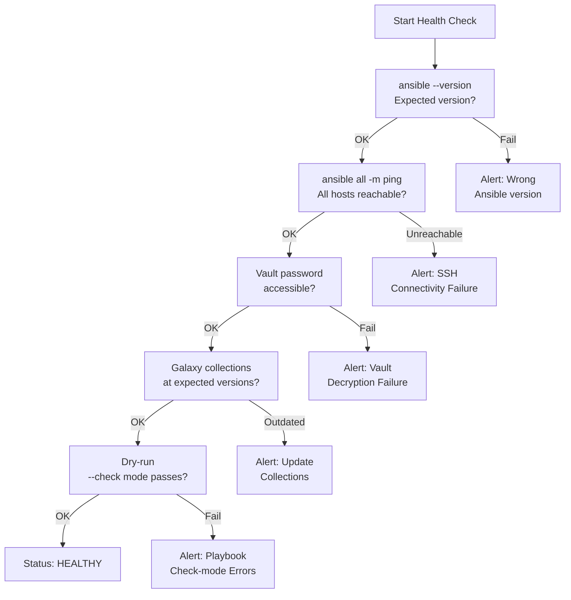

# Ansible — Health Checks

> Part of the [Ansible Operations](../index.md) reference.

---

## Ansible Health Check Flow

```mermaid
flowchart TD
    start["Start Health Check"] --> checkVersion["ansible --version\nExpected version?"]
    checkVersion -->|OK| pingAll["ansible all -m ping\nAll hosts reachable?"]
    checkVersion -->|Fail| alertVersion["Alert: Wrong\nAnsible version"]
    pingAll -->|OK| checkVault["Vault password\naccessible?"]
    pingAll -->|Unreachable| alertPing["Alert: SSH\nConnectivity Failure"]
    checkVault -->|OK| checkCollections["Galaxy collections\nat expected versions?"]
    checkVault -->|Fail| alertVault["Alert: Vault\nDecryption Failure"]
    checkCollections -->|OK| checkDryRun["Dry-run\n--check mode passes?"]
    checkCollections -->|Outdated| alertCollections["Alert: Update\nCollections"]
    checkDryRun -->|OK| healthy["Status: HEALTHY"]
    checkDryRun -->|Fail| alertDryRun["Alert: Playbook\nCheck-mode Errors"]
```
