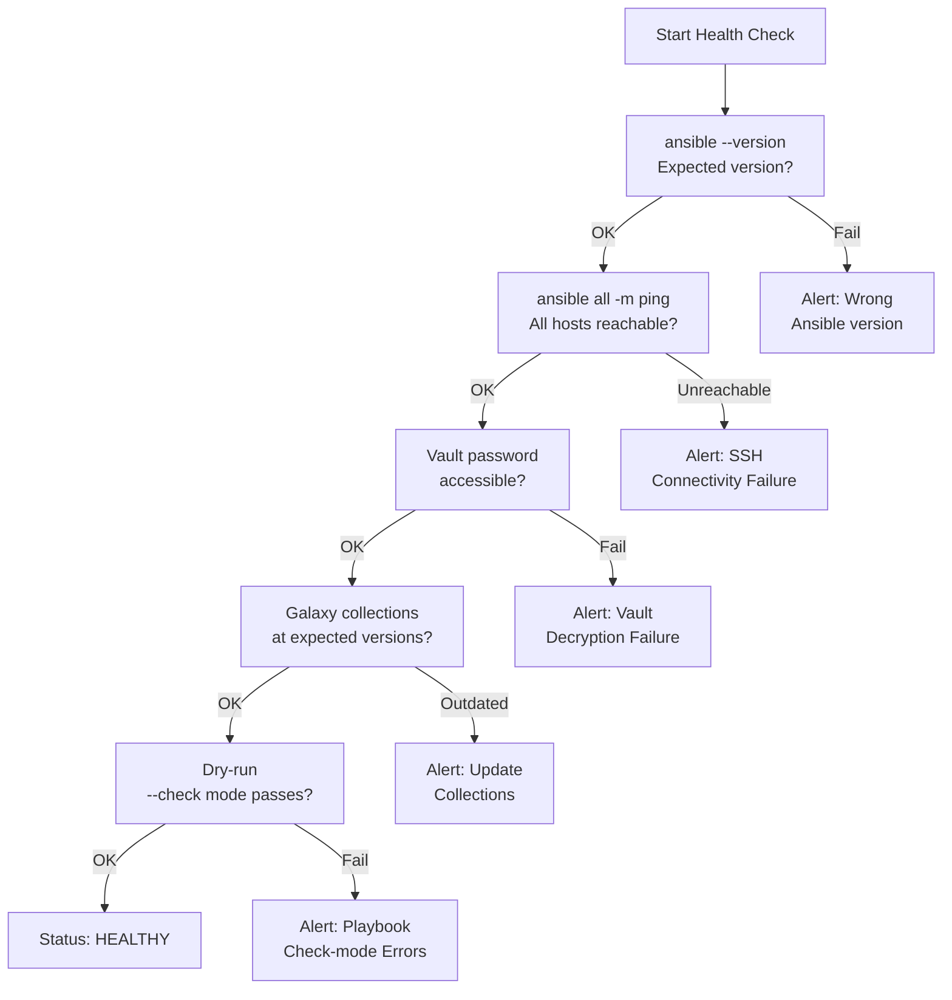

# Ansible — Health Checks

> Part of the [Ansible Operations](../index.md) reference.

---

## Ansible Health Check Flow



## Daily Checks

| Check | Command | Notes |
|---|---|---|
| Review scheduled playbook run results in AWX/Tower job history | | |
| Check AWX/Tower dashboard for job failures and review failure output | | |
| Validate dynamic inventory sources are returning the expected hosts | | |
| Review Vault-encrypted variable files for secrets nearing expiry | | |
| Confirm Galaxy roles and collections are current and not deprecated | | |
| Verify control node SSH key access to all critical host groups | | |
| Check for playbooks pinned to deprecated module names or legacy syntax | | |
| Confirm Python version on target hosts meets minimum Ansible requirements | | |

## Health Check

- [ ] Control node can reach all target hosts via SSH
- [ ] `ansible --version` reports expected Ansible core version
- [ ] Inventory returns the correct host count for all groups
- [ ] Vault password/file is accessible to the control node
- [ ] Galaxy collections are installed and at expected versions
- [ ] A `--check` run against a representative playbook completes without errors
- [ ] AWX/Tower API is reachable and job templates are visible
- [ ] Become/sudo access works on a representative target host

```bash
# Ansible version
ansible --version

# Ping all hosts in inventory
ansible all -m ping -i inventory/

# List hosts in a group
ansible <group> --list-hosts -i inventory/

# Syntax check a playbook
ansible-playbook site.yml --syntax-check -i inventory/

# Dry-run (check mode) against a group
ansible-playbook site.yml --check --limit <group> -i inventory/

# List installed collections
ansible-galaxy collection list
```
