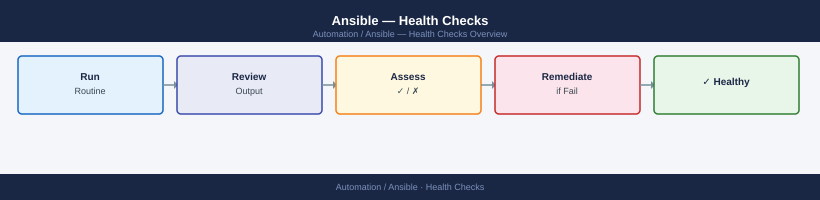

---
tags:
  - ansible
  - operations
---
# Ansible — Health Checks


<div class="kb-summary">
Health Checks reference covering Inventory Health, Connectivity, Vault and Secrets, AWX / Automation Platform.

*Applies to: Ansible 2.14+*
</div>



```d2
direction: right

begin_checks: "Begin Checks" {shape: oval}
run_this_routine: "Run This Routine" {shape: rectangle}
connectivity: "Connectivity" {shape: rectangle}
vault_and_secrets: "Vault and Secrets" {shape: rectangle}
awx_automation_platform: "AWX / Automation Platform" {shape: rectangle}
ansible_health_check_flow: "Ansible Health Check Flow" {shape: rectangle}
verify: "Verify" {shape: rectangle}
generate_report: "Generate Report" {shape: oval}

begin_checks -> run_this_routine
run_this_routine -> connectivity
connectivity -> vault_and_secrets
vault_and_secrets -> awx_automation_platform
awx_automation_platform -> ansible_health_check_flow
ansible_health_check_flow -> verify
verify -> generate_report
```

## Before you begin

- **Access:** SSH key or service account with sudo on managed hosts; Ansible control node
- **Timing:** safe to run during business hours unless a step is marked ⚠ (causes interruption)
- **Dependencies:** no active upgrades or migrations on the same infrastructure
- **Logging:** capture command output — paste into the change record on completion

---

## Run This Routine

```bash
# 1. Ansible version
ansible --version

# 2. Inventory check — verify host count
ansible-inventory --list -i <inventory> | python3 -m json.tool | grep -c "hosts"

# 3. Connectivity test — should return empty (no failures)
ansible all -i <inventory> -m ping --one-line | grep -v "SUCCESS"

# 4. Vault status — test decrypt
ansible-vault view <encrypted-file> --vault-password-file <vault-pass>

# 5. Role syntax check
ansible-playbook --syntax-check <playbook.yml>

# 6. AWX/AAP job queue — review recent failures (if using Tower/AAP)
awx jobs list --status failed --count 20

# 7. Facts gather test
ansible <host> -m setup -a 'filter=ansible_distribution' -i <inventory>

# 8. Collection versions
ansible-galaxy collection list
```


**Count hosts per group**

```bash
ansible-inventory --list -i <inventory> | python3 -m json.tool | grep -c "hosts"
```

**Validate inventory syntax**

```bash
ansible-inventory --list -i <inventory> --yaml
```

**Check for unreachable hosts in a dry run**

```bash
ansible all -i <inventory> -m ping --one-line 2>&1 | grep -E "UNREACHABLE|FAILED"
```

**Key health indicators**

| Indicator | Healthy | Action Required |
|---|---|---|
| Host count per group | Matches expected | Investigate additions or removals |
| No parse errors | Clean `--list` output | Fix syntax in inventory file |
| Dynamic inventory plugin | Returns current data | Check plugin credentials and API connectivity |
| Group variable files | Present and readable | Fix permissions or missing files |

---

## Connectivity

SSH connectivity must be confirmed before any playbook run. Unreachable hosts cause partial execution and can leave managed systems in an inconsistent state.

**Ping all hosts**

```bash
ansible all -i <inventory> -m ping
```

**Ping a specific group**

```bash
ansible <group> -i <inventory> -m ping
```

**Test with verbose output to see SSH details**

```bash
ansible all -i <inventory> -m ping -vvv 2>&1 | grep -E "SSH|ESTABLISH|FAILED"
```

**Check SSH key and user**

```bash
ansible all -i <inventory> -m command -a "whoami" --become
```

**Verify Python interpreter on managed nodes**

```bash
ansible all -i <inventory> -m command -a "python3 --version"
```

**Key health indicators**

| Indicator | Healthy | Action Required |
|---|---|---|
| Ping response | `pong` for all hosts | Check SSH keys, firewall, and host availability |
| SSH key authentication | No password prompts | Add or rotate SSH keys |
| Python interpreter | Python 3.x present | Install Python 3 on managed node |
| Become (sudo) | No privilege errors | Check sudoers configuration on target |

---

## Vault and Secrets

Ansible Vault encrypts sensitive variables. Confirm that vault-encrypted files can be decrypted and that vault passwords are accessible to the automation process.

**Test vault decryption**

```bash
ansible-vault view <encrypted-file> --vault-password-file <vault-pass>
```

**Verify vault-encrypted variable is readable in a playbook context**

```bash
ansible all -i <inventory> -m debug -a "var=<vault_variable>" --vault-password-file <vault-pass>
```

**Re-key vault file (rotate vault password)**

```bash
ansible-vault rekey <encrypted-file> --vault-password-file <old-vault-pass> --new-vault-password-file <new-vault-pass>
```

**List all vault-encrypted files in the project**

```bash
grep -rl '\$ANSIBLE_VAULT' . --include="*.yml" --include="*.yaml"
```

**Key health indicators**

| Indicator | Healthy | Action Required |
|---|---|---|
| Vault decrypt | No errors | Check vault password file path and permissions |
| Vault password file | Readable by automation user | Fix file permissions (`chmod 600`) |
| Encrypted variables in playbook | Resolve correctly at runtime | Confirm `--vault-password-file` path or `ANSIBLE_VAULT_PASSWORD_FILE` env var |
| Vault password rotation | Completed on schedule | Re-key all encrypted files after rotation |

---

## AWX / Automation Platform

AWX (open source) and Red Hat Ansible Automation Platform (AAP) provide a centralised job scheduler, RBAC, and credential store. Health checks here focus on service availability and job queue status.

**List recent failed jobs**

```bash
awx jobs list --status failed --count 20
```

**List running jobs**

```bash
awx jobs list --status running
```

**Check AWX service pods (Kubernetes deployment)**

```bash
kubectl get pods -n awx
```

All pods should show `Running` status. Pods in `CrashLoopBackOff` or `Error` state require immediate investigation.

**Check AWX capacity (forks headroom)**

```bash
awx instances list
```

Review the `capacity` and `consumed_capacity` fields. High consumption indicates a need to scale the instance group.

**Review credential expiry**

In the AWX/AAP UI, navigate to **Resources → Credentials** and check for credentials with upcoming expiry dates (API tokens, SSH keys, cloud credentials).

**Key health indicators**

| Indicator | Healthy | Action Required |
|---|---|---|
| Failed job rate | <5% over 7 days | Investigate recurring failures |
| AWX pods | All `Running` | Restart failing pods; check logs |
| Instance capacity | <80% consumed | Scale instance group or reduce concurrent jobs |
| Credential expiry | >30 days remaining | Rotate and update credentials |
| Job queue depth | Low, clearing quickly | Add capacity if queue persists |

---

## Ansible Health Check Flow
> Part of the [Ansible Operations](../index.md) reference.

---

## Verify

- Confirm the operation completed without errors in the log or management UI
- Verify the expected state change is visible (service running, object created, config applied)
- Document the outcome in the change record

---

## See also

- [Ansible — Procedures](../procedures/)
- [Ansible — CLI Reference](../cli-reference/)
- [Ansible — Common Issues](../../troubleshooting/common-issues/)
