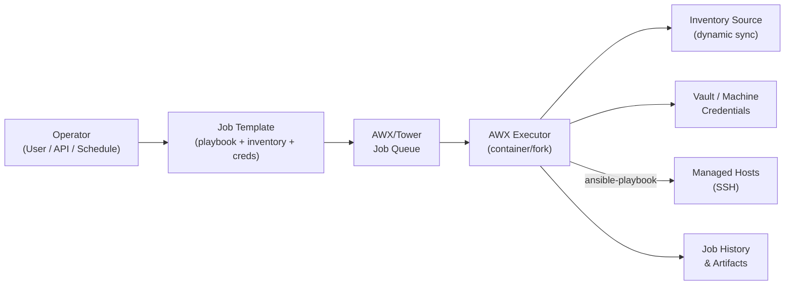

---
tags:
  - ansible
  - operations
---
# Ansible — Procedures


<div class="kb-summary">
Ansible operational procedures: deploying playbooks, managing inventory sources, rotating vault passwords, and promoting changes from dev to production environments.

*Applies to: Ansible 2.14+*
</div>

---

## Before you begin

- **Access:** SSH key or service account with sudo on managed hosts; Ansible control node
- **Timing:** safe to run during business hours unless a step is marked ⚠ (causes interruption)
- **Dependencies:** no active upgrades or migrations on the same infrastructure
- **Logging:** capture command output — paste into the change record on completion

---

## Change Readiness

- [ ] Playbook tested in staging environment or validated with `--check` mode
- [ ] Inventory validated — `--list-hosts` confirms correct target scope
- [ ] Vault secrets are accessible (vault password file or prompt configured)
- [ ] `--limit` flag set to scope the run to the correct host group or pattern
- [ ] Rollback playbook or manual revert procedure documented
- [ ] `--tags` or `--skip-tags` configured if running a subset of tasks
- [ ] Syntax check passes: `ansible-playbook site.yml --syntax-check`

| Item | Status | Notes |
|---|---|---|
| Staging / check-mode run | | Pass / Fail |
| Inventory scope (`--limit`) | | Host group or pattern |
| Vault access confirmed | | Yes / No |
| Rollback procedure | | Link to runbook |
| Syntax check | | Pass / Fail |

## Incident Triage

- [ ] Re-run the playbook with `-v` (verbose) or `-vvv` (very verbose) to capture detailed output
- [ ] Test SSH connectivity to the failing target host manually
- [ ] Validate `become`/sudo access on the target host
- [ ] Check the inventory source — confirm the failing host is listed and reachable
- [ ] Confirm the correct Python interpreter is available on the target
- [ ] Review Ansible log file if logging is configured (`log_path` in ansible.cfg)
- [ ] Check if a Vault-encrypted variable file failed to decrypt
- [ ] Confirm no module or collection version mismatch between control node and requirements

| Question | Answer |
|---|---|
| Is the target host reachable via SSH? | `ssh -i <key> user@host` |
| Does become/sudo work? | `ansible <host> -m shell -a "id" --become` |
| Is the Vault password accessible? | Check vault password file/env var |
| Is the inventory returning the host? | `ansible <group> --list-hosts` |
| Is the correct Python available? | `ansible_python_interpreter` set? |

## Maintenance Window

1. Disable AWX/Tower scheduled jobs or comment out cron entries for the affected playbooks during the window.
2. Notify team of the maintenance window and the scope of playbook changes.
3. Take a snapshot or backup of configuration files on target hosts if the playbook makes destructive changes.
4. Run the playbook with `--check` immediately before the window to confirm expected task list.
5. Execute the playbook with `--limit` scoped to the target group; monitor output.
6. If a failure occurs mid-run, stop and execute the rollback playbook or manual revert.
7. Re-enable AWX/Tower scheduled jobs or cron entries after successful completion.
8. Confirm idempotency with a follow-up `--check` run.

## Post-Change Validation

- [ ] Re-run the playbook in `--check` mode — confirm zero tasks report changes (idempotent)
- [ ] Full re-run produces no unexpected changes on any host
- [ ] Target service or application is healthy and responding
- [ ] AWX/Tower scheduled jobs re-enabled and showing green on next run
- [ ] Ansible log or AWX job output shows no errors or warnings
- [ ] Inventory still returns the expected host count for all groups
- [ ] Vault-encrypted variables still decrypt successfully

## Ansible Tower / AWX Job Launch Sequence


```text
┌──────────────────────────────────────── Ansible — Procedures ─────────────────────────────────────────┐
│   ┌───────────────────────────────────────────────────────────────────────────────────────────────┐   │
│   │        Common Ansible ops: rolling OS patching, credential rotation, inventory cleanup        │   │
│   │    Pre-run: verify inventory is current, check mode first, confirm Vault password available   │   │
│   │     Post-run: review output for warnings, verify app health, update runbook with outcomes     │   │
│   └───────────────────────────────────────────────────────────────────────────────────────────────┘   │
│                                                                                                       │
│   ┌──────────────────────────────────────────────┐  ┌─────────────────────────────────────────────┐   │
│   │          Rolling OS Patch Procedure          │  │             Credential Rotation             │   │
│   │          1. Run check mode: --check          │  │         1. Generate new SSH key pair        │   │
│   │           2. Review changed tasks            │  │         2. Add new pub key to hosts         │   │
│   │         3. Execute serial:1 (canary)         │  │           3. Update AWX credential          │   │
│   │        4. Verify app health per host         │  │         4. Remove old key from hosts        │   │
│   │         5. Increase serial, continue         │  │            5. Verify connectivity           │   │
│   └──────────────────────────────────────────────┘  └─────────────────────────────────────────────┘   │
│                                                                                                       │
│   ┌───────────────────────────────────────────────────────────────────────────────────────────────┐   │
│   │     serial: 1     = run one host at a time; ensures app stays available during rolling ops    │   │
│   │    max_fail_pct  = max_fail_percentage: 0 → abort if any host fails; safe for prod changes    │   │
│   │     pre_tasks     = tasks that run before roles in a play; use for health checks and drain    │   │
│   └───────────────────────────────────────────────────────────────────────────────────────────────┘   │
└───────────────────────────────────────────────────────────────────────────────────────────────────────┘
```

### Tags

Tags let you selectively run subsets of tasks without editing the playbook.

```yaml
tasks:
  - name: Install packages
    ansible.builtin.apt:
      name: "{{ item }}"
      state: present
    loop: "{{ packages }}"
    tags:
      - packages
      - install

  - name: Deploy config
    ansible.builtin.template:
      src: app.conf.j2
      dest: /etc/app/app.conf
    tags:
      - config
      - deploy
```

```bash
# Run only tasks tagged 'config'
ansible-playbook site.yml --tags config

# Skip tasks tagged 'packages'
ansible-playbook site.yml --skip-tags packages

# List all tags in a playbook
ansible-playbook site.yml --list-tags

# Dry-run (check mode)
ansible-playbook site.yml --check --diff
```

### Running Playbooks

| Flag | Purpose |
|---|---|
| `-i inventory/` | Specify inventory path |
| `--limit web01` | Target a subset of hosts |
| `--check` | Dry run, no changes made |
| `--diff` | Show file diffs on changes |
| `-v / -vvv` | Increase verbosity |
| `--start-at-task "name"` | Resume from a specific task |
| `--tags / --skip-tags` | Filter by tag |
| `-e "key=value"` | Pass extra variables |

```bash
# Standard run
ansible-playbook -i inventory/ site.yml

# Limit to one host with verbose output
ansible-playbook -i inventory/ site.yml --limit web01 -vv

# Run only deploy-tagged tasks on production
ansible-playbook -i inventory/ site.yml --tags deploy --limit production
```

## Roles

Roles provide a standardised way to organise tasks, variables, files, and templates.

```bash
roles/
  nginx/
    tasks/
      main.yml        # entry point — all tasks
    handlers/
      main.yml        # handlers referenced by tasks
    templates/
      nginx.conf.j2   # Jinja2 templates
    files/
      index.html      # static files to copy
    vars/
      main.yml        # high-priority role vars
    defaults/
      main.yml        # low-priority defaults (overridable)
    meta/
      main.yml        # role metadata and dependencies
    README.md
```

Create a skeleton with `ansible-galaxy`:

```bash
ansible-galaxy role init roles/nginx
```

### defaults and vars

`defaults/main.yml` holds low-priority variables that callers can override. `vars/main.yml` holds higher-priority values not intended to be overridden.

```yaml
# roles/nginx/defaults/main.yml
nginx_port: 80
nginx_worker_processes: auto
nginx_keepalive_timeout: 65
nginx_log_dir: /var/log/nginx

# roles/nginx/vars/main.yml
nginx_pid_file: /run/nginx.pid
nginx_conf_dir: /etc/nginx
```

### meta and Dependencies

The `meta/main.yml` file declares role metadata and dependencies that Ansible resolves before running the role.

```yaml
# roles/nginx/meta/main.yml
galaxy_info:
  author: your_name
  description: Install and configure nginx
  license: MIT
  min_ansible_version: "2.12"
  platforms:
    - name: Ubuntu
      versions:
        - "22.04"
        - "24.04"

dependencies:
  - role: common
    vars:
      common_packages:
        - curl
        - ca-certificates
```

### Using Roles in Playbooks

```yaml
# site.yml
---
- name: Configure web servers
  hosts: webservers
  become: true
  roles:
    - common
    - role: nginx
      vars:
        nginx_port: 443
    - role: certbot
      when: ssl_enabled | default(true)
```

Roles can also be called as tasks with `ansible.builtin.include_role`:

```yaml
tasks:
  - name: Apply nginx role conditionally
    ansible.builtin.include_role:
      name: nginx
    vars:
      nginx_port: 8080
    when: install_nginx | default(true)
```

### Ansible Galaxy

| Command | Purpose |
|---|---|
| `ansible-galaxy role install geerlingguy.nginx` | Install a role from Galaxy |
| `ansible-galaxy role install -r requirements.yml` | Install from requirements file |
| `ansible-galaxy role list` | List installed roles |
| `ansible-galaxy role remove geerlingguy.nginx` | Remove a role |
| `ansible-galaxy role init roles/myrole` | Scaffold a new role |

```yaml
# requirements.yml
roles:
  - name: geerlingguy.nginx
    version: "3.2.0"
  - name: geerlingguy.postgresql
    version: "3.4.1"
collections:
  - name: community.general
    version: ">=8.0.0"
```

```bash
# Install all requirements
ansible-galaxy install -r requirements.yml

# Install to a specific path
ansible-galaxy role install -r requirements.yml -p roles/
```

## Inventory

### INI Format Inventory

The simplest inventory format uses INI-style grouping with hosts and optional inline variables.

```ini
# inventory/hosts.ini

[webservers]
web01.example.com
web02.example.com ansible_port=2222

[dbservers]
db01.example.com ansible_user=admin
db02.example.com

[production:children]
webservers
dbservers

[webservers:vars]
http_port=80
nginx_version=1.24
```

### YAML Format Inventory

YAML inventory is more expressive and suits complex nested group hierarchies.

```yaml
# inventory/hosts.yml
all:
  children:
    webservers:
      hosts:
        web01.example.com:
          ansible_port: 22
        web02.example.com:
          ansible_port: 2222
      vars:
        http_port: 80
    dbservers:
      hosts:
        db01.example.com:
          ansible_user: admin
        db02.example.com:
      vars:
        db_port: 5432
```

### Dynamic Inventory

Dynamic inventory plugins pull host data from external sources at runtime.

```bash
# Install the AWS collection
ansible-galaxy collection install amazon.aws

# Preview dynamic inventory output
ansible-inventory -i inventory/aws_ec2.yml --list

# Show as tree
ansible-inventory -i inventory/aws_ec2.yml --graph

# Run playbook against dynamic inventory
ansible-playbook -i inventory/aws_ec2.yml site.yml
```

```yaml
# inventory/aws_ec2.yml
plugin: amazon.aws.aws_ec2
regions:
  - eu-west-1
filters:
  instance-state-name: running
  tag:Environment: production
keyed_groups:
  - key: tags.Role
    prefix: role
hostnames:
  - private-ip-address
```

### host_vars and group_vars

Variable files scoped to individual hosts or groups, loaded automatically by Ansible.

```bash
# Recommended directory layout
inventory/
  hosts.yml
  host_vars/
    web01.example.com/
      main.yml        # host-specific vars
      vault.yml       # encrypted secrets
  group_vars/
    webservers/
      main.yml        # applied to all webservers
      vault.yml       # encrypted group secrets
    all/
      main.yml        # applied to every host
```

```yaml
# inventory/group_vars/webservers/main.yml
nginx_worker_processes: auto
nginx_keepalive_timeout: 65
ssl_certificate: /etc/ssl/certs/web.crt
```

### Grouping Strategies

| Pattern | Syntax example | Purpose |
|---|---|---|
| Static group | `[webservers]` | Manually listed hosts |
| Child group | `[prod:children]` | Group that contains other groups |
| Inline group vars | `[web:vars]` | Variables applied to group |
| Range expansion | `web[01:05]` | Generates web01 through web05 |
| Regex match | `~web\d+\.example\.com` | Pattern-matched host names |

### Inventory Commands

```bash
# List all hosts
ansible-inventory -i inventory/ --list

# Show tree structure
ansible-inventory -i inventory/ --graph

# Test connectivity for all hosts
ansible -i inventory/ all -m ping

# Run ad-hoc command on a group
ansible -i inventory/ webservers -m shell -a "uptime"

# Inspect variables for one host
ansible-inventory -i inventory/ --host web01.example.com

# Check which groups a host belongs to
ansible -i inventory/ --list-hosts webservers
```

## Variables

### Variable Precedence

Ansible resolves variable conflicts using a strict precedence order. Higher numbers win.

| Priority | Source |
|---|---|
| 1 (lowest) | `defaults/main.yml` in a role |
| 2 | Inventory group_vars/all |
| 3 | Inventory group_vars/groupname |
| 4 | Inventory host_vars/hostname |
| 5 | Play `vars:` block |
| 6 | `vars_files:` |
| 7 | `include_vars` |
| 8 | `set_fact` / `register` |
| 9 | `vars/main.yml` in a role |
| 10 (highest) | `-e` / `--extra-vars` on CLI |

### Defining and Using Variables

```yaml
# In a play vars block
- hosts: webservers
  vars:
    app_port: 8080
    app_user: webapp
    deploy_dir: /opt/app

  tasks:
    - name: Create deploy directory
      ansible.builtin.file:
        path: "{{ deploy_dir }}"
        owner: "{{ app_user }}"
        state: directory
        mode: '0755'
```

### extra-vars at Runtime

Extra vars passed on the command line override everything else.

```bash
# Simple key=value pairs
ansible-playbook site.yml -e "app_env=production app_version=2.1.0"

# JSON string for complex data
ansible-playbook site.yml -e '{"app_port": 9090, "debug": true}'

# From a vars file
ansible-playbook site.yml -e @vars/prod.yml
```

### Register and Facts

`register` captures a task's output as a variable for use in subsequent tasks.

```yaml
- name: Get current kernel version
  ansible.builtin.command: uname -r
  register: kernel_version

- name: Show kernel
  ansible.builtin.debug:
    msg: "Kernel: {{ kernel_version.stdout }}"

- name: Reboot if kernel changed
  ansible.builtin.reboot:
  when: kernel_version.stdout != expected_kernel
```

Ansible facts are automatically gathered variables about managed hosts:

```yaml
- name: Show OS details
  ansible.builtin.debug:
    msg: "{{ ansible_distribution }} {{ ansible_distribution_version }}"

- name: Set timezone based on datacenter
  ansible.builtin.timezone:
    name: "Europe/Athens"
  when: ansible_hostname | regex_search('^dc1')
```

### Vault Variables

Sensitive values should be stored in encrypted vault files rather than plaintext.

```bash
# Create an encrypted vars file
ansible-vault create group_vars/all/vault.yml

# Edit an existing vault file
ansible-vault edit group_vars/all/vault.yml

# Encrypt a single value for inline use
ansible-vault encrypt_string 'mypassword' --name 'db_password'
```

```yaml
# group_vars/all/vault.yml (encrypted at rest)
vault_db_password: "s3cr3tpassword"
vault_api_key: "abc123xyz"

# group_vars/all/main.yml (plaintext, references vault vars)
db_password: "{{ vault_db_password }}"
api_key: "{{ vault_api_key }}"
```

### set_fact and Variable Manipulation

```yaml
- name: Build versioned artifact name
  ansible.builtin.set_fact:
    artifact_name: "app-{{ app_version }}-{{ ansible_date_time.date }}.tar.gz"

- name: Combine default and custom config
  ansible.builtin.set_fact:
    final_config: "{{ default_config | combine(custom_config, recursive=True) }}"

- name: Filter list of packages
  ansible.builtin.set_fact:
    required_packages: "{{ all_packages | select('match', '^python') | list }}"
```

---

## Verify

- Confirm the operation completed without errors in the log or management UI
- Verify the expected state change is visible (service running, object created, config applied)
- Document the outcome in the change record

---

## See also

- [Ansible — Health Checks](../health-checks/)
- [Ansible — CLI Reference](../cli-reference/)
- [Ansible — Common Issues](../../troubleshooting/common-issues/)
