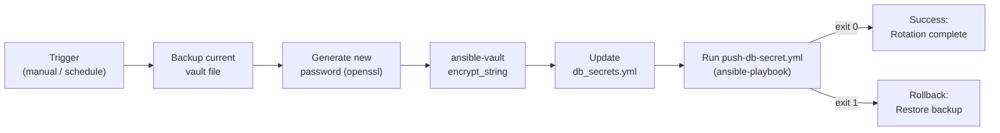

# Ansible — Scripts

> Part of the [Ansible Operations](../index.md) reference.

---

## Secret Rotation Workflow


┌────────────────────────────────────────── Ansible — Scripts ──────────────────────────────────────────┐
│   ┌───────────────────────────────────────────────────────────────────────────────────────────────┐   │
│   │Utility scripts for Ansible operations: inventory validation, bulk vault re-key, job report exp│   │
│   │   Scripts live in scripts/ at repo root; documented with usage header and example invocation  │   │
│   │     AWX API scripts: list failed jobs, cancel stuck jobs, export all job templates to JSON    │   │
│   └───────────────────────────────────────────────────────────────────────────────────────────────┘   │
│                                                                                                       │
│   ┌──────────────────────────────────────────────┐  ┌─────────────────────────────────────────────┐   │
│   │              Inventory Scripts               │  │               AWX API Scripts               │   │
│   │            validate_inventory.py             │  │             list_failed_jobs.py             │   │
│   │             compare_inventory.py             │  │             cancel_stuck_jobs.py            │   │
│   │            generate_host_vars.py             │  │           export_job_templates.py           │   │
│   │             prune_stale_hosts.py             │  │            rotate_credentials.py            │   │
│   └──────────────────────────────────────────────┘  └─────────────────────────────────────────────┘   │
│                                                                                                       │
│   ┌───────────────────────────────────────────────────────────────────────────────────────────────┐   │
│   │  AWX API     = REST API at /api/v2/; authenticate with bearer token; paginated JSON responses │   │
│   │        awx CLI     = official AWX CLI; wraps the REST API; install: pip install awxkit        │   │
│   │      awxkit     = Python library for AWX API; used by the awx CLI; importable in scripts      │   │
│   └───────────────────────────────────────────────────────────────────────────────────────────────┘   │
└───────────────────────────────────────────────────────────────────────────────────────────────────────┘
```

**Step 3 — Open the right terminal**

- **For .yml (Ansible):** Needs Linux or WSL. Open your WSL terminal.

**Step 4 — Run it**

```bash
cd ~
ansible-playbook infra-health-check.yml -i inventory/hosts.yml
```

**What you should see**

Ansible connects to each server in sequence and runs disk, load, and service checks. Each check prints a warning if thresholds are exceeded. At the end, a summary aggregates the results for all servers. If any servers are unreachable, they are flagged as UNREACHABLE.

---

## Rolling Update Playbook

Update a web application fleet one host at a time without downtime: drain from the load balancer, stop, update, start, health-check, and re-add. Stops immediately on first failure.

~~~yaml
---
# rolling-update.yml
# Usage: ansible-playbook rolling-update.yml -i inventory/hosts.yml
#        -e "app_package=myapp app_version=2.3.1 lb_api_url=http://lb.example.com/api lb_token=TOKEN"

- name: Rolling Application Update
  hosts: web_servers
  serial: 1
  max_fail_percentage: 0
  gather_facts: true

  vars:
    app_package:      "{{ app_package }}"
    app_version:      "{{ app_version }}"
    app_service:      "myapp"
    health_check_url: "http://{{ ansible_host }}:8080/health"
    health_check_retries: 10
    health_check_delay:   5
    lb_api_url:       "{{ lb_api_url }}"
    lb_token:         "{{ lb_token }}"
    drain_timeout:    30

  tasks:

    - name: Drain host from load balancer
      uri:
        url: "{{ lb_api_url }}/backends/{{ inventory_hostname }}/drain"
        method: POST
        headers:
          Authorization: "Bearer {{ lb_token }}"
          Content-Type: "application/json"
        body_format: json
        body:
          state: "drain"
        status_code: [200, 202]
      delegate_to: localhost
      register: drain_result

    - name: Wait for active connections to drop
      uri:
        url: "{{ lb_api_url }}/backends/{{ inventory_hostname }}/connections"
        method: GET
        headers:
          Authorization: "Bearer {{ lb_token }}"
        return_content: true
      register: conn_check
      until: (conn_check.json.active_connections | int) == 0
      retries: "{{ (drain_timeout / 5) | int }}"
      delay: 5
      delegate_to: localhost
      ignore_errors: true

    - name: Stop application service
      systemd:
        name: "{{ app_service }}"
        state: stopped
      become: true

    - name: Update application package
      package:
        name: "{{ app_package }}={{ app_version }}"
        state: present
      become: true
      register: package_update

    - name: Start application service
      systemd:
        name: "{{ app_service }}"
        state: started
        enabled: true
      become: true

    - name: Health check application endpoint
      uri:
        url: "{{ health_check_url }}"
        method: GET
        status_code: 200
        return_content: true
      register: health_check
      until: health_check.status == 200
      retries: "{{ health_check_retries }}"
      delay: "{{ health_check_delay }}"
      delegate_to: localhost

    - name: Re-add host to load balancer
      uri:
        url: "{{ lb_api_url }}/backends/{{ inventory_hostname }}/drain"
        method: POST
        headers:
          Authorization: "Bearer {{ lb_token }}"
          Content-Type: "application/json"
        body_format: json
        body:
          state: "active"
        status_code: [200, 202]
      delegate_to: localhost

    - name: Report update result for this host
      debug:
        msg: "{{ inventory_hostname }}: updated to {{ app_version }}, health OK, back in LB."
~~~

### How to run this script — step by step

**Before you start — what you need**
- Ansible installed on Linux or WSL
- SSH access to your web servers
- A load balancer with an API that supports draining/activating backends (the URLs in the playbook must match your LB's API)
- The application packaged as a system package that can be installed with `apt`/`yum`

**Step 1 — Save the file**

1. Open your WSL terminal
2. Create the file: `nano rolling-update.yml`
3. Paste the code, then press `Ctrl+X`, `Y`, `Enter` to save

**Step 2 — Fill in your details**

Most values are passed on the command line with `-e`. Update defaults in the `vars:` section as needed:

| Variable | What to enter | Where to find it |
|---|---|---|
| `app_service` | The systemd service name for your app | Run `systemctl list-units` on your server |
| `health_check_url` | The URL to check that your app is healthy | Your app's health endpoint |
| `drain_timeout` | Seconds to wait for connections to drain | Default: `30` |

**Step 3 — Open the right terminal**

- **For .yml (Ansible):** Needs Linux or WSL. Open your WSL terminal.

**Step 4 — Run it**

```bash
cd ~
ansible-playbook rolling-update.yml -i inventory/hosts.yml \
  -e "app_package=myapp app_version=2.3.1 lb_api_url=http://lb.example.com/api lb_token=YOUR_TOKEN"
```

**What you should see**

Ansible processes one server at a time. For each server you see: drain request, wait for connections to drop, service stop, package update, service start, health check (retries until 200 OK), then re-add to LB. If any step fails the playbook stops completely — no other servers are touched.

---

## Inventory Validation Playbook

Verify that every inventory host meets baseline configuration requirements: SSH access, Python, sudoers, required packages, hostname, NTP sync, and DNS resolution.

~~~yaml
---
# inventory-validate.yml
# Usage: ansible-playbook inventory-validate.yml -i inventory/hosts.yml

- name: Inventory Validation
  hosts: all
  gather_facts: true
  become: true

  vars:
    required_packages:
      - python3
      - curl
      - rsync
      - sudo
    ntp_service: "chronyd"   # or "ntp" depending on distro

  tasks:

    - name: Verify SSH connection
      ping:
      register: ssh_check

    - name: Verify Python is installed
      command: python3 --version
      register: python_check
      changed_when: false
      failed_when: false

    - name: Verify sudo access
      command: sudo -n true
      register: sudo_check
      changed_when: false
      failed_when: false

    - name: Check required packages
      package_facts:
        manager: auto

    - name: Flag missing packages
      set_fact:
        missing_packages: >-
          {{
            required_packages |
            reject('in', ansible_facts.packages.keys()) |
            list
          }}

    - name: Verify hostname matches inventory name
      set_fact:
        hostname_match: "{{ ansible_hostname == inventory_hostname.split('.')[0] }}"

    - name: Check NTP synchronisation
      command: "timedatectl show --property=NTPSynchronized --value"
      register: ntp_sync
      changed_when: false
      failed_when: false

    - name: Verify DNS resolution
      command: "getent hosts {{ inventory_hostname }}"
      register: dns_check
      changed_when: false
      failed_when: false
      delegate_to: localhost

    # Build per-host result
    - name: Compile validation results
      set_fact:
        validation_result:
          host:              "{{ inventory_hostname }}"
          ssh:               "{{ 'PASS' if ssh_check is defined else 'FAIL' }}"
          python:            "{{ 'PASS' if python_check.rc == 0 else 'FAIL' }}"
          sudo:              "{{ 'PASS' if sudo_check.rc == 0 else 'FAIL' }}"
          required_packages: "{{ 'PASS' if missing_packages | length == 0 else 'FAIL: missing ' + missing_packages | join(',') }}"
          hostname_match:    "{{ 'PASS' if hostname_match else 'FAIL (got ' + ansible_hostname + ')' }}"
          ntp_sync:          "{{ 'PASS' if ntp_sync.stdout == 'yes' else 'FAIL' }}"
          dns:               "{{ 'PASS' if dns_check.rc == 0 else 'FAIL' }}"

    - name: Print per-host validation table
      debug:
        msg:
          - "Host      : {{ validation_result.host }}"
          - "SSH       : {{ validation_result.ssh }}"
          - "Python    : {{ validation_result.python }}"
          - "Sudo      : {{ validation_result.sudo }}"
          - "Packages  : {{ validation_result.required_packages }}"
          - "Hostname  : {{ validation_result.hostname_match }}"
          - "NTP       : {{ validation_result.ntp_sync }}"
          - "DNS       : {{ validation_result.dns }}"

    - name: Persist results to controller
      set_fact:
        validation_result: "{{ validation_result }}"
      delegate_to: localhost
      delegate_facts: true

- name: Validation Summary
  hosts: localhost
  gather_facts: false

  tasks:
    - name: Identify non-compliant hosts
      set_fact:
        non_compliant: >-
          {{
            groups['all'] |
            map('extract', hostvars) |
            selectattr('validation_result', 'defined') |
            selectattr('validation_result.ssh', 'ne', 'PASS') |
            map(attribute='validation_result.host') |
            list
          }}

    - name: Print non-compliant summary
      debug:
        msg: "Non-compliant hosts: {{ non_compliant }}"

    - name: Fail if any non-compliant hosts
      fail:
        msg: "Validation failed for: {{ non_compliant | join(', ') }}"
      when: non_compliant | length > 0
~~~

### How to run this script — step by step

**Before you start — what you need**
- Ansible installed on Linux or WSL
- SSH access to all the hosts in your inventory
- Your Ansible user must have sudo rights on the remote hosts

**Step 1 — Save the file**

1. Open your WSL terminal
2. Create the file: `nano inventory-validate.yml`
3. Paste the code, then press `Ctrl+X`, `Y`, `Enter` to save

**Step 2 — Fill in your details**

Update the `vars:` section to match your environment:

| Variable | What to enter | Where to find it |
|---|---|---|
| `required_packages` | List of packages every server must have | Your organisation's baseline requirements |
| `ntp_service` | Name of your NTP service | `chronyd` on RHEL/CentOS, `ntp` on older Debian |

**Step 3 — Open the right terminal**

- **For .yml (Ansible):** Needs Linux or WSL. Open your WSL terminal.

**Step 4 — Run it**

```bash
cd ~
ansible-playbook inventory-validate.yml -i inventory/hosts.yml
```

**What you should see**

For each host in your inventory, a table is printed showing PASS or FAIL for each check: SSH, Python, sudo, required packages, hostname, NTP, and DNS. At the end, a list of non-compliant hosts is shown. The playbook fails (exits non-zero) if any hosts fail the SSH check.

---

## Secret Rotation with Vault (Bash + Ansible)

Bash wrapper that generates a new database password, encrypts it into an Ansible Vault file, runs the playbook to push it to the database and app servers, and rolls back if the playbook fails.

~~~bash
#!/usr/bin/env bash
# rotate-db-secret.sh
# Usage: VAULT_PASSWORD_FILE=<path> DB_VARS_FILE=<path> ./rotate-db-secret.sh
#
# Requires: ansible, ansible-vault, openssl, python3

set -euo pipefail

VAULT_PASSWORD_FILE="${VAULT_PASSWORD_FILE:?VAULT_PASSWORD_FILE is required}"
DB_VARS_FILE="${DB_VARS_FILE:-vars/db_secrets.yml}"
PLAYBOOK="${PLAYBOOK:-playbooks/push-db-secret.yml}"
INVENTORY="${INVENTORY:-inventory/hosts.yml}"
BACKUP_FILE="/tmp/db_secrets_backup_$(date +%Y%m%d%H%M%S).yml"
LOGFILE="/var/log/secret-rotation-$(date +%Y%m%d-%H%M%S).log"

log() {
    local msg="[$(date '+%Y-%m-%d %H:%M:%S')] $*"
    echo "${msg}"
    echo "${msg}" >> "${LOGFILE}"
}

log "=== Database Secret Rotation ==="
log "Vars file : ${DB_VARS_FILE}"
log "Playbook  : ${PLAYBOOK}"

# --- Step 1: Backup current vault file ---
log "Step 1: Backing up current vars file to ${BACKUP_FILE}..."
cp "${DB_VARS_FILE}" "${BACKUP_FILE}"

# --- Step 2: Generate new password ---
log "Step 2: Generating new database password..."
NEW_PASSWORD=$(openssl rand -base64 32 | tr -d '=+/' | cut -c1-24)
log "New password generated (not logged)."

# --- Step 3: Encrypt new password with Ansible Vault ---
log "Step 3: Encrypting new password with Ansible Vault..."
ENCRYPTED_VALUE=$(ansible-vault encrypt_string \
    --vault-password-file "${VAULT_PASSWORD_FILE}" \
    --stdin-name "db_password" <<< "${NEW_PASSWORD}")

# Update the vars file: replace the db_password line with new encrypted value.
python3 - <<EOF
import re, sys

with open('${DB_VARS_FILE}', 'r') as f:
    content = f.read()

new_content = re.sub(
    r'^db_password:.*?(?=^\w|\Z)',
    '',
    content,
    flags=re.MULTILINE | re.DOTALL
)

new_content = new_content.rstrip('\n') + '\n' + '''${ENCRYPTED_VALUE}''' + '\n'

with open('${DB_VARS_FILE}', 'w') as f:
    f.write(new_content)

print("Vars file updated.")
EOF

log "Vars file updated with new encrypted password."

# --- Step 4: Run Ansible playbook to push new password ---
log "Step 4: Running Ansible playbook to push new password..."
if ansible-playbook \
    --vault-password-file "${VAULT_PASSWORD_FILE}" \
    -i "${INVENTORY}" \
    -e "db_password=${NEW_PASSWORD}" \
    "${PLAYBOOK}" 2>&1 | tee -a "${LOGFILE}"; then
    log "Playbook succeeded. Secret rotation complete."
    log "Backup of old vars: ${BACKUP_FILE}"
else
    # --- Step 5: Rollback on failure ---
    log "ERROR: Playbook failed. Rolling back vars file from backup..."
    cp "${BACKUP_FILE}" "${DB_VARS_FILE}"
    log "Rollback complete. Old vars file restored."
    log "MANUAL ACTION REQUIRED: The database password was NOT successfully rotated."
    log "  Review playbook errors above and investigate before retrying."
    exit 1
fi
~~~

### How to run this script — step by step

**Before you start — what you need**
- Ansible and Ansible Vault installed on Linux or WSL
- `openssl` available (already installed on most Linux systems)
- A vault password file (a plain text file containing just the vault password)
- An existing Ansible Vault-encrypted vars file with a `db_password:` entry
- A playbook that applies the new password to your database servers

**Step 1 — Save the file**

1. Open your WSL terminal
2. Create the file: `nano rotate-db-secret.sh`
3. Paste the code, then press `Ctrl+X`, `Y`, `Enter` to save
4. Make it executable: `chmod +x rotate-db-secret.sh`

**Step 2 — Fill in your details**

| Variable | What to enter | Where to find it |
|---|---|---|
| `VAULT_PASSWORD_FILE` | Path to the file containing your Ansible Vault password | Wherever you store it securely |
| `DB_VARS_FILE` | Path to your encrypted vars file | Your Ansible project directory |
| `PLAYBOOK` | Path to the playbook that applies the new password | Your Ansible project directory |
| `INVENTORY` | Path to your inventory file | Your Ansible project directory |

**Step 3 — Open the right terminal**

- **For .sh (Bash):** Open your WSL terminal (Git Bash also works).

**Step 4 — Run it**

```bash
export VAULT_PASSWORD_FILE=/path/to/vault-password.txt
export DB_VARS_FILE=vars/db_secrets.yml
export PLAYBOOK=playbooks/push-db-secret.yml
bash rotate-db-secret.sh
```

**What you should see**

Step-by-step log messages showing: backup created, new password generated, password encrypted with Ansible Vault, vars file updated, playbook running. If the playbook succeeds you see a success message. If the playbook fails, the old vars file is automatically restored from backup and the script exits with an error so you can investigate.

---

## Windows: Run Ansible Playbooks from Windows via WSL (CMD Batch)

Ansible does not run natively on Windows. This batch file uses WSL (Windows Subsystem for Linux) to run your Ansible playbooks without leaving Windows.

~~~batch
@echo off
REM ansible-run.bat
REM Runs an Ansible playbook via WSL from Windows.

set PLAYBOOK=playbook.yml
set INVENTORY=inventory.ini
set EXTRA_VARS=

echo === Ansible Playbook Runner (via WSL) ===
echo Playbook  : %PLAYBOOK%
echo Inventory : %INVENTORY%
echo.

wsl --status >nul 2>&1
if %errorlevel% neq 0 (
    echo ERROR: WSL is not installed or not running.
    pause
    exit /b 1
)

if "%EXTRA_VARS%"=="" (
    wsl ansible-playbook /mnt/c/Users/%USERNAME%/Desktop/%PLAYBOOK% -i /mnt/c/Users/%USERNAME%/Desktop/%INVENTORY%
) else (
    wsl ansible-playbook /mnt/c/Users/%USERNAME%/Desktop/%PLAYBOOK% -i /mnt/c/Users/%USERNAME%/Desktop/%INVENTORY% -e "%EXTRA_VARS%"
)

if %errorlevel% equ 0 (
    echo.
    echo Playbook completed successfully.
) else (
    echo.
    echo Playbook FAILED. Check the output above for errors.
)

pause
~~~

---

## Windows: Ansible Inventory Ping Test (PowerShell + WSL)

Test that Ansible can reach all hosts in your inventory by running `ansible all -m ping` via WSL from PowerShell. Shows a count of successful and failed hosts.

~~~powershell
# ansible-ping-test.ps1
param(
    [Parameter(Mandatory)]
    [string]$InventoryFile
)

function ConvertTo-WslPath {
    param([string]$WindowsPath)
    $path = $WindowsPath.Replace('\', '/')
    if ($path -match '^([A-Za-z]):(.*)') {
        $drive = $Matches[1].ToLower()
        $rest  = $Matches[2]
        return "/mnt/$drive$rest"
    }
    return $path
}

$wslInventoryPath = ConvertTo-WslPath -WindowsPath $InventoryFile

Write-Host "`n=== Ansible Inventory Ping Test ===" -ForegroundColor Cyan
Write-Host "Inventory (Windows): $InventoryFile"
Write-Host "Inventory (WSL)    : $wslInventoryPath`n"

$output = wsl ansible all -m ping -i $wslInventoryPath 2>&1
$output | ForEach-Object { Write-Host $_ }

$successCount = ($output | Select-String "SUCCESS").Count
$failedCount  = ($output | Select-String "FAILED|UNREACHABLE").Count

Write-Host "`n--- Results ---" -ForegroundColor Cyan
Write-Host "Hosts reachable : $successCount" -ForegroundColor Green
if ($failedCount -gt 0) {
    Write-Host "Hosts failed    : $failedCount" -ForegroundColor Red
} else {
    Write-Host "Hosts failed    : $failedCount" -ForegroundColor Green
}

if ($failedCount -gt 0) {
    Write-Host "`nSome hosts failed. Check SSH keys and network connectivity." -ForegroundColor Yellow
    exit 1
}

Write-Host "`nAll hosts reachable." -ForegroundColor Green
~~~

---

## Daily Check Script

Check that scheduled Ansible jobs ran successfully. Reads the last Ansible log file for failures, pings all hosts in inventory, and counts reachable vs unreachable hosts.

```bash
#!/bin/bash
# ansible_daily_check.sh — Check Ansible automation health
INVENTORY="${INVENTORY_FILE:-/etc/ansible/hosts}"
ANSIBLE_LOG="${ANSIBLE_LOG_PATH:-/var/log/ansible.log}"
FAIL=0

check() { local l="$1"; shift; "$@" &>/dev/null && echo "[OK] $l" || { echo "[FAIL] $l"; FAIL=$((FAIL+1)); }; }

echo "=== Ansible Daily Check — $(date) ==="
check "Ansible installed" ansible --version
check "Inventory valid" ansible-inventory -i "$INVENTORY" --list

echo "Pinging inventory hosts..."
RESULT=$(ansible all -i "$INVENTORY" -m ping --one-line 2>/dev/null || true)
UNREACHABLE=$(echo "$RESULT" | grep -c "UNREACHABLE" || true)
SUCCESS=$(echo "$RESULT" | grep -c "SUCCESS" || true)
echo "  Reachable: $SUCCESS  |  Unreachable: $UNREACHABLE"
[[ $UNREACHABLE -gt 0 ]] && { echo "[FAIL] $UNREACHABLE host(s) unreachable"; FAIL=$((FAIL+1)); } || echo "[OK] All hosts reachable"

if [[ -f "$ANSIBLE_LOG" ]]; then
  RECENT_FAILS=$(tail -100 "$ANSIBLE_LOG" | grep -c "FAILED!" || true)
  [[ $RECENT_FAILS -gt 0 ]] && { echo "[WARN] $RECENT_FAILS FAILED task(s) in recent log"; } || echo "[OK] No recent task failures in log"
fi

echo ""; echo "Daily check: $FAIL failure(s)"
[[ $FAIL -gt 0 ]] && exit 2 || exit 0
```

---

## Incident Triage Script

Captures a full Ansible environment snapshot to a timestamped file for incident investigation.

```bash
#!/bin/bash
# ansible_incident_triage.sh — Capture Ansible environment snapshot for triage
INVENTORY="${INVENTORY_FILE:-/etc/ansible/hosts}"
ANSIBLE_LOG="${ANSIBLE_LOG_PATH:-/var/log/ansible.log}"
PLAYBOOK_DIR="${PLAYBOOK_DIR:-/etc/ansible/playbooks}"
OUTFILE="/tmp/ansible_triage_$(date +%Y%m%d_%H%M%S).txt"

{
  echo "=== Ansible Incident Triage — $(date) ==="
  echo ""
  echo "--- Ansible Version ---"
  ansible --version 2>&1
  echo ""
  echo "--- Inventory Host List ---"
  ansible-inventory -i "$INVENTORY" --list 2>&1 || ansible all -i "$INVENTORY" --list-hosts 2>&1
  echo ""
  echo "--- Last 100 Lines of Ansible Log ($ANSIBLE_LOG) ---"
  if [[ -f "$ANSIBLE_LOG" ]]; then
    tail -100 "$ANSIBLE_LOG"
  else
    echo "Log file not found: $ANSIBLE_LOG"
  fi
  echo ""
  echo "--- Host Connectivity (ansible ping) ---"
  ansible all -i "$INVENTORY" -m ping --one-line 2>&1 || true
  echo ""
  echo "--- Playbooks in \$PLAYBOOK_DIR ($PLAYBOOK_DIR) ---"
  if [[ -d "$PLAYBOOK_DIR" ]]; then
    find "$PLAYBOOK_DIR" -name "*.yml" -o -name "*.yaml" 2>/dev/null | sort
  else
    echo "Playbook directory not found: $PLAYBOOK_DIR"
  fi
  echo ""
  echo "--- Installed Collections ---"
  ansible-galaxy collection list 2>&1
  echo ""
  echo "--- Installed Roles ---"
  ansible-galaxy role list 2>&1
  echo ""
  echo "=== Triage complete ==="
} | tee "$OUTFILE"

echo ""
echo "Triage output saved to: $OUTFILE"
```

---

## Change Pre-Check Script

Run before executing a production playbook. Performs syntax check, pings all target hosts, verifies required collections, checks vault password availability, and executes a dry-run.

```bash
#!/bin/bash
# ansible_pre_check.sh — Pre-change validation before running a production playbook
PLAYBOOK="${PLAYBOOK:?PLAYBOOK is required}"
INVENTORY="${INVENTORY_FILE:-/etc/ansible/hosts}"
VAULT_PASSWORD_FILE="${VAULT_PASSWORD_FILE:-}"
REQUIRED_COLLECTIONS=("ansible.builtin" "community.general")
FAIL=0

fail() { echo "[FAIL] $1"; FAIL=$((FAIL+1)); }
ok()   { echo "[OK]   $1"; }

echo "=== Ansible Change Pre-Check — $(date) ==="
echo "Playbook : $PLAYBOOK"
echo "Inventory: $INVENTORY"
echo ""

echo "--- Syntax Check ---"
ansible-playbook --syntax-check -i "$INVENTORY" "$PLAYBOOK" &>/dev/null \
  && ok "Syntax check passed" \
  || fail "Syntax check FAILED — fix errors before proceeding"

echo ""
echo "--- Host Connectivity ---"
RESULT=$(ansible all -i "$INVENTORY" -m ping --one-line 2>/dev/null || true)
UNREACHABLE=$(echo "$RESULT" | grep -c "UNREACHABLE" || true)
[[ $UNREACHABLE -gt 0 ]] \
  && fail "$UNREACHABLE host(s) unreachable — cannot proceed" \
  || ok "All hosts reachable"

echo ""
echo "--- Required Collections ---"
for col in "${REQUIRED_COLLECTIONS[@]}"; do
  ansible-galaxy collection list 2>/dev/null | grep -q "${col//.//}" \
    && ok "Collection installed: $col" \
    || fail "Collection missing: $col (run: ansible-galaxy collection install $col)"
done

echo ""
echo "--- Vault Password ---"
if grep -rq "!vault" "$PLAYBOOK" 2>/dev/null || grep -rq "ansible_vault" "$PLAYBOOK" 2>/dev/null; then
  if [[ -n "$VAULT_PASSWORD_FILE" && -f "$VAULT_PASSWORD_FILE" ]]; then
    ok "Vault password file found: $VAULT_PASSWORD_FILE"
  else
    fail "Playbook uses vault but VAULT_PASSWORD_FILE not set or file missing"
  fi
else
  ok "No vault usage detected in playbook"
fi

echo ""
echo "--- Dry-Run (--check mode) ---"
VAULT_OPT=""
[[ -n "$VAULT_PASSWORD_FILE" && -f "$VAULT_PASSWORD_FILE" ]] && VAULT_OPT="--vault-password-file $VAULT_PASSWORD_FILE"
ansible-playbook --check -i "$INVENTORY" $VAULT_OPT "$PLAYBOOK" \
  && ok "Dry-run completed without errors" \
  || fail "Dry-run reported errors — review before proceeding"

echo ""
echo "Pre-check complete: $FAIL failure(s)"
[[ $FAIL -gt 0 ]] && exit 2 || exit 0
```

---

## Post-Change Validation Script

Run after a playbook completes to verify key outcomes using Ansible modules against target hosts.

```bash
#!/bin/bash
# ansible_post_validate.sh — Post-change validation using Ansible ad-hoc commands
INVENTORY="${INVENTORY_FILE:-/etc/ansible/hosts}"
FAIL=0
PASS=0

result() {
  local status="$1" label="$2"
  if [[ "$status" == "0" ]]; then
    echo "[PASS] $label"; PASS=$((PASS+1))
  else
    echo "[FAIL] $label"; FAIL=$((FAIL+1))
  fi
}

echo "=== Ansible Post-Change Validation — $(date) ==="
echo ""

echo "--- File Exists: /etc/ansible/ansible.cfg ---"
ansible all -i "$INVENTORY" -m stat \
  -a "path=/etc/ansible/ansible.cfg" --one-line 2>/dev/null \
  | grep -q '"exists": true' \
  && result 0 "Config file /etc/ansible/ansible.cfg exists on all hosts" \
  || result 1 "Config file /etc/ansible/ansible.cfg missing on one or more hosts"

echo ""
echo "--- Service Running: sshd ---"
ansible all -i "$INVENTORY" -m service \
  -a "name=sshd state=started" --check --one-line 2>/dev/null \
  | grep -qv "FAILED" \
  && result 0 "sshd running on all hosts" \
  || result 1 "sshd not running on one or more hosts"

echo ""
echo "--- Python3 Available ---"
ansible all -i "$INVENTORY" -m command \
  -a "python3 --version" --one-line 2>/dev/null \
  | grep -qv "FAILED" \
  && result 0 "python3 available on all hosts" \
  || result 1 "python3 missing on one or more hosts"

echo ""
echo "--- No Failed Systemd Services ---"
FAILED_SVCS=$(ansible all -i "$INVENTORY" -m command \
  -a "systemctl list-units --state=failed --no-legend --no-pager" \
  --one-line 2>/dev/null | grep -v "^$" | grep -v "SUCCESS" | grep -c "." || true)
result "$([[ $FAILED_SVCS -eq 0 ]] && echo 0 || echo 1)" \
  "No failed systemd units ($FAILED_SVCS host(s) reported failures)"

echo ""
echo "Post-change validation: $PASS PASS  |  $FAIL FAIL"
[[ $FAIL -gt 0 ]] && exit 2 || exit 0
```

---

## Health Check Script

Lightweight cron-safe health check reporting Ansible version, host reachability counts, installed collection count, and log error count in the last 24 hours.

```bash
#!/bin/bash
# ansible_health_check.sh — Cron-safe Ansible health check
# Exit codes: 0=healthy  1=warning  2=critical
INVENTORY="${INVENTORY_FILE:-/etc/ansible/hosts}"
ANSIBLE_LOG="${ANSIBLE_LOG_PATH:-/var/log/ansible.log}"
STATUS=0

stamp() { date '+%Y-%m-%d %H:%M:%S'; }

echo "=== Ansible Health Check — $(stamp) ==="

VERSION=$(ansible --version 2>/dev/null | head -1 || echo "UNAVAILABLE")
echo "Ansible version : $VERSION"
[[ "$VERSION" == "UNAVAILABLE" ]] && STATUS=2

RESULT=$(ansible all -i "$INVENTORY" -m ping --one-line 2>/dev/null || true)
REACHABLE=$(echo "$RESULT"  | grep -c "SUCCESS"     || true)
UNREACHABLE=$(echo "$RESULT" | grep -c "UNREACHABLE" || true)
echo "Hosts reachable : $REACHABLE  |  unreachable: $UNREACHABLE"
[[ $UNREACHABLE -gt 0 && $STATUS -lt 2 ]] && STATUS=2

COL_COUNT=$(ansible-galaxy collection list 2>/dev/null | grep -c "/" || true)
echo "Collections installed: $COL_COUNT"

if [[ -f "$ANSIBLE_LOG" ]]; then
  CUTOFF=$(date -d '24 hours ago' '+%Y-%m-%d %H:%M:%S' 2>/dev/null \
    || date -v-24H '+%Y-%m-%d %H:%M:%S' 2>/dev/null || echo "")
  if [[ -n "$CUTOFF" ]]; then
    ERR_COUNT=$(awk -v cutoff="$CUTOFF" '$0 >= cutoff' "$ANSIBLE_LOG" 2>/dev/null \
      | grep -c "FAILED!" || true)
  else
    ERR_COUNT=$(tail -200 "$ANSIBLE_LOG" | grep -c "FAILED!" || true)
  fi
  echo "Log errors (24h): $ERR_COUNT"
  [[ $ERR_COUNT -gt 0 && $STATUS -lt 1 ]] && STATUS=1
else
  echo "Log file       : not found ($ANSIBLE_LOG)"
fi

echo ""
case $STATUS in
  0) echo "Status: HEALTHY" ;;
  1) echo "Status: WARNING" ;;
  2) echo "Status: CRITICAL" ;;
esac
exit $STATUS
```
