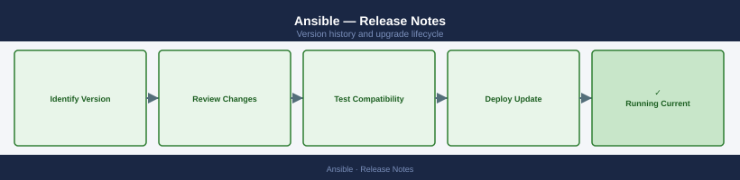

---
tags:
  - ansible
---
# Ansible — Release Notes

Version history and release notes for Ansible.

## Version History

| Version | Released | Summary | Notes |
|---------|----------|---------|-------|
| 2.17 | 2024-Q2 | Python 3.12 support, improved event-driven automation | [Release Notes](#) |
| 2.16 | 2023-Q4 | AAP 2.4 compatibility, collection loader rewrite | [Release Notes](#) |
| 2.15 | 2023-Q2 | Mitogen strategy improvements, fact caching backends | [Release Notes](#) |
| 2.14 | 2022-Q4 | ansible-core 2.14 LTS release, controller deprecations | [Release Notes](#) |
| 2.13 | 2022-Q2 | Python 3.8 minimum, task include_role refactor | [Release Notes](#) |

## Key Terminology

**Major Version**
: A release containing significant new features or architectural changes; may require additional planning and testing.

**Patch Release**
: A targeted fix release that addresses bugs or security issues within a major/minor version.

**EOL (End of Life)**
: Date after which the vendor no longer provides updates, security patches, or technical support.

**Upgrade Path**
: The supported sequence of versions a system must traverse to reach a target version (some versions cannot be skipped).

## Upgrade Path

Upgrade ansible-core via `pip install --upgrade ansible-core==<version>`. When moving to a new major version review the [porting guide](https://docs.ansible.com/ansible/latest/porting_guides/). Test all existing playbooks in a staging inventory before rolling to production controllers. For AAP, use the installer bundle and follow the in-place upgrade procedure documented in the AAP Installation Guide.
