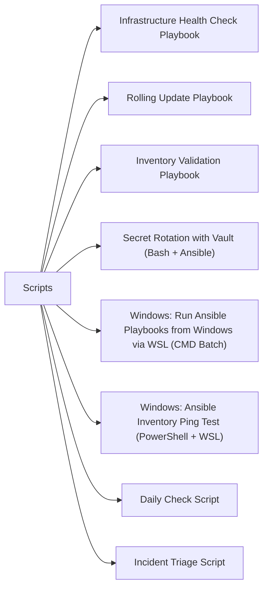

# Scripts

> Part of the [Ansible](../) reference.

---



## Infrastructure Health Check Playbook

A general-purpose health-check playbook targeting Linux server and network device groups. Reports disk usage, load average, failed services, and reboot time per host, with block/rescue error handling and a delegated summary at the end.

~~~yaml
---
# infra-health-check.yml
# Usage: ansible-playbook infra-health-check.yml -i inventory/hosts.yml

- name: Linux Server Health Check
  hosts: linux_servers
  gather_facts: true
  become: true

  vars:
    disk_warn_pct: 85
    load_warn: 4

  tasks:
    - name: Check disk usage
      block:
        - name: Get disk usage facts
          command: df -h --output=source,pcent,target
          register: df_output
          changed_when: false

        - name: Parse and flag high disk usage
          set_fact:
            high_disk_mounts: >-
              {{
                df_output.stdout_lines[1:] |
                map('split') |
                selectattr(1, 'regex', '^([89][0-9]|100)%$') |
                list
              }}

        - name: Warn on high disk usage
          debug:
            msg: "WARNING: High disk usage on {{ inventory_hostname }}: {{ high_disk_mounts }}"
          when: high_disk_mounts | length > 0

      rescue:
        - name: Record disk check failure
          set_fact:
            disk_check_failed: true
          delegate_to: localhost

    - name: Check load average
      block:
        - name: Read load average
          command: cat /proc/loadavg
          register: load_raw
          changed_when: false

        - name: Parse 1-minute load average
          set_fact:
            load_1m: "{{ load_raw.stdout.split()[0] | float }}"

        - name: Warn on high load
          debug:
            msg: "WARNING: High load on {{ inventory_hostname }}: {{ load_1m }}"
          when: load_1m | float > load_warn

      rescue:
        - name: Record load check failure
          set_fact:
            load_check_failed: true
          delegate_to: localhost

    - name: Check for failed systemd services
      block:
        - name: List failed services
          command: systemctl list-units --state=failed --no-legend --no-pager
          register: failed_services
          changed_when: false
          failed_when: false

        - name: Report failed services
          debug:
            msg: "FAILED SERVICES on {{ inventory_hostname }}: {{ failed_services.stdout_lines }}"
          when: failed_services.stdout_lines | length > 0

      rescue:
        - name: Record service check failure
          set_fact:
            service_check_failed: true
          delegate_to: localhost

    - name: Get last reboot time
      command: who -b
      register: last_reboot
      changed_when: false
      failed_when: false

    - name: Aggregate host health to controller
      set_fact:
        host_health_summary:
          host: "{{ inventory_hostname }}"
          load_1m: "{{ load_1m | default('N/A') }}"
          high_disk: "{{ high_disk_mounts | default([]) | length }}"
          failed_services: "{{ failed_services.stdout_lines | default([]) | length }}"
          last_reboot: "{{ last_reboot.stdout | default('unknown') | trim }}"
      delegate_to: localhost
      delegate_facts: true

  post_tasks:
    - name: Print health summary for this host
      debug:
        msg:
          - "Host           : {{ inventory_hostname }}"
          - "Load (1m)      : {{ load_1m | default('N/A') }}"
          - "High disk mts  : {{ high_disk_mounts | default([]) | length }}"
          - "Failed services: {{ failed_services.stdout_lines | default([]) | length }}"
          - "Last reboot    : {{ last_reboot.stdout | default('unknown') | trim }}"


- name: Network Device Reachability Check
  hosts: network_devices
  gather_facts: false

  tasks:
    - name: Ping network devices from controller
      command: "ping -c 3 -W 2 {{ ansible_host }}"
      register: ping_result
      changed_when: false
      failed_when: false
      delegate_to: localhost

    - name: Report unreachable devices
      debug:
        msg: "UNREACHABLE: {{ inventory_hostname }} ({{ ansible_host }})"
      when: ping_result.rc != 0


- name: Health Report Aggregation
  hosts: localhost
  gather_facts: false

  tasks:
    - name: Print overall summary header
      debug:
        msg: "=== Infrastructure Health Summary ==="

    - name: Print per-host summaries
      debug:
        msg: "{{ hostvars[item].host_health_summary | default({'host': item, 'status': 'no data'}) }}"
      loop: "{{ groups['linux_servers'] | default([]) }}"
~~~

#### How to run this script — step by step

**Before you start — what you need**
- Ansible installed on Linux or WSL — Ansible does not run natively on Windows
- SSH access to the servers you want to check (your SSH key should be set up)
- An inventory file listing your servers under the groups `linux_servers` and/or `network_devices`

**Step 1 — Save the file**

1. Open your WSL terminal (Windows key → type `wsl`)
2. Create the file: `nano infra-health-check.yml`
3. Paste the code, then press `Ctrl+X`, `Y`, `Enter` to save

**Step 2 — Fill in your details**

Create or edit your inventory file (`inventory/hosts.yml`). The playbook expects two groups:

| Section | What to enter | Where to find it |
|---|---|---|
| `linux_servers` | Hostnames or IPs of your Linux servers | Your server list / infrastructure docs |
| `network_devices` | Hostnames or IPs of network devices to ping | Your network documentation |
| `disk_warn_pct` | Disk usage percentage to warn at | Default: `85` |
| `load_warn` | 1-minute load average to warn at | Default: `4` |

A simple inventory file looks like this:
```
[linux_servers]
server01 ansible_host=192.168.1.10
server02 ansible_host=192.168.1.11

[network_devices]
router01 ansible_host=192.168.1.1
```

**Step 3 — Open the right terminal**

- **For .yml (Ansible):** Needs Linux or WSL. Open your WSL terminal.

**Step 4 — Run it**

```
cd ~
ansible-playbook infra-health-check.yml -i inventory/hosts.yml
```

**What you should see**

Ansible connects to each server in sequence and runs disk, load, and service checks. Each check prints a warning if thresholds are exceeded. At the end, a summary aggregates the results for all servers. If any servers are unreachable, they are flagged as UNREACHABLE.

---

## Rolling Update Playbook

Update a web application fleet one host at a time without downtime: drain from the load balancer, stop, update, start, health-check, and re-add. Stops immediately on first failure.

~~~yaml
---
# rolling-update.yml
# Usage: ansible-playbook rolling-update.yml -i inventory/hosts.yml
#        -e "app_package=myapp app_version=2.3.1 lb_api_url=http://lb.example.com/api lb_token=TOKEN"

- name: Rolling Application Update
  hosts: web_servers
  serial: 1
  max_fail_percentage: 0
  gather_facts: true

  vars:
    app_package:      "{{ app_package }}"
    app_version:      "{{ app_version }}"
    app_service:      "myapp"
    health_check_url: "http://{{ ansible_host }}:8080/health"
    health_check_retries: 10
    health_check_delay:   5
    lb_api_url:       "{{ lb_api_url }}"
    lb_token:         "{{ lb_token }}"
    drain_timeout:    30

  tasks:

    - name: Drain host from load balancer
      uri:
        url: "{{ lb_api_url }}/backends/{{ inventory_hostname }}/drain"
        method: POST
        headers:
          Authorization: "Bearer {{ lb_token }}"
          Content-Type: "application/json"
        body_format: json
        body:
          state: "drain"
        status_code: [200, 202]
      delegate_to: localhost
      register: drain_result

    - name: Wait for active connections to drop
      uri:
        url: "{{ lb_api_url }}/backends/{{ inventory_hostname }}/connections"
        method: GET
        headers:
          Authorization: "Bearer {{ lb_token }}"
        return_content: true
      register: conn_check
      until: (conn_check.json.active_connections | int) == 0
      retries: "{{ (drain_timeout / 5) | int }}"
      delay: 5
      delegate_to: localhost
      ignore_errors: true

    - name: Stop application service
      systemd:
        name: "{{ app_service }}"
        state: stopped
      become: true

    - name: Update application package
      package:
        name: "{{ app_package }}={{ app_version }}"
        state: present
      become: true
      register: package_update

    - name: Start application service
      systemd:
        name: "{{ app_service }}"
        state: started
        enabled: true
      become: true

    - name: Health check application endpoint
      uri:
        url: "{{ health_check_url }}"
        method: GET
        status_code: 200
        return_content: true
      register: health_check
      until: health_check.status == 200
      retries: "{{ health_check_retries }}"
      delay: "{{ health_check_delay }}"
      delegate_to: localhost

    - name: Re-add host to load balancer
      uri:
        url: "{{ lb_api_url }}/backends/{{ inventory_hostname }}/drain"
        method: POST
        headers:
          Authorization: "Bearer {{ lb_token }}"
          Content-Type: "application/json"
        body_format: json
        body:
          state: "active"
        status_code: [200, 202]
      delegate_to: localhost

    - name: Report update result for this host
      debug:
        msg: "{{ inventory_hostname }}: updated to {{ app_version }}, health OK, back in LB."
~~~

#### How to run this script — step by step

**Before you start — what you need**
- Ansible installed on Linux or WSL
- SSH access to your web servers
- A load balancer with an API that supports draining/activating backends (the URLs in the playbook must match your LB's API)
- The application packaged as a system package that can be installed with `apt`/`yum`

**Step 1 — Save the file**

1. Open your WSL terminal
2. Create the file: `nano rolling-update.yml`
3. Paste the code, then press `Ctrl+X`, `Y`, `Enter` to save

**Step 2 — Fill in your details**

Most values are passed on the command line with `-e`. Update defaults in the `vars:` section as needed:

| Variable | What to enter | Where to find it |
|---|---|---|
| `app_service` | The systemd service name for your app | Run `systemctl list-units` on your server |
| `health_check_url` | The URL to check that your app is healthy | Your app's health endpoint |
| `drain_timeout` | Seconds to wait for connections to drain | Default: `30` |

**Step 3 — Open the right terminal**

- **For .yml (Ansible):** Needs Linux or WSL. Open your WSL terminal.

**Step 4 — Run it**

```
cd ~
ansible-playbook rolling-update.yml -i inventory/hosts.yml \
  -e "app_package=myapp app_version=2.3.1 lb_api_url=http://lb.example.com/api lb_token=YOUR_TOKEN"
```

**What you should see**

Ansible processes one server at a time. For each server you see: drain request, wait for connections to drop, service stop, package update, service start, health check (retries until 200 OK), then re-add to LB. If any step fails the playbook stops completely — no other servers are touched.

---

## Inventory Validation Playbook

Verify that every inventory host meets baseline configuration requirements: SSH access, Python, sudoers, required packages, hostname, NTP sync, and DNS resolution.

~~~yaml
---
# inventory-validate.yml
# Usage: ansible-playbook inventory-validate.yml -i inventory/hosts.yml

- name: Inventory Validation
  hosts: all
  gather_facts: true
  become: true

  vars:
    required_packages:
      - python3
      - curl
      - rsync
      - sudo
    ntp_service: "chronyd"   # or "ntp" depending on distro

  tasks:

    - name: Verify SSH connection
      ping:
      register: ssh_check

    - name: Verify Python is installed
      command: python3 --version
      register: python_check
      changed_when: false
      failed_when: false

    - name: Verify sudo access
      command: sudo -n true
      register: sudo_check
      changed_when: false
      failed_when: false

    - name: Check required packages
      package_facts:
        manager: auto

    - name: Flag missing packages
      set_fact:
        missing_packages: >-
          {{
            required_packages |
            reject('in', ansible_facts.packages.keys()) |
            list
          }}

    - name: Verify hostname matches inventory name
      set_fact:
        hostname_match: "{{ ansible_hostname == inventory_hostname.split('.')[0] }}"

    - name: Check NTP synchronisation
      command: "timedatectl show --property=NTPSynchronized --value"
      register: ntp_sync
      changed_when: false
      failed_when: false

    - name: Verify DNS resolution
      command: "getent hosts {{ inventory_hostname }}"
      register: dns_check
      changed_when: false
      failed_when: false
      delegate_to: localhost

    # Build per-host result
    - name: Compile validation results
      set_fact:
        validation_result:
          host:              "{{ inventory_hostname }}"
          ssh:               "{{ 'PASS' if ssh_check is defined else 'FAIL' }}"
          python:            "{{ 'PASS' if python_check.rc == 0 else 'FAIL' }}"
          sudo:              "{{ 'PASS' if sudo_check.rc == 0 else 'FAIL' }}"
          required_packages: "{{ 'PASS' if missing_packages | length == 0 else 'FAIL: missing ' + missing_packages | join(',') }}"
          hostname_match:    "{{ 'PASS' if hostname_match else 'FAIL (got ' + ansible_hostname + ')' }}"
          ntp_sync:          "{{ 'PASS' if ntp_sync.stdout == 'yes' else 'FAIL' }}"
          dns:               "{{ 'PASS' if dns_check.rc == 0 else 'FAIL' }}"

    - name: Print per-host validation table
      debug:
        msg:
          - "Host      : {{ validation_result.host }}"
          - "SSH       : {{ validation_result.ssh }}"
          - "Python    : {{ validation_result.python }}"
          - "Sudo      : {{ validation_result.sudo }}"
          - "Packages  : {{ validation_result.required_packages }}"
          - "Hostname  : {{ validation_result.hostname_match }}"
          - "NTP       : {{ validation_result.ntp_sync }}"
          - "DNS       : {{ validation_result.dns }}"

    - name: Persist results to controller
      set_fact:
        validation_result: "{{ validation_result }}"
      delegate_to: localhost
      delegate_facts: true


- name: Validation Summary
  hosts: localhost
  gather_facts: false

  tasks:
    - name: Identify non-compliant hosts
      set_fact:
        non_compliant: >-
          {{
            groups['all'] |
            map('extract', hostvars) |
            selectattr('validation_result', 'defined') |
            selectattr('validation_result.ssh', 'ne', 'PASS') |
            map(attribute='validation_result.host') |
            list
          }}

    - name: Print non-compliant summary
      debug:
        msg: "Non-compliant hosts: {{ non_compliant }}"

    - name: Fail if any non-compliant hosts
      fail:
        msg: "Validation failed for: {{ non_compliant | join(', ') }}"
      when: non_compliant | length > 0
~~~

#### How to run this script — step by step

**Before you start — what you need**
- Ansible installed on Linux or WSL
- SSH access to all the hosts in your inventory
- Your Ansible user must have sudo rights on the remote hosts

**Step 1 — Save the file**

1. Open your WSL terminal
2. Create the file: `nano inventory-validate.yml`
3. Paste the code, then press `Ctrl+X`, `Y`, `Enter` to save

**Step 2 — Fill in your details**

Update the `vars:` section to match your environment:

| Variable | What to enter | Where to find it |
|---|---|---|
| `required_packages` | List of packages every server must have | Your organisation's baseline requirements |
| `ntp_service` | Name of your NTP service | `chronyd` on RHEL/CentOS, `ntp` on older Debian |

**Step 3 — Open the right terminal**

- **For .yml (Ansible):** Needs Linux or WSL. Open your WSL terminal.

**Step 4 — Run it**

```
cd ~
ansible-playbook inventory-validate.yml -i inventory/hosts.yml
```

**What you should see**

For each host in your inventory, a table is printed showing PASS or FAIL for each check: SSH, Python, sudo, required packages, hostname, NTP, and DNS. At the end, a list of non-compliant hosts is shown. The playbook fails (exits non-zero) if any hosts fail the SSH check.

---

## Secret Rotation with Vault (Bash + Ansible)

Bash wrapper that generates a new database password, encrypts it into an Ansible Vault file, runs the playbook to push it to the database and app servers, and rolls back if the playbook fails.

~~~bash
#!/usr/bin/env bash
# rotate-db-secret.sh
# Usage: VAULT_PASSWORD_FILE=<path> DB_VARS_FILE=<path> ./rotate-db-secret.sh
#
# Requires: ansible, ansible-vault, openssl, python3

set -euo pipefail

VAULT_PASSWORD_FILE="${VAULT_PASSWORD_FILE:?VAULT_PASSWORD_FILE is required}"
DB_VARS_FILE="${DB_VARS_FILE:-vars/db_secrets.yml}"
PLAYBOOK="${PLAYBOOK:-playbooks/push-db-secret.yml}"
INVENTORY="${INVENTORY:-inventory/hosts.yml}"
BACKUP_FILE="/tmp/db_secrets_backup_$(date +%Y%m%d%H%M%S).yml"
LOGFILE="/var/log/secret-rotation-$(date +%Y%m%d-%H%M%S).log"

log() {
    local msg="[$(date '+%Y-%m-%d %H:%M:%S')] $*"
    echo "${msg}"
    echo "${msg}" >> "${LOGFILE}"
}

log "=== Database Secret Rotation ==="
log "Vars file : ${DB_VARS_FILE}"
log "Playbook  : ${PLAYBOOK}"

# --- Step 1: Backup current vault file ---
log "Step 1: Backing up current vars file to ${BACKUP_FILE}..."
cp "${DB_VARS_FILE}" "${BACKUP_FILE}"

# --- Step 2: Generate new password ---
log "Step 2: Generating new database password..."
NEW_PASSWORD=$(openssl rand -base64 32 | tr -d '=+/' | cut -c1-24)
log "New password generated (not logged)."

# --- Step 3: Encrypt new password with Ansible Vault ---
log "Step 3: Encrypting new password with Ansible Vault..."
ENCRYPTED_VALUE=$(ansible-vault encrypt_string \
    --vault-password-file "${VAULT_PASSWORD_FILE}" \
    --stdin-name "db_password" <<< "${NEW_PASSWORD}")

# Update the vars file: replace the db_password line with new encrypted value.
# The vars file is expected to contain a line starting with "db_password:"
python3 - <<EOF
import re, sys

with open('${DB_VARS_FILE}', 'r') as f:
    content = f.read()

# Remove old db_password block (multi-line vault value)
new_content = re.sub(
    r'^db_password:.*?(?=^\w|\Z)',
    '',
    content,
    flags=re.MULTILINE | re.DOTALL
)

# Append new encrypted value
new_content = new_content.rstrip('\n') + '\n' + '''${ENCRYPTED_VALUE}''' + '\n'

with open('${DB_VARS_FILE}', 'w') as f:
    f.write(new_content)

print("Vars file updated.")
EOF

log "Vars file updated with new encrypted password."

# --- Step 4: Run Ansible playbook to push new password ---
log "Step 4: Running Ansible playbook to push new password..."
if ansible-playbook \
    --vault-password-file "${VAULT_PASSWORD_FILE}" \
    -i "${INVENTORY}" \
    -e "db_password=${NEW_PASSWORD}" \
    "${PLAYBOOK}" 2>&1 | tee -a "${LOGFILE}"; then
    log "Playbook succeeded. Secret rotation complete."
    log "Backup of old vars: ${BACKUP_FILE}"
else
    # --- Step 5: Rollback on failure ---
    log "ERROR: Playbook failed. Rolling back vars file from backup..."
    cp "${BACKUP_FILE}" "${DB_VARS_FILE}"
    log "Rollback complete. Old vars file restored."
    log "MANUAL ACTION REQUIRED: The database password was NOT successfully rotated."
    log "  Review playbook errors above and investigate before retrying."
    exit 1
fi
~~~

#### How to run this script — step by step

**Before you start — what you need**
- Ansible and Ansible Vault installed on Linux or WSL
- `openssl` available (already installed on most Linux systems)
- A vault password file (a plain text file containing just the vault password)
- An existing Ansible Vault-encrypted vars file with a `db_password:` entry
- A playbook that applies the new password to your database servers

**Step 1 — Save the file**

1. Open your WSL terminal
2. Create the file: `nano rotate-db-secret.sh`
3. Paste the code, then press `Ctrl+X`, `Y`, `Enter` to save
4. Make it executable: `chmod +x rotate-db-secret.sh`

**Step 2 — Fill in your details**

These values are passed as environment variables before running, not edited in the script:

| Variable | What to enter | Where to find it |
|---|---|---|
| `VAULT_PASSWORD_FILE` | Path to the file containing your Ansible Vault password | Wherever you store it securely |
| `DB_VARS_FILE` | Path to your encrypted vars file | Your Ansible project directory |
| `PLAYBOOK` | Path to the playbook that applies the new password | Your Ansible project directory |
| `INVENTORY` | Path to your inventory file | Your Ansible project directory |

**Step 3 — Open the right terminal**

- **For .sh (Bash):** Open your WSL terminal (Git Bash also works).

**Step 4 — Run it**

```
export VAULT_PASSWORD_FILE=/path/to/vault-password.txt
export DB_VARS_FILE=vars/db_secrets.yml
export PLAYBOOK=playbooks/push-db-secret.yml
bash rotate-db-secret.sh
```

**What you should see**

Step-by-step log messages showing: backup created, new password generated, password encrypted with Ansible Vault, vars file updated, playbook running. If the playbook succeeds you see a success message. If the playbook fails, the old vars file is automatically restored from backup and the script exits with an error so you can investigate.

---

## Windows: Run Ansible Playbooks from Windows via WSL (CMD Batch)

Ansible does not run natively on Windows. This batch file uses WSL (Windows Subsystem for Linux) to run your Ansible playbooks without leaving Windows.

~~~batch
@echo off
REM ansible-run.bat
REM Runs an Ansible playbook via WSL from Windows.
REM
REM Prerequisites:
REM   1. Install WSL: open PowerShell as admin and run: wsl --install
REM   2. After WSL installs, open the Ubuntu terminal and run:
REM      sudo apt-get update && sudo apt-get install ansible -y
REM
REM Place your playbook and inventory files on your Desktop or in a folder
REM under C:\Users\YourName\ (accessible as /mnt/c/Users/YourName/ in WSL).

set PLAYBOOK=playbook.yml
set INVENTORY=inventory.ini
set EXTRA_VARS=

echo === Ansible Playbook Runner (via WSL) ===
echo Playbook  : %PLAYBOOK%
echo Inventory : %INVENTORY%
echo.

REM Check that WSL is installed
wsl --status >nul 2>&1
if %errorlevel% neq 0 (
    echo ERROR: WSL is not installed or not running.
    echo Install WSL by opening PowerShell as Administrator and running:
    echo   wsl --install
    pause
    exit /b 1
)

REM Run the playbook via WSL
REM Files on your Desktop are accessible in WSL as /mnt/c/Users/USERNAME/Desktop/
if "%EXTRA_VARS%"=="" (
    wsl ansible-playbook /mnt/c/Users/%USERNAME%/Desktop/%PLAYBOOK% -i /mnt/c/Users/%USERNAME%/Desktop/%INVENTORY%
) else (
    wsl ansible-playbook /mnt/c/Users/%USERNAME%/Desktop/%PLAYBOOK% -i /mnt/c/Users/%USERNAME%/Desktop/%INVENTORY% -e "%EXTRA_VARS%"
)

if %errorlevel% equ 0 (
    echo.
    echo Playbook completed successfully.
) else (
    echo.
    echo Playbook FAILED. Check the output above for errors.
)

pause
~~~

#### How to run this script — step by step

**Before you start — what you need**
- WSL (Windows Subsystem for Linux) installed — open PowerShell as Administrator and run `wsl --install`, then restart your PC
- Ansible installed inside WSL — open the Ubuntu terminal and run `sudo apt-get update && sudo apt-get install ansible -y`
- Your playbook file (`.yml`) and inventory file (`.ini`) saved somewhere accessible

**Step 1 — Save the file**

1. Open **Notepad** (Windows key → search for Notepad)
2. Copy the entire code block above
3. Click **File → Save As**
4. Set "Save as type" to **All Files** (important — prevents Notepad adding .txt)
5. Name it `ansible-run.bat` and save to your Desktop

**Step 2 — Fill in your details**

Open the saved file and update these values near the top:

| Variable | What to enter | Where to find it |
|---|---|---|
| `PLAYBOOK` | Filename of your Ansible playbook, e.g. `my-playbook.yml` | The playbook file you want to run |
| `INVENTORY` | Filename of your inventory file, e.g. `hosts.ini` | Your inventory file listing the servers |
| `EXTRA_VARS` | Any extra variables to pass, e.g. `env=prod` | Leave empty if not needed |

Also save your playbook and inventory files to your Desktop so the script can find them.

**Step 3 — Open the right terminal**

- **For .bat / .cmd:** Open Command Prompt or just double-click the file

**Step 4 — Run it**

```
cd C:\Users\YourName\Desktop
ansible-run.bat
```

Or just double-click the file from your Desktop.

**What you should see**

The batch file checks that WSL is installed, then runs your Ansible playbook inside WSL. You will see the normal Ansible output (play recap, task results) in your Command Prompt window. At the end it prints either "completed successfully" or "FAILED". The window stays open so you can read the output.

---

## Windows: Ansible Inventory Ping Test (PowerShell + WSL)

Test that Ansible can reach all hosts in your inventory by running `ansible all -m ping` via WSL from PowerShell. Shows a count of successful and failed hosts.

~~~powershell
# ansible-ping-test.ps1
# Tests connectivity to all Ansible inventory hosts via WSL.
# Requires: WSL installed with Ansible inside it.

param(
    [Parameter(Mandatory)]
    [string]$InventoryFile   # Windows path, e.g. C:\Users\YourName\Desktop\hosts.ini
)

# Convert Windows path to WSL path
# e.g. C:\Users\foo\Desktop\hosts.ini -> /mnt/c/Users/foo/Desktop/hosts.ini
function ConvertTo-WslPath {
    param([string]$WindowsPath)
    $path = $WindowsPath.Replace('\', '/')
    if ($path -match '^([A-Za-z]):(.*)') {
        $drive = $Matches[1].ToLower()
        $rest  = $Matches[2]
        return "/mnt/$drive$rest"
    }
    return $path
}

$wslInventoryPath = ConvertTo-WslPath -WindowsPath $InventoryFile

Write-Host "`n=== Ansible Inventory Ping Test ===" -ForegroundColor Cyan
Write-Host "Inventory (Windows): $InventoryFile"
Write-Host "Inventory (WSL)    : $wslInventoryPath`n"

# Check WSL is available
try {
    $null = wsl --status 2>&1
} catch {
    Write-Host "ERROR: WSL is not installed. Install it with: wsl --install" -ForegroundColor Red
    exit 1
}

# Run ansible ping via WSL and capture output
Write-Host "Running ansible ping..." -ForegroundColor White
$output = wsl ansible all -m ping -i $wslInventoryPath 2>&1

# Display raw output
$output | ForEach-Object { Write-Host $_ }

# Parse results
$successCount = ($output | Select-String "SUCCESS").Count
$failedCount  = ($output | Select-String "FAILED|UNREACHABLE").Count

Write-Host "`n--- Results ---" -ForegroundColor Cyan
Write-Host "Hosts reachable : $successCount" -ForegroundColor Green
if ($failedCount -gt 0) {
    Write-Host "Hosts failed    : $failedCount" -ForegroundColor Red
} else {
    Write-Host "Hosts failed    : $failedCount" -ForegroundColor Green
}

if ($failedCount -gt 0) {
    Write-Host "`nSome hosts failed. Check SSH keys and network connectivity." -ForegroundColor Yellow
    exit 1
}

Write-Host "`nAll hosts reachable." -ForegroundColor Green
~~~

#### How to run this script — step by step

**Before you start — what you need**
- WSL installed with Ansible inside it (see the batch file above for setup instructions)
- An Ansible inventory file on your Windows machine listing the hosts to ping
- SSH keys configured so Ansible can connect to your hosts without a password prompt

**Step 1 — Save the file**

1. Open **Notepad** (Windows key → search for Notepad)
2. Copy the entire code block above
3. Click **File → Save As**
4. Set "Save as type" to **All Files** (important — prevents Notepad adding .txt)
5. Name it `ansible-ping-test.ps1` and save to your Desktop

**Step 2 — Fill in your details**

This script takes the inventory file path as a parameter — no editing needed inside the file.

| Parameter | What to enter | Example |
|---|---|---|
| `$InventoryFile` | Full Windows path to your inventory file | `C:\Users\YourName\Desktop\hosts.ini` |

**Step 3 — Open the right terminal**

- **For .ps1 (PowerShell):** Windows key → `PowerShell` → right-click → **Run as Administrator**

**Step 4 — Allow scripts to run (one-time per session)**

```
Set-ExecutionPolicy -Scope Process -ExecutionPolicy Bypass
```

**Step 5 — Run it**

```
cd C:\Users\YourName\Desktop
.\ansible-ping-test.ps1 -InventoryFile "C:\Users\YourName\Desktop\hosts.ini"
```

**What you should see**

The raw output from `ansible all -m ping` appears, showing each host with a green `SUCCESS` or red `FAILED`/`UNREACHABLE`. At the bottom, a summary shows how many hosts responded and how many failed. If any hosts failed, the script exits with an error code.

---

## Daily Check Script

Check that scheduled Ansible jobs ran successfully. Reads the last Ansible log file for failures, pings all hosts in inventory, and counts reachable vs unreachable hosts. Any unreachable host is flagged. Environment variables: `INVENTORY_FILE` (default `/etc/ansible/hosts`), `ANSIBLE_LOG_PATH` (default `/var/log/ansible.log`).

```bash
#!/bin/bash
# ansible_daily_check.sh — Check Ansible automation health
INVENTORY="${INVENTORY_FILE:-/etc/ansible/hosts}"
ANSIBLE_LOG="${ANSIBLE_LOG_PATH:-/var/log/ansible.log}"
FAIL=0

check() { local l="$1"; shift; "$@" &>/dev/null && echo "[OK] $l" || { echo "[FAIL] $l"; FAIL=$((FAIL+1)); }; }

echo "=== Ansible Daily Check — $(date) ==="
check "Ansible installed" ansible --version
check "Inventory valid" ansible-inventory -i "$INVENTORY" --list

# Ping all hosts
echo "Pinging inventory hosts..."
RESULT=$(ansible all -i "$INVENTORY" -m ping --one-line 2>/dev/null || true)
UNREACHABLE=$(echo "$RESULT" | grep -c "UNREACHABLE" || true)
SUCCESS=$(echo "$RESULT" | grep -c "SUCCESS" || true)
echo "  Reachable: $SUCCESS  |  Unreachable: $UNREACHABLE"
[[ $UNREACHABLE -gt 0 ]] && { echo "[FAIL] $UNREACHABLE host(s) unreachable"; FAIL=$((FAIL+1)); } || echo "[OK] All hosts reachable"

# Check last log for failures
if [[ -f "$ANSIBLE_LOG" ]]; then
  RECENT_FAILS=$(tail -100 "$ANSIBLE_LOG" | grep -c "FAILED!" || true)
  [[ $RECENT_FAILS -gt 0 ]] && { echo "[WARN] $RECENT_FAILS FAILED task(s) in recent log"; } || echo "[OK] No recent task failures in log"
fi

echo ""; echo "Daily check: $FAIL failure(s)"
[[ $FAIL -gt 0 ]] && exit 2 || exit 0
```

---

## Incident Triage Script

Captures a full Ansible environment snapshot to a timestamped file for incident investigation. Collects: Ansible version, inventory host list, last 100 lines of the Ansible log, connectivity status for all hosts, list of all playbooks in `$PLAYBOOK_DIR`, and installed collections and roles.

```bash
#!/bin/bash
# ansible_incident_triage.sh — Capture Ansible environment snapshot for triage
INVENTORY="${INVENTORY_FILE:-/etc/ansible/hosts}"
ANSIBLE_LOG="${ANSIBLE_LOG_PATH:-/var/log/ansible.log}"
PLAYBOOK_DIR="${PLAYBOOK_DIR:-/etc/ansible/playbooks}"
OUTFILE="/tmp/ansible_triage_$(date +%Y%m%d_%H%M%S).txt"

{
  echo "=== Ansible Incident Triage — $(date) ==="
  echo ""

  echo "--- Ansible Version ---"
  ansible --version 2>&1

  echo ""
  echo "--- Inventory Host List ---"
  ansible-inventory -i "$INVENTORY" --list 2>&1 || ansible all -i "$INVENTORY" --list-hosts 2>&1

  echo ""
  echo "--- Last 100 Lines of Ansible Log ($ANSIBLE_LOG) ---"
  if [[ -f "$ANSIBLE_LOG" ]]; then
    tail -100 "$ANSIBLE_LOG"
  else
    echo "Log file not found: $ANSIBLE_LOG"
  fi

  echo ""
  echo "--- Host Connectivity (ansible ping) ---"
  ansible all -i "$INVENTORY" -m ping --one-line 2>&1 || true

  echo ""
  echo "--- Playbooks in \$PLAYBOOK_DIR ($PLAYBOOK_DIR) ---"
  if [[ -d "$PLAYBOOK_DIR" ]]; then
    find "$PLAYBOOK_DIR" -name "*.yml" -o -name "*.yaml" 2>/dev/null | sort
  else
    echo "Playbook directory not found: $PLAYBOOK_DIR"
  fi

  echo ""
  echo "--- Installed Collections ---"
  ansible-galaxy collection list 2>&1

  echo ""
  echo "--- Installed Roles ---"
  ansible-galaxy role list 2>&1

  echo ""
  echo "=== Triage complete ==="
} | tee "$OUTFILE"

echo ""
echo "Triage output saved to: $OUTFILE"
```

---

## Change Pre-Check Script

Run before executing a production playbook. Performs syntax check, pings all target hosts to confirm reachability, verifies required collections are installed, checks vault password availability if needed, and executes a dry-run with `--check` mode. Exits 2 on any failure.

```bash
#!/bin/bash
# ansible_pre_check.sh — Pre-change validation before running a production playbook
# Usage: PLAYBOOK=site.yml [VAULT_PASSWORD_FILE=/path/to/vault-pass] bash ansible_pre_check.sh
PLAYBOOK="${PLAYBOOK:?PLAYBOOK is required}"
INVENTORY="${INVENTORY_FILE:-/etc/ansible/hosts}"
VAULT_PASSWORD_FILE="${VAULT_PASSWORD_FILE:-}"
REQUIRED_COLLECTIONS=("ansible.builtin" "community.general")   # Adjust as needed
FAIL=0

fail() { echo "[FAIL] $1"; FAIL=$((FAIL+1)); }
ok()   { echo "[OK]   $1"; }

echo "=== Ansible Change Pre-Check — $(date) ==="
echo "Playbook : $PLAYBOOK"
echo "Inventory: $INVENTORY"
echo ""

# 1. Syntax check
echo "--- Syntax Check ---"
ansible-playbook --syntax-check -i "$INVENTORY" "$PLAYBOOK" &>/dev/null \
  && ok "Syntax check passed" \
  || fail "Syntax check FAILED — fix errors before proceeding"

# 2. Ping all target hosts
echo ""
echo "--- Host Connectivity ---"
RESULT=$(ansible all -i "$INVENTORY" -m ping --one-line 2>/dev/null || true)
UNREACHABLE=$(echo "$RESULT" | grep -c "UNREACHABLE" || true)
[[ $UNREACHABLE -gt 0 ]] \
  && fail "$UNREACHABLE host(s) unreachable — cannot proceed" \
  || ok "All hosts reachable"

# 3. Required collections
echo ""
echo "--- Required Collections ---"
for col in "${REQUIRED_COLLECTIONS[@]}"; do
  ansible-galaxy collection list 2>/dev/null | grep -q "${col//.//}" \
    && ok "Collection installed: $col" \
    || fail "Collection missing: $col (run: ansible-galaxy collection install $col)"
done

# 4. Vault password availability
echo ""
echo "--- Vault Password ---"
if grep -rq "!vault" "$PLAYBOOK" 2>/dev/null || grep -rq "ansible_vault" "$PLAYBOOK" 2>/dev/null; then
  if [[ -n "$VAULT_PASSWORD_FILE" && -f "$VAULT_PASSWORD_FILE" ]]; then
    ok "Vault password file found: $VAULT_PASSWORD_FILE"
  else
    fail "Playbook uses vault but VAULT_PASSWORD_FILE not set or file missing"
  fi
else
  ok "No vault usage detected in playbook"
fi

# 5. Dry-run (--check mode)
echo ""
echo "--- Dry-Run (--check mode) ---"
VAULT_OPT=""
[[ -n "$VAULT_PASSWORD_FILE" && -f "$VAULT_PASSWORD_FILE" ]] && VAULT_OPT="--vault-password-file $VAULT_PASSWORD_FILE"
# shellcheck disable=SC2086
ansible-playbook --check -i "$INVENTORY" $VAULT_OPT "$PLAYBOOK" \
  && ok "Dry-run completed without errors" \
  || fail "Dry-run reported errors — review before proceeding"

echo ""
echo "Pre-check complete: $FAIL failure(s)"
[[ $FAIL -gt 0 ]] && exit 2 || exit 0
```

---

## Post-Change Validation Script

Run after a playbook completes to verify key outcomes using Ansible modules (`stat`, `command`, `service`) against target hosts. Reports PASS/FAIL per validation item.

```bash
#!/bin/bash
# ansible_post_validate.sh — Post-change validation using Ansible ad-hoc commands
# Usage: INVENTORY_FILE=/etc/ansible/hosts bash ansible_post_validate.sh
INVENTORY="${INVENTORY_FILE:-/etc/ansible/hosts}"
FAIL=0
PASS=0

result() {
  local status="$1" label="$2"
  if [[ "$status" == "0" ]]; then
    echo "[PASS] $label"; PASS=$((PASS+1))
  else
    echo "[FAIL] $label"; FAIL=$((FAIL+1))
  fi
}

echo "=== Ansible Post-Change Validation — $(date) ==="
echo ""

# 1. Verify a key config file exists on all hosts
echo "--- File Exists: /etc/ansible/ansible.cfg ---"
ansible all -i "$INVENTORY" -m stat \
  -a "path=/etc/ansible/ansible.cfg" --one-line 2>/dev/null \
  | grep -q '"exists": true' \
  && result 0 "Config file /etc/ansible/ansible.cfg exists on all hosts" \
  || result 1 "Config file /etc/ansible/ansible.cfg missing on one or more hosts"

# 2. Verify SSH service is running on all hosts
echo ""
echo "--- Service Running: sshd ---"
ansible all -i "$INVENTORY" -m service \
  -a "name=sshd state=started" --check --one-line 2>/dev/null \
  | grep -qv "FAILED" \
  && result 0 "sshd running on all hosts" \
  || result 1 "sshd not running on one or more hosts"

# 3. Verify Python3 is available on all hosts
echo ""
echo "--- Python3 Available ---"
ansible all -i "$INVENTORY" -m command \
  -a "python3 --version" --one-line 2>/dev/null \
  | grep -qv "FAILED" \
  && result 0 "python3 available on all hosts" \
  || result 1 "python3 missing on one or more hosts"

# 4. Verify no failed services on hosts
echo ""
echo "--- No Failed Systemd Services ---"
FAILED_SVCS=$(ansible all -i "$INVENTORY" -m command \
  -a "systemctl list-units --state=failed --no-legend --no-pager" \
  --one-line 2>/dev/null | grep -v "^$" | grep -v "SUCCESS" | grep -c "." || true)
result "$([[ $FAILED_SVCS -eq 0 ]] && echo 0 || echo 1)" \
  "No failed systemd units ($FAILED_SVCS host(s) reported failures)"

echo ""
echo "Post-change validation: $PASS PASS  |  $FAIL FAIL"
[[ $FAIL -gt 0 ]] && exit 2 || exit 0
```

---

## Health Check Script

Lightweight cron-safe health check reporting Ansible version, host reachability counts, installed collection count, and log error count in the last 24 hours. Exits 0 (healthy), 1 (warning), or 2 (critical).

```bash
#!/bin/bash
# ansible_health_check.sh — Cron-safe Ansible health check
# Exit codes: 0=healthy  1=warning  2=critical
INVENTORY="${INVENTORY_FILE:-/etc/ansible/hosts}"
ANSIBLE_LOG="${ANSIBLE_LOG_PATH:-/var/log/ansible.log}"
STATUS=0

stamp() { date '+%Y-%m-%d %H:%M:%S'; }

echo "=== Ansible Health Check — $(stamp) ==="

# 1. Ansible version
VERSION=$(ansible --version 2>/dev/null | head -1 || echo "UNAVAILABLE")
echo "Ansible version : $VERSION"
[[ "$VERSION" == "UNAVAILABLE" ]] && STATUS=2

# 2. Host reachability
RESULT=$(ansible all -i "$INVENTORY" -m ping --one-line 2>/dev/null || true)
REACHABLE=$(echo "$RESULT"  | grep -c "SUCCESS"     || true)
UNREACHABLE=$(echo "$RESULT" | grep -c "UNREACHABLE" || true)
echo "Hosts reachable : $REACHABLE  |  unreachable: $UNREACHABLE"
[[ $UNREACHABLE -gt 0 && $STATUS -lt 2 ]] && STATUS=2

# 3. Installed collections
COL_COUNT=$(ansible-galaxy collection list 2>/dev/null | grep -c "/" || true)
echo "Collections installed: $COL_COUNT"

# 4. Log errors last 24h
if [[ -f "$ANSIBLE_LOG" ]]; then
  CUTOFF=$(date -d '24 hours ago' '+%Y-%m-%d %H:%M:%S' 2>/dev/null \
    || date -v-24H '+%Y-%m-%d %H:%M:%S' 2>/dev/null || echo "")
  if [[ -n "$CUTOFF" ]]; then
    ERR_COUNT=$(awk -v cutoff="$CUTOFF" '$0 >= cutoff' "$ANSIBLE_LOG" 2>/dev/null \
      | grep -c "FAILED!" || true)
  else
    ERR_COUNT=$(tail -200 "$ANSIBLE_LOG" | grep -c "FAILED!" || true)
  fi
  echo "Log errors (24h): $ERR_COUNT"
  [[ $ERR_COUNT -gt 0 && $STATUS -lt 1 ]] && STATUS=1
else
  echo "Log file       : not found ($ANSIBLE_LOG)"
fi

echo ""
case $STATUS in
  0) echo "Status: HEALTHY" ;;
  1) echo "Status: WARNING" ;;
  2) echo "Status: CRITICAL" ;;
esac
exit $STATUS
```
