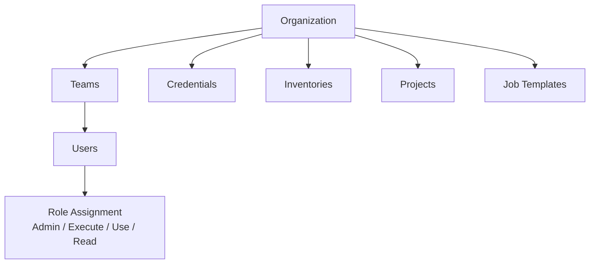

# Ansible — Access Control

> Part of the [Ansible Security](../index.md) reference.

## AWX / AAP RBAC Model

Ansible Automation Platform enforces role-based access control at the organization, team, and object level.



### Built-in Roles

| Role | Scope | Permissions |
|---|---|---|
| System Administrator | Platform | Full access to everything |
| System Auditor | Platform | Read-only to all objects |
| Organization Admin | Organization | Full control within org |
| Organization Auditor | Organization | Read-only within org |
| Project Admin | Project | CRUD on the project |
| Inventory Admin | Inventory | CRUD on inventory + hosts |
| Job Template Execute | Job Template | Can launch, not edit |
| Credential Use | Credential | Can attach to templates, not view secrets |

### Assign Roles via AWX CLI

```bash
# Grant user execute on a job template
awx role grant \
  --user jsmith \
  --type execute \
  --job_template "Deploy Web App" \
  --conf.host https://awx.example.com \
  --conf.token "$AWX_TOKEN"

# Add user to team
awx team associate \
  --team "Ops Team" \
  --user jsmith

# Grant team use of a credential
awx role grant \
  --team "Ops Team" \
  --type use \
  --credential "Production SSH Key"
```

### Assign Roles via Playbook

```yaml
- name: Configure AWX RBAC
  hosts: localhost
  gather_facts: false
  collections:
    - ansible.controller
  tasks:
    - name: Create ops team
      ansible.controller.team:
        name: "Linux Operations"
        organization: "IT Infrastructure"
        state: present

    - name: Grant team execute on job template
      ansible.controller.role:
        user: "{{ item }}"
        role: execute
        job_templates:
          - "Patch Linux Servers"
      loop:
        - jsmith
        - mjones
```

## Least Privilege on Managed Nodes

### Dedicated ansible Service Account

```bash
# Create non-root ansible user on managed nodes
useradd -r -s /bin/bash -m ansible

# Restrict SSH — key-only, no password
cat >> /etc/ssh/sshd_config <<EOF
Match User ansible
    PasswordAuthentication no
    PubkeyAuthentication yes
    AllowAgentForwarding no
    X11Forwarding no
EOF
systemctl reload sshd
```

### Sudoers — Scope Privilege Escalation

```bash
# /etc/sudoers.d/ansible
# Allow ansible user to sudo only specific commands (preferred)
ansible ALL=(root) NOPASSWD: /usr/bin/dnf, /usr/bin/yum, /usr/bin/apt-get, \
  /usr/bin/systemctl, /usr/sbin/service

# If full sudo required, restrict to specific hosts only via sudoers
# Avoid: ansible ALL=(ALL) NOPASSWD: ALL
```

```yaml
# Enforce become only on tasks that need it — not globally
- name: Install packages (needs root)
  ansible.builtin.package:
    name: nginx
    state: present
  become: true

- name: Check app status (no escalation needed)
  ansible.builtin.command:
    cmd: /opt/app/bin/status
  become: false
```

## Inventory Access Controls

```yaml
# Limit playbook runs to specific groups
ansible-playbook site.yml --limit webservers
ansible-playbook site.yml --limit "prod:&webservers"   # prod AND webservers
ansible-playbook site.yml --limit "all:!databases"     # exclude databases

# In AWX — set inventory source limits per job template
# Job Template → "Limit" field → "webservers"
```

## Credential Isolation

AWX never exposes credential values to job runs — the automation controller injects them as environment variables or files inside an isolated execution environment.

```yaml
# Bad — plaintext credential in vars
db_password: "mysecret"

# Good — credential injected by AAP at runtime
# SSH credentials: injected as SSH_AUTH_SOCK / private key file
# Cloud credentials: injected as AWS_ACCESS_KEY_ID, AWS_SECRET_ACCESS_KEY
# Custom credentials: injected per credential type input fields
```

### Custom Credential Types

```json
// Input configuration (what fields to collect)
{
  "fields": [
    {"id": "api_token", "label": "API Token", "secret": true, "type": "string"},
    {"id": "api_url",   "label": "API URL",   "secret": false, "type": "string"}
  ]
}

// Injector configuration (how to expose in job)
{
  "env": {
    "MY_APP_TOKEN": "{{ api_token }}",
    "MY_APP_URL":   "{{ api_url }}"
  }
}
```

## Audit and Compliance

```bash
# AWX activity stream — full audit log
curl -H "Authorization: Bearer $AWX_TOKEN" \
  "https://awx.example.com/api/v2/activity_stream/?page_size=50" \
  | python3 -m json.tool

# Filter by user
curl -H "Authorization: Bearer $AWX_TOKEN" \
  "https://awx.example.com/api/v2/activity_stream/?actor__username=jsmith"

# Job history — who ran what, when, against which hosts
curl -H "Authorization: Bearer $AWX_TOKEN" \
  "https://awx.example.com/api/v2/jobs/?launched_by__username=jsmith&page_size=20"
```

| Audit Event | AWX Log Location |
|---|---|
| Job launch | Activity stream + job events |
| Credential use | Activity stream |
| User login | Activity stream + system logs |
| RBAC change | Activity stream |
| Inventory update | Activity stream |
