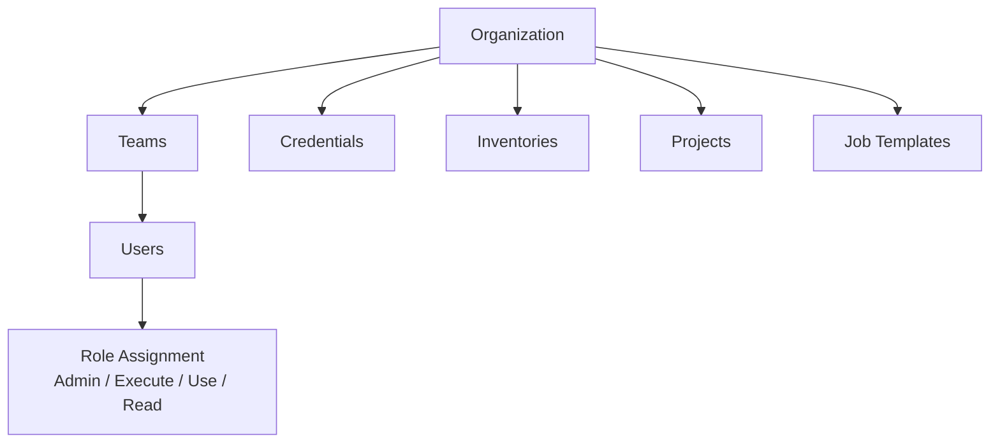

# Ansible — Access Control


<div class="kb-summary">
> Part of the [Ansible Security](../index.md) reference.
</div>

## AWX / AAP RBAC Model

Ansible Automation Platform enforces role-based access control at the organization, team, and object level.


```
┌────────────────────────────────────── Ansible — Access Control ───────────────────────────────────────┐
│   ┌───────────────────────────────────────────────────────────────────────────────────────────────┐   │
│   │   Ansible access control: who can run which playbooks against which hosts — enforced via AWX  │   │
│   │      AWX RBAC: organizations → teams → users; permissions per job template and credential     │   │
│   │     CLI access: limit SSH key distribution; service accounts only; no shared personal keys    │   │
│   └───────────────────────────────────────────────────────────────────────────────────────────────┘   │
│                                                                                                       │
│   ┌──────────────────────────────────────────────┐  ┌─────────────────────────────────────────────┐   │
│   │              AWX RBAC Hierarchy              │  │              Permission Levels              │   │
│   │          Organization → Team → User          │  │               Admin: full CRUD              │   │
│   │           Credentials: team-scoped           │  │            Execute: run jobs only           │   │
│   │           Inventories: team-scoped           │  │            Read: view job output            │   │
│   │          Job templates: team-scoped          │  │           Use: attach to template           │   │
│   │            LDAP/SAML sync for SSO            │  │           Approval: require review          │   │
│   └──────────────────────────────────────────────┘  └─────────────────────────────────────────────┘   │
│                                                                                                       │
│   ┌───────────────────────────────────────────────────────────────────────────────────────────────┐   │
│   │        AWX organization = top-level RBAC container; isolate business units or customers       │   │
│   │   Team             = group of users within an organization; assign permissions at team level  │   │
│   │ Approval workflow= AWX Workflow Job Template can require human approval step before execution │   │
│   └───────────────────────────────────────────────────────────────────────────────────────────────┘   │
└───────────────────────────────────────────────────────────────────────────────────────────────────────┘
```

### Sudoers — Scope Privilege Escalation

```bash
# /etc/sudoers.d/ansible
# Allow ansible user to sudo only specific commands (preferred)
ansible ALL=(root) NOPASSWD: /usr/bin/dnf, /usr/bin/yum, /usr/bin/apt-get, \
  /usr/bin/systemctl, /usr/sbin/service

# If full sudo required, restrict to specific hosts only via sudoers
# Avoid: ansible ALL=(ALL) NOPASSWD: ALL
```

```yaml
# Enforce become only on tasks that need it — not globally
- name: Install packages (needs root)
  ansible.builtin.package:
    name: nginx
    state: present
  become: true

- name: Check app status (no escalation needed)
  ansible.builtin.command:
    cmd: /opt/app/bin/status
  become: false
```

## Inventory Access Controls

```yaml
# Limit playbook runs to specific groups
ansible-playbook site.yml --limit webservers
ansible-playbook site.yml --limit "prod:&webservers"   # prod AND webservers
ansible-playbook site.yml --limit "all:!databases"     # exclude databases

# In AWX — set inventory source limits per job template
# Job Template → "Limit" field → "webservers"
```

## Credential Isolation

AWX never exposes credential values to job runs — the automation controller injects them as environment variables or files inside an isolated execution environment.

```yaml
# Bad — plaintext credential in vars
db_password: "mysecret"

# Good — credential injected by AAP at runtime
# SSH credentials: injected as SSH_AUTH_SOCK / private key file
# Cloud credentials: injected as AWS_ACCESS_KEY_ID, AWS_SECRET_ACCESS_KEY
# Custom credentials: injected per credential type input fields
```

### Custom Credential Types

```json
// Input configuration (what fields to collect)
{
  "fields": [
    {"id": "api_token", "label": "API Token", "secret": true, "type": "string"},
    {"id": "api_url",   "label": "API URL",   "secret": false, "type": "string"}
  ]
}

// Injector configuration (how to expose in job)
{
  "env": {
    "MY_APP_TOKEN": "{{ api_token }}",
    "MY_APP_URL":   "{{ api_url }}"
  }
}
```

## Audit and Compliance

```bash
# AWX activity stream — full audit log
curl -H "Authorization: Bearer $AWX_TOKEN" \
  "https://awx.example.com/api/v2/activity_stream/?page_size=50" \
  | python3 -m json.tool

# Filter by user
curl -H "Authorization: Bearer $AWX_TOKEN" \
  "https://awx.example.com/api/v2/activity_stream/?actor__username=jsmith"

# Job history — who ran what, when, against which hosts
curl -H "Authorization: Bearer $AWX_TOKEN" \
  "https://awx.example.com/api/v2/jobs/?launched_by__username=jsmith&page_size=20"
```

| Audit Event | AWX Log Location |
|---|---|
| Job launch | Activity stream + job events |
| Credential use | Activity stream |
| User login | Activity stream + system logs |
| RBAC change | Activity stream |
| Inventory update | Activity stream |
