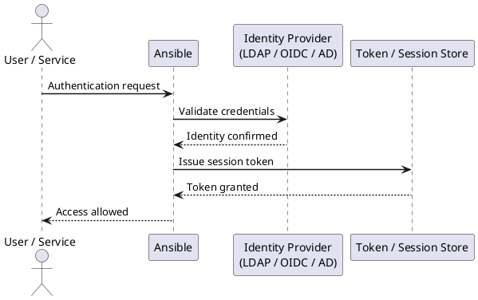

---
tags:
  - ansible
  - security
---
# Ansible — Authentication

```bash
# ED25519 — preferred (faster, smaller, equally secure)
ssh-keygen -t ed25519 -C "ansible-control@prod" -f ~/.ssh/ansible_ed25519 -N ""

# RSA 4096 — for legacy systems that don't support Ed25519
ssh-keygen -t rsa -b 4096 -C "ansible-control@prod" -f ~/.ssh/ansible_rsa -N ""
```

```bash
pip install pywinrm[kerberos]   # domain-joined hosts
pip install pywinrm              # NTLM / basic
```
```yaml
# group_vars/windows/main.yml
ansible_connection: winrm
ansible_winrm_transport: kerberos
ansible_winrm_scheme: https
ansible_winrm_server_cert_validation: validate
ansible_port: 5986
```
```bash
# Get Kerberos ticket before running playbook
kinit svc-ansible@EXAMPLE.COM
ansible -i inventory/ windows_hosts -m ansible.windows.win_ping
```
```yaml
# AWX Settings → Authentication → LDAP
LDAP Server URI: ldaps://dc01.example.com:636
LDAP Bind DN: CN=svc-awx-ldap,OU=ServiceAccounts,DC=example,DC=com
LDAP Bind Password: <vault secret>
LDAP User Search:
  - OU=Users,DC=example,DC=com
  - SCOPE_SUBTREE
  - (sAMAccountName=%(user)s)
LDAP Group Search:
  - OU=Groups,DC=example,DC=com
  - SCOPE_SUBTREE
  - (objectClass=group)
LDAP User Attribute Map:
  first_name: givenName
  last_name: sn
  email: mail
LDAP Organization Map:
  IT Infrastructure:
    admins: CN=AWX-Admins,OU=Groups,DC=example,DC=com
    users: CN=AWX-Users,OU=Groups,DC=example,DC=com
```
```yaml
# AWX Settings → Authentication → SAML
SAML Service Provider Entity ID: https://awx.example.com/sso/metadata/saml/
SAML IdP URL: https://example.okta.com/app/ansible/sso/saml
SAML ACS URL: https://awx.example.com/sso/complete/saml/
SAML Organization Attribute Mapping:
  IT Infra:
    admins: ["awx-admins"]
    users: ["awx-users"]
```
```bash
awx users create \
  --username breakglass-admin \
  --password "$BREAKGLASS_PASS" \
  --is_superuser true \
  --conf.host https://awx.example.com \
  --conf.token "$AWX_TOKEN"
```
```bash
echo "vault-password-here" > ~/.ansible_vault_pass
chmod 600 ~/.ansible_vault_pass
```
```ini
# ansible.cfg
[defaults]
vault_password_file = ~/.ansible_vault_pass
```
```bash
#!/bin/bash
vault kv get -field=password secret/ansible/vault-password
```
```ini
[defaults]
vault_password_file = ~/.get_vault_pass.sh
```
```bash
ansible-playbook site.yml \
  --vault-id prod@~/.vault_pass_prod \
  --vault-id staging@~/.vault_pass_staging
```
```bash
vault auth enable approle
vault write auth/approle/role/ansible \
  token_policies="ansible-policy" \
  secret_id_ttl=24h \
  token_ttl=1h

ROLE_ID=$(vault read -field=role_id auth/approle/role/ansible/role-id)
SECRET_ID=$(vault write -field=secret_id -f auth/approle/role/ansible/secret-id)
export VAULT_ROLE_ID="$ROLE_ID"
export VAULT_SECRET_ID="$SECRET_ID"
```
```yaml
vars:
  db_password: "{{ lookup('community.hashi_vault.hashi_vault',
    'secret/data/prod/db:password',
    auth_method='approle',
    role_id=lookup('env','VAULT_ROLE_ID'),
    secret_id=lookup('env','VAULT_SECRET_ID')) }}"
```
```ini
[ssh_connection]
ssh_args = -C -o ControlMaster=auto -o ControlPersist=60s \
           -o ProxyJump=bastion.example.com
```
```yaml
# host_vars/web01.prod.example.com/main.yml
ansible_ssh_common_args: >-
  -o ProxyJump=bastion.example.com
  -o StrictHostKeyChecking=yes
```



## Before you begin

- **Access:** SSH key or service account with sudo on managed hosts; Ansible control node
- **Change management:** security changes require CAB approval in most environments
- **Rollback plan:** document current state before any security control change
- **Testing:** validate in a non-production environment first where possible

---

---

## See also

- [Ansible — Access Control](../access-control/)
- [Ansible — Hardening](../hardening/)
- [Ansible — Encryption](../encryption/)
