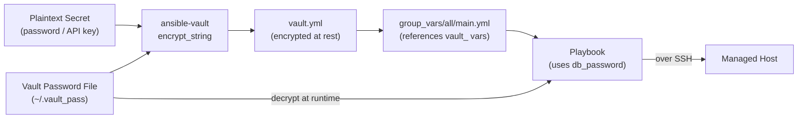

# Ansible — Encryption


<div class="kb-summary">
> Part of the [Ansible Security](../index.md) reference.
</div>

## Ansible Vault

Ansible Vault encrypts sensitive data at rest using AES-256-CBC. Encrypted content lives alongside plaintext YAML in the same repository — safely committed to Git.


┌──────────────────────────────────────── Ansible — Encryption ─────────────────────────────────────────┐
│   ┌───────────────────────────────────────────────────────────────────────────────────────────────┐   │
│   │     Ansible encryption: Vault (var files), SSH transport (TLS), AWX credential encryption     │   │
│   │Ansible Vault: AES-256-CTR encryption; password protects vault files; vault ID for multiple PWs│   │
│   │    AWX: credentials encrypted at rest using SECRET_KEY; rotated during AWX rekey procedure    │   │
│   │    Transport: SSH always encrypted; WinRM must use HTTPS (TLS) — reject HTTP WinRM in prod    │   │
│   └───────────────────────────────────────────────────────────────────────────────────────────────┘   │
│                                                                                                       │
│   ┌──────────────────────────────────────────────┐  ┌─────────────────────────────────────────────┐   │
│   │                 Vault Usage                  │  │          AWX Credential Encryption          │   │
│   │         ansible-vault encrypt_string         │  │         Stored: AES-256 + SECRET_KEY        │   │
│   │            Encrypt full var files            │  │           Injected at job runtime           │   │
│   │          vault_id: prod, dev labels          │  │           Never logged or exposed           │   │
│   │        Password in external vault/HSM        │  │          SECRET_KEY backup required         │   │
│   └──────────────────────────────────────────────┘  └─────────────────────────────────────────────┘   │
│                                                                                                       │
│   ┌───────────────────────────────────────────────────────────────────────────────────────────────┐   │
│   │ vault_id       = label for a vault password; allows different passwords for prod vs dev vaults│   │
│   │  SECRET_KEY     = AWX Django secret key; used to encrypt credentials in DB; MUST be backed up │   │
│   │   encrypt_string = encrypts a single string value; embed inline in plain YAML variable files  │   │
│   └───────────────────────────────────────────────────────────────────────────────────────────────┘   │
└───────────────────────────────────────────────────────────────────────────────────────────────────────┘
```
```bash

### Recommended Layout

```text
group_vars/
└── prod/
    ├── main.yml    # plaintext — references vault_ vars
    └── vault.yml   # encrypted — actual secret values
```

```yaml
# vault.yml (encrypted)
vault_db_password: "prod-db-pass"
vault_api_key: "sk-prod-abc123"

# main.yml (plaintext)
db_password: "{{ vault_db_password }}"
api_key: "{{ vault_api_key }}"
```

### Multiple Vault IDs

```bash
# Encrypt per environment
ansible-vault encrypt group_vars/prod/vault.yml --vault-id prod@~/.vault_pass_prod
ansible-vault encrypt group_vars/staging/vault.yml --vault-id staging@~/.vault_pass_staging

# Run with multiple IDs
ansible-playbook site.yml \
  --vault-id prod@~/.vault_pass_prod \
  --vault-id staging@~/.vault_pass_staging
```

### CI/CD Integration

| Method | How | When |
|---|---|---|
| File on runner | CI writes secret to temp file | Simple pipelines |
| Environment variable | `ANSIBLE_VAULT_PASSWORD_FILE` | CI with secret masking |
| Script | Fetches password from secrets manager at runtime | HashiCorp Vault / AWS Secrets Manager |

```yaml
# GitHub Actions
- name: Write vault password
  run: echo "${{ secrets.VAULT_PASSWORD }}" > ~/.vault_pass && chmod 600 ~/.vault_pass

- name: Run playbook
  run: ansible-playbook -i inventory/ site.yml
  env:
    ANSIBLE_VAULT_PASSWORD_FILE: ~/.vault_pass
```

## TLS Certificate Management

```yaml
- name: Generate ECC private key
  community.crypto.openssl_privatekey:
    path: /etc/ssl/private/app.key
    type: ECC
    curve: secp384r1
    mode: '0640'

- name: Generate CSR
  community.crypto.openssl_csr:
    path: /etc/ssl/csr/app.csr
    privatekey_path: /etc/ssl/private/app.key
    common_name: "{{ ansible_fqdn }}"
    subject_alt_name: "DNS:{{ ansible_fqdn }}"

- name: Deploy cert from HashiCorp Vault PKI
  community.hashi_vault.hashi_vault:
    path: pki/issue/web-role
    method: POST
    data:
      common_name: "{{ ansible_fqdn }}"
      ttl: "720h"
  register: vault_cert
  no_log: true

- name: Write certificate and key
  ansible.builtin.copy:
    content: "{{ item.content }}"
    dest: "{{ item.dest }}"
    mode: "{{ item.mode }}"
  loop:
    - content: "{{ vault_cert.data.data.certificate }}"
      dest: /etc/ssl/certs/app.crt
      mode: '0644'
    - content: "{{ vault_cert.data.data.private_key }}"
      dest: /etc/ssl/private/app.key
      mode: '0640'
  no_log: true
```

## SSH Transport Encryption

```ini
# ansible.cfg — enforce strong ciphers
[ssh_connection]
ssh_args = -C -o ControlMaster=auto -o ControlPersist=60s \
           -o Ciphers=chacha20-poly1305@openssh.com,aes256-gcm@openssh.com \
           -o MACs=hmac-sha2-256-etm@openssh.com \
           -o KexAlgorithms=curve25519-sha256
```

## Sensitive Task Output

```yaml
# Suppress output for tasks handling secrets
- name: Set database password
  ansible.builtin.command:
    cmd: "mysql -u root -e \"ALTER USER 'app'@'%' IDENTIFIED BY '{{ db_password }}';\""
  no_log: true
  changed_when: true
```

## Encryption Standards Summary

| Data Category | Method |
|---|---|
| Secrets at rest (vars files) | Ansible Vault AES-256-CBC |
| SSH transport | Ed25519 keys + AES-256-GCM |
| WinRM transport | HTTPS TLS 1.2+ |
| TLS certificates | ECC P-384 or RSA 4096 |
| AWX credential storage | AES-256 (Django Fernet) |
| HashiCorp Vault secrets | AES-256-GCM (Transit engine) |
