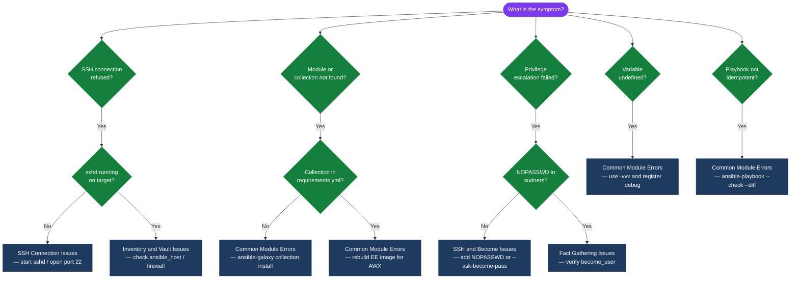
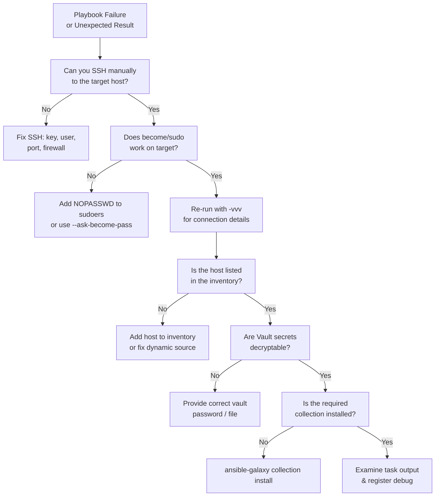

---
tags:
  - ansible
  - troubleshooting
search:
  boost: 1.5
---
# Ansible — Common Issues

<div class="kb-summary">
Ansible troubleshooting: unreachable hosts, privilege escalation failures, variable precedence conflicts, vault decryption errors, and module compatibility issues.

*Applies to: Ansible 2.14+*
</div>

---

```d2
direction: down

symptom: Identify Symptom {shape: diamond}
diagnostic_flow: "Diagnostic Flow" {shape: rectangle}
ansible_troubleshooting_decision_flo: "Ansible Troubleshooting Decision Flow" {shape: rectangle}
common_module_errors: "Common Module Errors" {shape: rectangle}
fact_gathering_issues: "Fact Gathering Issues" {shape: rectangle}
verify_resolution: "Verify resolution" {shape: rectangle}
resolution: Resolve or Escalate {shape: oval}

symptom -> diagnostic_flow: investigate
symptom -> ansible_troubleshooting_decision_flo: investigate
symptom -> common_module_errors: investigate
symptom -> fact_gathering_issues: investigate
symptom -> verify_resolution: investigate
diagnostic_flow -> resolution
ansible_troubleshooting_decision_flo -> resolution
common_module_errors -> resolution
fact_gathering_issues -> resolution
verify_resolution -> resolution
```

## Diagnostic Flow



---

## Before you begin

- **Access:** SSH key or service account with sudo on managed hosts; Ansible control node
- **Gather first:** recent error message text, event timestamps, and affected object names
- **Scope:** confirm whether the issue affects a single object, host, cluster, or site
- **Escalation:** open a vendor support ticket before running any destructive step
- **Logging:** document each command and output — required if escalation is needed

---

## Ansible Troubleshooting Decision Flow



## Common Module Errors

```bash
# Module not found / collection missing
ansible-galaxy collection install community.general

# Verify collection is installed
ansible-galaxy collection list

# "Temporary failure in name resolution" during package install
# Usually a DNS issue on the managed host — test with:
ansible webservers -m shell -a "nslookup archive.ubuntu.com"

# "changed=0" but task should have changed — check idempotency logic
ansible-playbook site.yml --check --diff

# Register output to inspect what a command returns
- name: Check service status
  ansible.builtin.command: systemctl is-active nginx
  register: svc_result
  ignore_errors: true

- name: Show result
  ansible.builtin.debug:
    var: svc_result
```

## Fact Gathering Issues

```bash
# Manually gather facts for a host
ansible -i inventory/ web01 -m setup

# Filter facts
ansible -i inventory/ web01 -m setup -a "filter=ansible_distribution*"

# Disable fact gathering to speed up playbooks that don't need them
- hosts: webservers
  gather_facts: false
```

---

## Verify resolution

- Confirm the original symptom no longer occurs
- Check logs for any residual errors related to the issue
- Monitor for 10–15 minutes to confirm the fix is stable

---

## See also

- [Ansible — Diagnostics](../diagnostics/)
- [Ansible — Escalation](../escalation/)
- [Ansible — Health Checks](../../operations/health-checks/)
