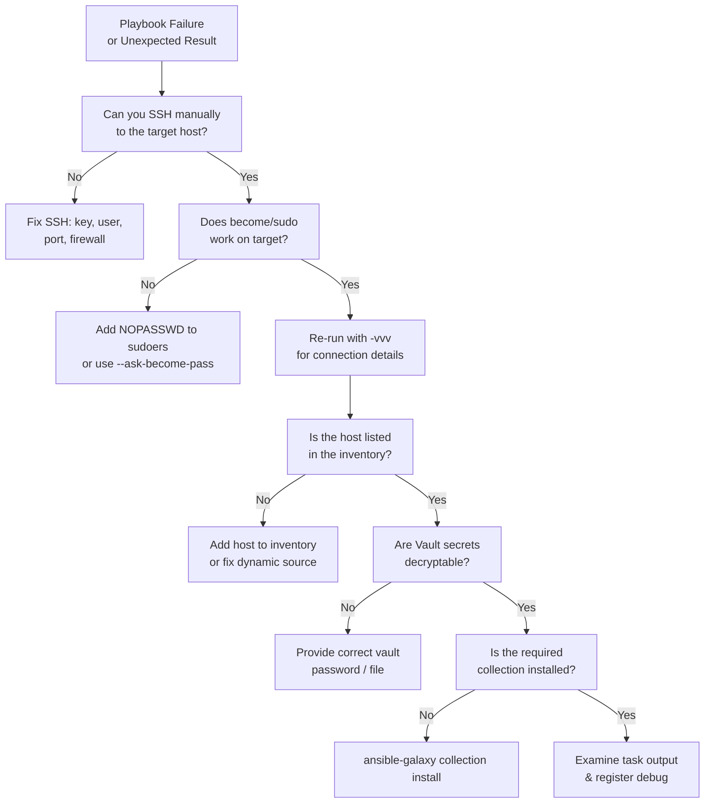

# Ansible — Common Issues

> Part of the [Ansible Troubleshooting](../index.md) reference.

---

## Ansible Troubleshooting Decision Flow


┌─────────────────────────────────────── Ansible — Common Issues ───────────────────────────────────────┐
│   ┌───────────────────────────────────────────────────────────────────────────────────────────────┐   │
│   │      Most frequent Ansible failures: SSH, Python errors, Vault decrypt, module not found      │   │
│   └───────────────────────────────────────────────────────────────────────────────────────────────┘   │
│                                                                                                       │
│   ┌───────────────────────────────────────────────────────────────────────────────────────────────┐   │
│   │                    Issue: UNREACHABLE — SSH connection refused or timed out                   │   │
│   │               Cause A: SSH service stopped on target → fix: start sshd on target              │   │
│   │           Cause B: firewall blocking port 22 → fix: open port 22 in host/network FW           │   │
│   │         Cause C: wrong ansible_host or ansible_port → fix: correct inventory variable         │   │
│   └───────────────────────────────────────────────────────────────────────────────────────────────┘   │
│                                                                                                       │
│   ┌───────────────────────────────────────────────────────────────────────────────────────────────┐   │
│   │                                 Issue: Vault decryption failed                                │   │
│   │           Cause A: wrong password → fix: verify vault password; check vault_id label          │   │
│   │         Cause B: wrong vault_id → fix: pass --vault-id prod@prompt if using vault IDs         │   │
│   │      Cause C: AWX vault credential missing → fix: re-add vault credential to job template     │   │
│   └───────────────────────────────────────────────────────────────────────────────────────────────┘   │
│                                                                                                       │
│   ┌───────────────────────────────────────────────────────────────────────────────────────────────┐   │
│   │                          Issue: module not found / collection missing                         │   │
│   │    Fix: ansible-galaxy collection install <namespace.collection> or add to requirements.yml   │   │
│   │               Fix: rebuild EE image with collection included if running via AWX               │   │
│   └───────────────────────────────────────────────────────────────────────────────────────────────┘   │
└───────────────────────────────────────────────────────────────────────────────────────────────────────┘

## Sudo and Privilege Escalation Failures

| Error | Likely cause | Fix |
|---|---|---|
| `sudo: a password is required` | No NOPASSWD in sudoers | Add `NOPASSWD` or use `--ask-become-pass` |
| `incorrect sudo password` | Wrong become password | Run with `-K` flag |
| `sudo: command not found` | sudo not installed | Install sudo or use `become_method: su` |
| `Failed to set permissions on the temporary files` | sudoers restricts `SETENV` | Add `SETENV` to sudoers entry |

```bash
# Prompt for become password interactively
ansible-playbook site.yml --ask-become-pass

# Specify become method
- name: Run as root
  become: true
  become_method: sudo
  become_user: root
```

## Common Module Errors

```bash
# Module not found / collection missing
ansible-galaxy collection install community.general

# Verify collection is installed
ansible-galaxy collection list

# "Temporary failure in name resolution" during package install
# Usually a DNS issue on the managed host — test with:
ansible webservers -m shell -a "nslookup archive.ubuntu.com"

# "changed=0" but task should have changed — check idempotency logic
ansible-playbook site.yml --check --diff

# Register output to inspect what a command returns
- name: Check service status
  ansible.builtin.command: systemctl is-active nginx
  register: svc_result
  ignore_errors: true

- name: Show result
  ansible.builtin.debug:
    var: svc_result
```

## Fact Gathering Issues

```bash
# Manually gather facts for a host
ansible -i inventory/ web01 -m setup

# Filter facts
ansible -i inventory/ web01 -m setup -a "filter=ansible_distribution*"

# Disable fact gathering to speed up playbooks that don't need them
- hosts: webservers
  gather_facts: false
```
