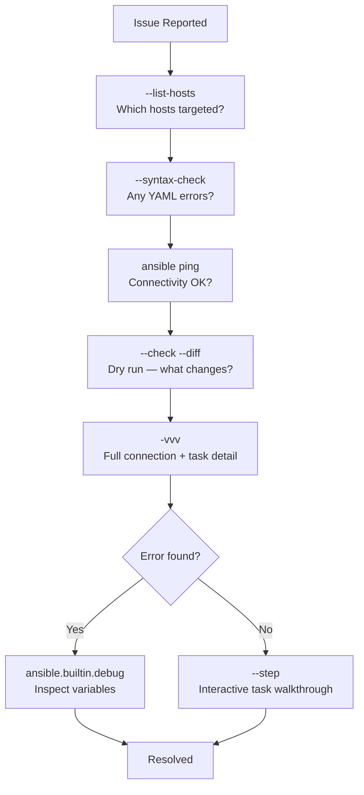

# Ansible — Diagnostics

> Part of the [Ansible Troubleshooting](../index.md) reference.

## Diagnostic Workflow



## Core Diagnostic Commands

```bash
# Connectivity check
ansible all -i inventory/ -m ansible.builtin.ping

# List targeted hosts
ansible-playbook site.yml --list-hosts

# List tasks without running
ansible-playbook site.yml --list-tasks

# Syntax check only
ansible-playbook --syntax-check site.yml

# Dry run with diff output
ansible-playbook site.yml --check --diff

# Step through tasks interactively (y/n/c for each task)
ansible-playbook site.yml --step

# Retry last failed hosts
ansible-playbook site.yml --limit @site.retry
```

## Verbosity Levels

```bash
-v     # Show task results
-vv    # Show input/output data
-vvv   # Show SSH connection details, module args
-vvvv  # Show SSH binary connection info (connection plugin)
```

```bash
# Debug a single host with full SSH trace
ansible-playbook site.yml -i inventory/ --limit web01 -vvv 2>&1 | tee /tmp/ansible-debug.log
```

## Variable Inspection

```yaml
# Print a variable value mid-play
- name: Debug variable
  ansible.builtin.debug:
    var: nginx_port

# Print multiple variables
- name: Debug connection info
  ansible.builtin.debug:
    msg: |
      Host: {{ inventory_hostname }}
      IP: {{ ansible_host }}
      User: {{ ansible_user }}
      OS: {{ ansible_distribution }} {{ ansible_distribution_major_version }}
      Python: {{ ansible_python_interpreter }}

# Print all vars for a host
- name: Dump all variables
  ansible.builtin.debug:
    var: hostvars[inventory_hostname]
```

```bash
# From command line — show all facts for a host
ansible web01 -i inventory/ -m ansible.builtin.setup

# Filter facts by prefix
ansible web01 -i inventory/ -m ansible.builtin.setup -a "filter=ansible_network*"
ansible web01 -i inventory/ -m ansible.builtin.setup -a "filter=ansible_os_family"
```

## SSH Connectivity Diagnostics

```bash
# Test raw SSH as ansible user
ssh -i ~/.ssh/ansible_ed25519 -o BatchMode=yes ansible@web01.example.com "echo OK"

# Test with verbose SSH
ssh -vvv -i ~/.ssh/ansible_ed25519 ansible@web01.example.com

# Check if Python exists on target
ansible web01 -i inventory/ -m ansible.builtin.raw -a "which python3; python3 --version"

# Check sudo works
ansible web01 -i inventory/ -m ansible.builtin.command \
  -a "sudo -l" --become-user root
```

## Module Execution Diagnostics

```bash
# Run a single module ad-hoc
ansible web01 -i inventory/ -m ansible.builtin.service \
  -a "name=nginx state=started" --check

# Run with environment dumped
ansible web01 -i inventory/ -m ansible.builtin.command \
  -a "env" | grep -i path
```

## Fact Caching Issues

```bash
# Clear stale fact cache
rm -rf /tmp/ansible_facts/

# Force fact regather (ignore cache)
ansible-playbook site.yml -e "gather_facts=true" --flush-cache

# Check when facts were last gathered
ls -la /tmp/ansible_facts/
```

## AWX / AAP Job Diagnostics

```bash
# Get job stdout via API
curl -H "Authorization: Bearer $AWX_TOKEN" \
  "https://awx.example.com/api/v2/jobs/1234/stdout/?format=txt"

# Get job events (individual task results)
curl -H "Authorization: Bearer $AWX_TOKEN" \
  "https://awx.example.com/api/v2/jobs/1234/job_events/?page_size=50"

# Check recently failed jobs
curl -H "Authorization: Bearer $AWX_TOKEN" \
  "https://awx.example.com/api/v2/jobs/?status=failed&page_size=10" \
  | python3 -m json.tool
```

## Common Error Patterns

| Error | Likely Cause | Fix |
|---|---|---|
| `UNREACHABLE! Connection refused` | SSH not running on target | Start sshd; check firewall |
| `FAILED! Permission denied (publickey)` | SSH key not deployed | Deploy public key first |
| `MODULE FAILURE — python not found` | No Python on target | `ansible -m raw -a "dnf install -y python3"` |
| `[WARNING] No inventory was parsed` | Wrong inventory path | Check `-i` flag or ansible.cfg |
| `FAILED — Timeout (12s) waiting for privilege escalation prompt` | sudo requires password | Add NOPASSWD to sudoers |
| `Vault encrypted file, but no vault secret found` | Missing vault password | `--ask-vault-pass` or check vault_password_file |
| `msg: Invalid/incorrect password` | Wrong become password | Check `ansible_become_password` var |
| `ERROR! conflicting action statements: template, vars` | YAML parse error | Check task indentation |

## Log Analysis

```bash
# ansible.cfg — enable logging
[defaults]
log_path = /var/log/ansible/ansible.log

# Grep for failures
grep "FAILED\|UNREACHABLE\|ERROR" /var/log/ansible/ansible.log

# Count failures by host
grep "FAILED" /var/log/ansible/ansible.log | \
  grep -oP 'FAILED \[.*?\]' | sort | uniq -c | sort -rn
```
