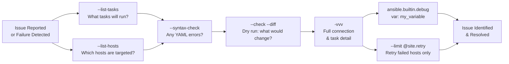

# Ansible — Diagnostics

> Part of the [Ansible Troubleshooting](../) reference.

---

## Ansible Diagnostic Workflow



## Useful Diagnostic Commands

```bash
# List tasks without running them
ansible-playbook site.yml --list-tasks

# List hosts that would be targeted
ansible-playbook site.yml --list-hosts

# Syntax check only
ansible-playbook site.yml --syntax-check

# Step through tasks interactively
ansible-playbook site.yml --step

# Retry failed hosts from last run
ansible-playbook site.yml --limit @site.retry
```

Content to be added.
