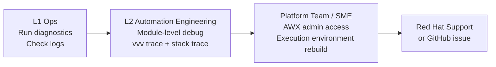

# Ansible — Escalation


<div class="kb-summary">
> Part of the [Ansible Troubleshooting](../index.md) reference.
</div>

## When to Escalate

Escalate when any of the following are true and cannot be resolved with standard diagnostics:

- Ansible module producing incorrect results with correct inputs (potential module bug)
- AWX/AAP platform-level failure (database corruption, operator crash, license issue)
- Execution Environment image pull failures from Red Hat registry
- Unexpected behaviour after ansible-core or collection upgrade
- Vault decryption failures not explained by password/key issues
- SSH transport bugs (pipelining, ControlMaster, ControlPersist edge cases)

## Internal Escalation Path


┌──────────────────────────────────────── Ansible — Escalation ─────────────────────────────────────────┐
│   ┌───────────────────────────────────────────────────────────────────────────────────────────────┐   │
│   │   Escalate Ansible issues when: AWX pod crash-loops, Vault key lost, bulk playbook failures   │   │
│   │           Tier 1: automation team (AWX job config, playbook bugs, inventory issues)           │   │
│   │           Tier 2: platform/infra team (AWX Kubernetes deployment, network, storage)           │   │
│   │         Tier 3: Red Hat support (AAP licensing, Ansible Core bugs, EE build failures)         │   │
│   └───────────────────────────────────────────────────────────────────────────────────────────────┘   │
│                                                                                                       │
│   ┌──────────────────────────────────────────────┐  ┌─────────────────────────────────────────────┐   │
│   │             Escalation Triggers              │  │                Info to Gather               │   │
│   │            AWX pods crash-looping            │  │         AWX version, Ansible version        │   │
│   │             Vault password lost              │  │          kubectl logs all AWX pods          │   │
│   │            >20% job failure rate             │  │          Job ID and full event log          │   │
│   │        Performance: queue backing up         │  │        Inventory count, fork setting        │   │
│   │          EE build broken repeatedly          │  │          ansible-builder log output         │   │
│   └──────────────────────────────────────────────┘  └─────────────────────────────────────────────┘   │
│                                                                                                       │
│   ┌───────────────────────────────────────────────────────────────────────────────────────────────┐   │
│   │       Red Hat support  = access via access.redhat.com; requires active AAP subscription       │   │
│   │   Must-gather      = AWX support bundle: Settings → Subscriptions → Download support bundle   │   │
│   │          SLA              = AAP Premium: 1-hour response for Sev 1; Standard: 4 hours         │   │
│   └───────────────────────────────────────────────────────────────────────────────────────────────┘   │
└───────────────────────────────────────────────────────────────────────────────────────────────────────┘
```bash

## Community Escalation (Open Source)

### ansible-core Bugs

```bash
# Check existing issues first
# https://github.com/ansible/ansible/issues

# Minimal reproduction case
cat > /tmp/repro.yml <<'EOF'
- name: Reproduction case
  hosts: localhost
  gather_facts: false
  tasks:
    - name: Failing task
      ansible.builtin.MODULE:
        arg: value
EOF

ansible-playbook /tmp/repro.yml -vvv 2>&1 | tee /tmp/repro.log
```

Include in the GitHub issue:
- `ansible --version` output
- Python version
- OS version
- Minimal reproduction playbook
- Full `-vvv` output

### Collection Bugs

| Collection | Issue Tracker |
|---|---|
| `community.vmware` | github.com/ansible-collections/community.vmware |
| `amazon.aws` | github.com/ansible-collections/amazon.aws |
| `community.general` | github.com/ansible-collections/community.general |
| `cisco.ios` | github.com/ansible-collections/cisco.ios |
| `servicenow.itsm` | github.com/ServiceNowITOM/servicenow-ansible |

## Workarounds While Awaiting Fix

```yaml
# Pin to last known-good collection version
collections:
  - name: community.vmware
    version: "4.2.0"   # pinned until bug fixed in 4.3.x

# Use raw/command module as fallback when a declarative module has a bug
- name: Workaround — create vlan via command until module fixed
  ansible.builtin.command:
    cmd: "esxcli network vswitch standard portgroup add -v 'VLAN100' -p vSwitch0"
  delegate_to: esxi01
  changed_when: true

# Add ignore_errors with manual check as last resort
- name: Idempotency workaround
  ansible.builtin.command:
    cmd: /opt/app/configure.sh
  register: config_result
  ignore_errors: true
  changed_when: config_result.rc == 0
  failed_when: config_result.rc not in [0, 1]
```

## Escalation Checklist

| Step | Done |
|---|---|
| Reproduced with `--check` and `--diff` | ☐ |
| Ran with `-vvv` and saved output | ☐ |
| Verified ansible-core and collection versions | ☐ |
| Checked GitHub issues for known bug | ☐ |
| Tested with latest collection version | ☐ |
| Gathered AWX pod logs (if AWX issue) | ☐ |
| Prepared minimal reproduction case | ☐ |
| Opened support case or GitHub issue | ☐ |
