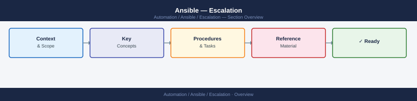
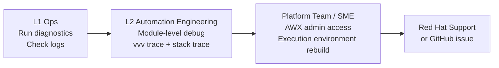
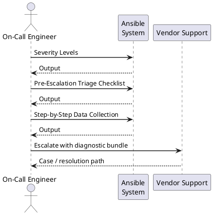
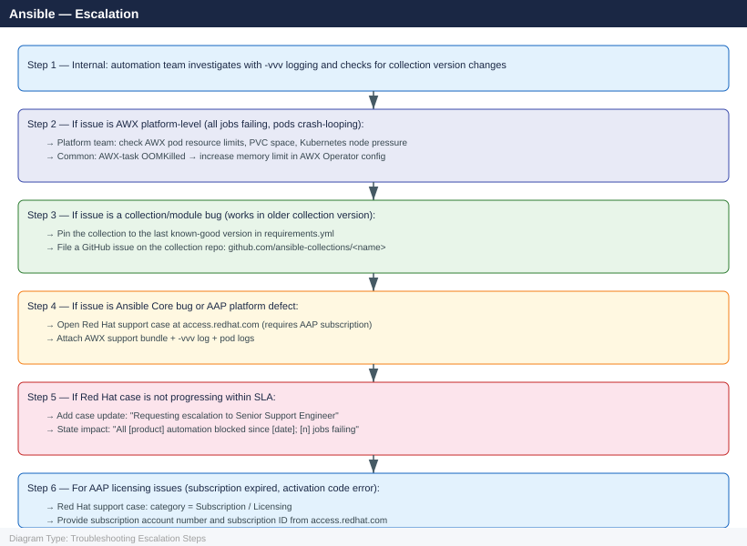

---
tags:
  - ansible
  - troubleshooting
search:
  boost: 1.5
---
# Ansible — Escalation

<div class="kb-summary">
Ansible escalation: when to open a Red Hat support case for AAP, how to file a community bug, how to collect AWX logs and execution environment info, and the internal escalation path for playbook failures, AWX outages, and Vault issues.

*Applies to: Ansible 2.14+ / AWX / Ansible Automation Platform (AAP)*
</div>







## Before you begin

- **Access:** SSH key or service account with sudo on managed hosts; Ansible control node or AWX admin access
- **Gather first:** exact error message with `-vvv` output, job ID (for AWX), Ansible version, and the specific playbook/module that failed
- **Scope:** confirm whether the failure is on a single target host, a group, or all managed hosts; and whether it is job-specific or platform-wide (all AWX jobs failing)
- **AWX Vault:** if Vault access is broken, confirm whether the Vault key is lost or the Vault container cannot decrypt — different recovery paths apply
- **EE issues:** for Execution Environment failures, identify whether the issue is at build time (`ansible-builder`) or run time (pod startup)

---

## Severity Levels

| Severity | Definition | Escalation Path |
|---|---|---|
| S1 — Critical | AWX platform completely down; Vault key lost (no credentials accessible); production automation halted | Immediate: platform team + Red Hat support case (AAP subscription) |
| S2 — High | All AWX jobs failing across all projects; EE builds broken across all templates; >50% job failure rate | Same day: platform team → Red Hat support if not resolved |
| S3 — Medium | Single playbook or collection failing; AWX performance degraded; specific module bug | Next business day: automation team → GitHub issue for open-source modules |
| S4 — Low | Non-critical playbook intermittently timing out; performance question; feature request | Sprint backlog item |

## Pre-Escalation Triage Checklist

| Check | Command | Expected |
|---|---|---|
| Ansible version | `ansible --version` | Expected version |
| AWX pods running (if AWX) | `kubectl get pods -n awx` | All pods `Running`, 0 restarts in last 10 min |
| AWX web accessible | Browse to AWX URL | Login page loads |
| EE image pullable | `kubectl describe pod <awx-pod> -n awx \| grep -A5 image` | No `ErrImagePull` or `ImagePullBackOff` |
| Target host reachable | `ansible <host> -m ping` | `pong` response |
| Vault accessible | `ansible-vault view <encrypted-file>` | File contents displayed (no password error) |
| Inventory returns data | `ansible-inventory --list` | JSON with host data (no empty groups) |
| Module available | `ansible-doc <module-name>` | Module documentation displayed |

---

## Step-by-Step Data Collection

### 1. Collect Ansible version and environment

```bash
# Full version info
ansible --version 2>&1 | tee /tmp/ansible-version.txt

# Installed collections
ansible-galaxy collection list 2>&1 | tee /tmp/collection-list.txt

# Python version and libraries
python3 --version
pip show ansible ansible-core jinja2 | tee /tmp/py-packages.txt

# Control node OS
uname -a
cat /etc/os-release
```

### 2. Run the failing playbook with full verbosity

```bash
# Run with maximum verbosity — captures all module args, connection details, and errors
ansible-playbook <failing-playbook.yml> -vvv \
  -i <inventory> \
  --extra-vars "key=value" \
  2>&1 | tee /tmp/ansible-vvv-$(date +%F-%H%M%S).log

# For a single task on a single host
ansible <hostname> -m <module> -a "<args>" -vvv 2>&1 | tee /tmp/ansible-task.log

# For Windows hosts (WinRM connection debug)
ANSIBLE_DEBUG=1 ansible <winhost> -m win_ping -vvv 2>&1 | tee /tmp/ansible-winrm.log
```

### 3. Collect AWX job details (if using AWX)

```bash
# Get job output for a specific job ID (via AWX API)
AWX_URL="https://<awx-hostname>"
TOKEN="<awx-oauth-token>"
JOB_ID=<job-id>

# Job details
curl -sk "${AWX_URL}/api/v2/jobs/${JOB_ID}/" \
  -H "Authorization: Bearer ${TOKEN}" | python3 -m json.tool > /tmp/awx-job-${JOB_ID}.json

# Full job stdout
curl -sk "${AWX_URL}/api/v2/jobs/${JOB_ID}/stdout/?format=txt" \
  -H "Authorization: Bearer ${TOKEN}" > /tmp/awx-job-${JOB_ID}-stdout.txt

# Job events (detailed task results)
curl -sk "${AWX_URL}/api/v2/jobs/${JOB_ID}/job_events/?page_size=50" \
  -H "Authorization: Bearer ${TOKEN}" | python3 -m json.tool > /tmp/awx-job-${JOB_ID}-events.json
```

### 4. Collect AWX pod logs (for platform-level failures)

```bash
# All AWX pod names in the awx namespace
kubectl get pods -n awx

# Logs for each component pod (replace with actual pod names)
kubectl logs -n awx deployment/awx-web     --since=1h > /tmp/awx-web.log
kubectl logs -n awx deployment/awx-task    --since=1h > /tmp/awx-task.log
kubectl logs -n awx deployment/awx-ee      --since=1h > /tmp/awx-ee.log  2>/dev/null || true
kubectl logs -n awx statefulset/awx-postgres-15 --since=1h > /tmp/awx-db.log  2>/dev/null || true

# Get events for the awx namespace (pod crashes, OOM kills)
kubectl get events -n awx --sort-by='.lastTimestamp' | tail -50 > /tmp/awx-events.txt

# AWX support bundle (from AWX Settings → Subscriptions → Download Support Bundle)
# This is the primary artifact for Red Hat support — attach to all SR cases
```

### 5. Write the timeline

```text
Ansible / AWX version: AWX 23.5.1 / ansible-core 2.16.2
EE image: registry.redhat.io/ansible-automation-platform-25/ee-supported-rhel9:latest

Issue first observed: 2026-06-15 14:00 UTC
Last successful job run: 2026-06-15 13:30 UTC (Job ID: 4521)

Error observed (from AWX job 4522):
  TASK [Configure vCenter] ****
  fatal: [vcenter01.corp.local]: FAILED! => {"msg": "community.vmware.vmware_vm_info returned
  an empty list; expected at least one VM matching filter."}
  Error raised: Ansible returned exit code 2 (failed)

AWX pod state:
  awx-web:     Running (normal)
  awx-task:    Running (1 restart in last hour — OOMKilled)
  awx-postgres: Running (normal)

Changes in 2h before issue:
  - community.vmware collection upgraded from 4.1.0 to 4.3.1 via requirements.yml update
  - No playbook configuration changes

Blast radius:
  - All VMware automation jobs failing
  - Non-VMware jobs (Linux, Windows) unaffected
```

---

## How to Open a Red Hat Support Case (AAP)

1. Go to **access.redhat.com** and sign in with your Red Hat account linked to your AAP subscription.

2. Click **Open a Case** (Support menu → Open a New Case).

3. Under **Product**, select **Red Hat Ansible Automation Platform**.

4. Under **Version**, enter your AWX/AAP version.

5. Under **Severity**, select:
   - **Severity 1**: AWX platform completely down; Vault key lost; all automation halted; no workaround
   - **Severity 2**: Major AWX feature broken; all EE builds failing; significant automation impact
   - **Severity 3**: Single playbook, collection, or component failing; workaround available
   - **Severity 4**: Configuration question; feature request; documentation

6. In the **Summary**: `AWX 23.5.1 — All community.vmware jobs failing after collection upgrade 4.1.0 → 4.3.1`.

7. In the **Description**, paste:
   - AWX/ansible-core version
   - EE image name and tag
   - Ansible collection versions (`ansible-galaxy collection list`)
   - Job ID of the failing run
   - Full error message from `ansible-playbook -vvv`
   - Timeline (from step 5 above)
   - AWX pod status

8. Upload attachments:
   - AWX support bundle (from Settings → Subscriptions → Download Support Bundle)
   - `ansible-vvv-<date>.log` — full `-vvv` output
   - `awx-task.log` and `awx-web.log`
   - `awx-events.txt` — kubectl events

9. Click **Submit**. You receive a case number by email.

10. **Severity 1 only:** the case page shows a phone number for your region. Call immediately.

---

## Escalation Path



---

## Community Escalation (Open Source Ansible)

### ansible-core Bugs

```bash
# Check existing issues first
# https://github.com/ansible/ansible/issues

# Create a minimal reproduction playbook
cat > /tmp/repro.yml <<'EOF'
- name: Reproduction case
  hosts: localhost
  gather_facts: false
  tasks:
    - name: Failing task
      ansible.builtin.command:
        cmd: "echo test"
      register: result
EOF

ansible-playbook /tmp/repro.yml -vvv 2>&1 | tee /tmp/repro.log
```

GitHub issue must include:
- `ansible --version` output
- Python version and OS
- Minimal reproduction playbook
- Full `-vvv` output

### Collection Bugs

| Collection | Issue Tracker |
|---|---|
| `community.vmware` | github.com/ansible-collections/community.vmware |
| `amazon.aws` | github.com/ansible-collections/amazon.aws |
| `community.general` | github.com/ansible-collections/community.general |
| `cisco.ios` | github.com/ansible-collections/cisco.ios |
| `servicenow.itsm` | github.com/ServiceNowITOM/servicenow-ansible |

---

## What NOT to Do

| Do NOT do this | Why | What to do instead |
|---|---|---|
| Run `ansible-playbook` with `--force-handlers` to bypass a failing handler | Executes handlers regardless of task success state; can leave systems in a partially configured state | Fix the failing task first; re-run only after the root cause is addressed |
| Increase AWX forks from 50 to 500 to "process more hosts faster" | Exhausts CPU and memory on the AWX control node; causes AWX task pod to OOMKill | Identify the bottleneck (inventory count, module latency, API rate limit); tune forks incrementally |
| Delete the AWX PostgreSQL PVC to fix a database issue | Permanently deletes all AWX job history, credentials, inventories, and projects | Back up the database first: `kubectl exec -n awx <postgres-pod> -- pg_dump awx > awx-backup.sql` |
| Store Vault password in a plain-text file accessible to all users | Defeats the purpose of Ansible Vault — anyone with read access can decrypt all secrets | Use AWX credentials to store the Vault password; or use a secrets manager integration |
| Run `ansible-galaxy collection install --force` to "fix" a collection | Overwrites a pinned collection version; may introduce the same bug you are trying to avoid | Specify an exact version: `ansible-galaxy collection install community.vmware:4.2.0` |

---

## Escalation Checklist

| Step | Done |
|---|---|
| Reproduced with `--check` and `--diff` | ☐ |
| Ran with `-vvv` and saved output | ☐ |
| Verified ansible-core and collection versions | ☐ |
| Checked GitHub issues for known bug | ☐ |
| Tested with last known-good collection version | ☐ |
| Gathered AWX pod logs and support bundle (if AWX issue) | ☐ |
| Prepared minimal reproduction playbook | ☐ |
| Opened support case or GitHub issue | ☐ |

---

## See also

- [Ansible — Diagnostics](../diagnostics/)
- [Ansible — Common Issues](../common-issues/)

---

## Verify resolution

- Confirm the failing job completes with exit code 0 for at least 3 consecutive runs
- Check AWX dashboard — job success rate back to expected level (≥ 95%)
- Verify AWX pod restarts count is stable (no OOMKill events in `kubectl get events`)
- If a collection was pinned as a workaround, create a follow-up ticket to upgrade when the bug fix is released
