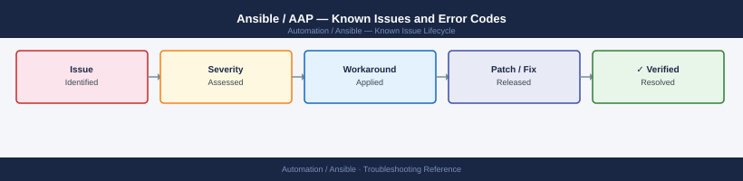

---
tags:
  - troubleshooting
  - ansible
  - automation
  - known-issues
---
# Ansible / AAP — Known Issues and Error Codes

<div class="kb-summary">
Catalog of known Ansible Automation Platform bugs, error codes, and workarounds covering inventory, playbook execution, and Receptor mesh.

*Applies to: Ansible Automation Platform 2.x*
</div>



```d2
direction: down

symptom: Identify Symptom {shape: diamond}
ssh_connectivity: "SSH Connectivity" {shape: rectangle}
become_sudo: "Become / Sudo" {shape: rectangle}
execution_nodes_receptor: "Execution Nodes (Receptor)" {shape: rectangle}
winrm_windows: "WinRM (Windows)" {shape: rectangle}
resolution: Resolve or Escalate {shape: oval}

symptom -> ssh_connectivity: investigate
symptom -> become_sudo: investigate
symptom -> execution_nodes_receptor: investigate
symptom -> winrm_windows: investigate
ssh_connectivity -> resolution
become_sudo -> resolution
execution_nodes_receptor -> resolution
winrm_windows -> resolution
```

## Before you begin

- AAP job errors appear in Automation Controller → Jobs — click the failed job for detailed output.
- Most playbook failures are SSH connectivity, become (sudo) config, or Python interpreter issues on targets.
- Verbose mode: run playbooks with `-vvv` to see connection details.

## SSH Connectivity

| Error / Symptom | Affected Versions | Cause | Workaround / Fix | Fixed In |
|---|---|---|---|---|
| `Permission denied (publickey)` | AAP 2.x | SSH key not deployed to target or wrong user | Verify machine credential in AAP has correct SSH private key; test: `ssh -i <key> user@host` | N/A |
| `ssh: connect to host port 22: Connection refused` | AAP 2.x | SSH not running on target or port blocked | Check SSH service on target; verify TCP 22 from AAP execution node to target | N/A |
| `UNREACHABLE: Failed to connect to the host via ssh: Host key verification failed` | AAP 2.x | SSH host key changed; known_hosts mismatch | Set `host_key_checking = False` in `ansible.cfg` (lab only); or update known_hosts | N/A |

## Become / Sudo

| Error / Symptom | Affected Versions | Cause | Workaround / Fix | Fixed In |
|---|---|---|---|---|
| `sudo: a password is required` | AAP 2.x | Target requires sudo password; not in credential | Add sudo password to machine credential in AAP; or configure passwordless sudo | N/A |
| `Timeout waiting for privilege escalation` | AAP 2.x | Sudo prompt not matched; or become_method mismatch | Set `become_method: sudo`; increase `timeout` in `ansible.cfg` | N/A |

## Execution Nodes (Receptor)

| Error / Symptom | Affected Versions | Cause | Workaround / Fix | Fixed In |
|---|---|---|---|---|
| Execution node `Unavailable` | AAP 2.x | Receptor mesh port 27199 blocked | Verify TCP 27199 between controller and execution nodes | N/A |
| Jobs queued but not starting | AAP 2.x | No healthy execution nodes in instance group | Check execution node health in AAP → Topology; restart receptor: `systemctl restart receptor` | N/A |

## WinRM (Windows)

| Error / Symptom | Affected Versions | Cause | Workaround / Fix | Fixed In |
|---|---|---|---|---|
| `winrm or requests is not installed` | AAP 2.x | Python `pywinrm` not installed on execution node | Install: `pip install pywinrm` on execution node | N/A |
| `AuthenticationError: 401 Unauthorized` | AAP 2.x | Windows credential type mismatch (basic vs Kerberos) | Configure WinRM for Basic or NTLM auth; or set up Kerberos properly | N/A |

## See also

- [Ansible — Common Issues](../common-issues/)
- [Terraform — Known Issues](../../terraform/troubleshooting/known-issues.md)
