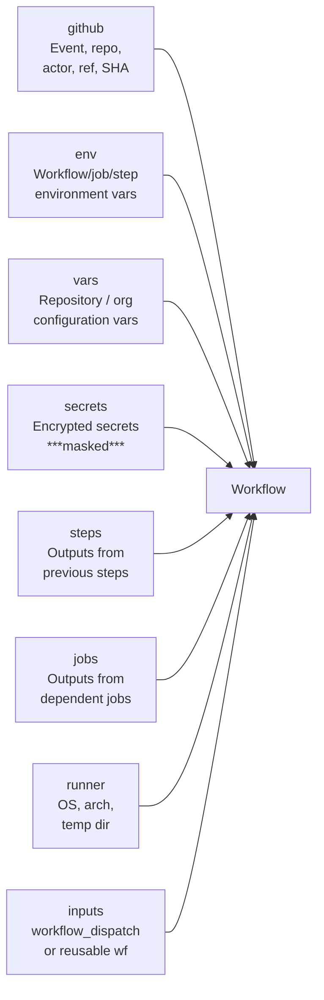

# GitHub Actions Components

This page covers the building blocks of GitHub Actions workflows: the YAML file structure, trigger events, jobs, steps, reusable actions, expressions, contexts, and environment variables.

## Workflow File Structure

All workflow files live in `.github/workflows/` and must be valid YAML. The top-level keys are `name`, `on`, `env`, `defaults`, `concurrency`, `permissions`, and `jobs`.

```yaml
name: CI Pipeline

on:
  push:
    branches: [main, develop]
  pull_request:
    branches: [main]

env:
  REGISTRY: ghcr.io
  IMAGE_NAME: ${{ github.repository }}

permissions:
  contents: read
  packages: write

concurrency:
  group: ${{ github.workflow }}-${{ github.ref }}
  cancel-in-progress: true

defaults:
  run:
    shell: bash
    working-directory: ./src

jobs:
  build:
    runs-on: ubuntu-24.04
    steps:
      - uses: actions/checkout@v4
      - name: Build
        run: make build
```

### Top-Level Keys Reference

| Key | Required | Purpose |
|-----|----------|---------|
| `name` | No | Display name in the GitHub UI |
| `on` | Yes | Events that trigger the workflow |
| `env` | No | Workflow-level environment variables |
| `defaults` | No | Default `run` settings (shell, working-directory) |
| `permissions` | No | Override default GITHUB_TOKEN permissions |
| `concurrency` | No | Prevent duplicate runs |
| `jobs` | Yes | Map of jobs to execute |

## Triggers (`on:`)

### Push and Pull Request

```yaml
on:
  push:
    branches:
      - main
      - 'release/**'
    tags:
      - 'v*'
    paths:
      - 'src/**'
      - '!**.md'         # exclude markdown changes
  pull_request:
    branches: [main]
    types: [opened, synchronize, reopened]
```

**Filter patterns:**

| Pattern | Matches |
|---------|---------|
| `main` | Exactly the `main` branch |
| `release/**` | Any branch starting with `release/` |
| `v*` | Any tag starting with `v` |
| `src/**` | Any file under `src/` |
| `!**.md` | Negation — exclude markdown files |

### Schedule

```yaml
on:
  schedule:
    - cron: '0 2 * * 1-5'   # 02:00 UTC, Mon-Fri
    - cron: '0 8 * * 0'     # 08:00 UTC, Sundays
```

!!! note "Schedule Precision"
    Scheduled workflows may run several minutes late during periods of high load. GitHub does not guarantee exact execution time. The minimum interval is 5 minutes. Schedules only run on the default branch.

### Manual Trigger (workflow_dispatch)

```yaml
on:
  workflow_dispatch:
    inputs:
      environment:
        description: 'Target environment'
        required: true
        type: choice
        options: [dev, staging, production]
      dry_run:
        description: 'Dry run (no changes applied)'
        required: false
        type: boolean
        default: false
      version:
        description: 'Version to deploy'
        required: true
        type: string
```

Inputs are accessed via `${{ inputs.environment }}` in the workflow.

### Repository Dispatch (External Trigger)

```yaml
on:
  repository_dispatch:
    types: [deploy-trigger, build-request]
```

Trigger externally:

```bash
curl -X POST \
  -H "Authorization: Bearer $GITHUB_TOKEN" \
  -H "Accept: application/vnd.github.v3+json" \
  https://api.github.com/repos/OWNER/REPO/dispatches \
  -d '{"event_type":"deploy-trigger","client_payload":{"version":"1.2.3"}}'
```

The `client_payload` is accessible via `${{ github.event.client_payload.version }}`.

### Workflow Run (Cross-Workflow Chaining)

```yaml
on:
  workflow_run:
    workflows: ["CI Pipeline"]
    types: [completed]
    branches: [main]
```

!!! tip "Use workflow_run for Post-CI Steps"
    `workflow_run` is the correct way to chain a deployment workflow after CI completes, particularly when the downstream workflow needs elevated permissions that should not be granted to PR workflows.

## Jobs

Jobs define the units of parallelism. Each job runs on its own runner and is isolated from other jobs unless artifacts or outputs are used to pass data.

### Job Dependencies

```yaml
jobs:
  lint:
    runs-on: ubuntu-24.04
    steps:
      - uses: actions/checkout@v4
      - run: npm run lint

  test:
    runs-on: ubuntu-24.04
    steps:
      - uses: actions/checkout@v4
      - run: npm test

  build:
    needs: [lint, test]         # runs after both complete successfully
    runs-on: ubuntu-24.04
    steps:
      - uses: actions/checkout@v4
      - run: npm run build

  deploy:
    needs: build
    if: github.ref == 'refs/heads/main'
    runs-on: ubuntu-24.04
    environment: production
    steps:
      - run: ./deploy.sh
```

### Job Outputs

Pass data from one job to a dependent job:

```yaml
jobs:
  prepare:
    runs-on: ubuntu-24.04
    outputs:
      version: ${{ steps.get-version.outputs.version }}
    steps:
      - id: get-version
        run: echo "version=$(cat VERSION)" >> "$GITHUB_OUTPUT"

  build:
    needs: prepare
    runs-on: ubuntu-24.04
    steps:
      - run: echo "Building version ${{ needs.prepare.outputs.version }}"
```

### Matrix Strategy

Run a job across multiple configurations simultaneously:

```yaml
jobs:
  test:
    strategy:
      matrix:
        os: [ubuntu-24.04, windows-2022, macos-15]
        node: [18, 20, 22]
        exclude:
          - os: macos-15
            node: 18
        include:
          - os: ubuntu-24.04
            node: 22
            experimental: true
      fail-fast: false       # don't cancel all on first failure
      max-parallel: 6
    runs-on: ${{ matrix.os }}
    steps:
      - uses: actions/setup-node@v4
        with:
          node-version: ${{ matrix.node }}
      - run: npm test
```

## Steps

Steps are the sequential instructions within a job. They share the runner's working directory and environment.

### Run Steps

```yaml
- name: Multi-line script
  run: |
    echo "Starting build..."
    make clean
    make all
  shell: bash
  working-directory: ./backend

- name: Windows PowerShell step
  run: Get-ChildItem -Recurse
  shell: pwsh
```

Supported shells: `bash`, `sh`, `cmd`, `pwsh`, `python`.

### Action Steps (uses:)

```yaml
- name: Checkout code
  uses: actions/checkout@v4
  with:
    fetch-depth: 0         # full history for git log
    submodules: recursive

- name: Set up Python
  uses: actions/setup-python@v5
  with:
    python-version: '3.12'
    cache: 'pip'
```

Actions can be sourced from:

| Source | Syntax | Example |
|--------|--------|---------|
| Marketplace / public repo | `owner/repo@ref` | `actions/checkout@v4` |
| Same repository | `./path/to/action` | `./ci/actions/setup` |
| Docker container | `docker://image:tag` | `docker://alpine:3.19` |

!!! warning "Always Pin Action Versions to a SHA"
    Using mutable tags like `@v4` or `@main` means a compromised upstream repo can inject malicious code into your workflow. In production, pin to the full commit SHA:
    ```yaml
    uses: actions/checkout@11bd71901bbe5b1630ceea73d27597364c9af683  # v4.2.2
    ```
    Use Dependabot or Renovate to automate SHA updates.

### Step Conditionals

```yaml
- name: Deploy to production
  if: github.ref == 'refs/heads/main' && github.event_name == 'push'
  run: ./deploy.sh

- name: Notify on failure
  if: failure()
  uses: slackapi/slack-github-action@v2
  with:
    payload: '{"text":"Build failed!"}'
```

**Status check functions:**

| Function | True when |
|----------|-----------|
| `success()` | All previous steps succeeded |
| `failure()` | Any previous step failed |
| `cancelled()` | Workflow was cancelled |
| `always()` | Unconditionally true |

## Expressions

Expressions evaluate at runtime and can access contexts, apply operators, and call built-in functions. They are delimited by `${{ }}`.

```yaml
# String interpolation
name: Build ${{ github.ref_name }}

# Conditional
if: ${{ github.event_name == 'push' && contains(github.ref, 'main') }}

# Ternary-like pattern using conditional assignment
env:
  DEPLOY_ENV: ${{ github.ref == 'refs/heads/main' && 'production' || 'staging' }}
```

### Built-in Functions

| Function | Description |
|----------|-------------|
| `contains(search, item)` | True if string/array contains item |
| `startsWith(str, prefix)` | True if string starts with prefix |
| `endsWith(str, suffix)` | True if string ends with suffix |
| `format(str, ...args)` | String interpolation |
| `join(array, separator)` | Join array elements |
| `toJSON(value)` | Convert value to JSON string |
| `fromJSON(string)` | Parse JSON string to object |
| `hashFiles(path)` | SHA-256 hash of matched files |

## Contexts

Contexts are structured objects available throughout a workflow that expose runtime information.



### `github` Context (Key Properties)

| Property | Value |
|----------|-------|
| `github.actor` | Username that triggered the workflow |
| `github.event_name` | Name of the triggering event |
| `github.ref` | Full ref (`refs/heads/main`) |
| `github.ref_name` | Short ref name (`main`) |
| `github.sha` | 40-character commit SHA |
| `github.repository` | `owner/repo` |
| `github.run_id` | Unique ID for the workflow run |
| `github.run_number` | Sequential run count for the workflow |
| `github.server_url` | `https://github.com` (or GHES URL) |
| `github.api_url` | `https://api.github.com` |
| `github.workspace` | Absolute path to workspace on runner |

### `runner` Context

| Property | Value |
|----------|-------|
| `runner.os` | `Linux`, `Windows`, `macOS` |
| `runner.arch` | `X64`, `ARM64` |
| `runner.temp` | Temporary directory (cleaned after job) |
| `runner.tool_cache` | Cached tool installations |

## Environment Variables

Variables can be set at three scopes. Narrower scopes override broader ones.

```yaml
env:
  GLOBAL_VAR: "available everywhere"   # workflow scope

jobs:
  build:
    env:
      JOB_VAR: "available in all steps of this job"
    steps:
      - name: Run with step-scoped var
        env:
          STEP_VAR: "only in this step"
        run: echo "$GLOBAL_VAR $JOB_VAR $STEP_VAR"
```

### Setting Variables Dynamically

```yaml
- name: Set dynamic variable
  run: echo "BUILD_DATE=$(date -u +%Y%m%d)" >> "$GITHUB_ENV"

- name: Use the variable
  run: echo "Build date is $BUILD_DATE"
```

### GitHub-Provided Default Variables

| Variable | Value |
|----------|-------|
| `GITHUB_WORKFLOW` | Workflow name |
| `GITHUB_RUN_ID` | Unique run ID |
| `GITHUB_RUN_NUMBER` | Run count for this workflow |
| `GITHUB_ACTOR` | Username triggering the run |
| `GITHUB_REPOSITORY` | `owner/repo` |
| `GITHUB_SHA` | Commit SHA |
| `GITHUB_REF` | Full ref (e.g. `refs/heads/main`) |
| `GITHUB_WORKSPACE` | Workspace path on runner |
| `GITHUB_OUTPUT` | Path to step output file |
| `GITHUB_ENV` | Path to step environment file |
| `GITHUB_PATH` | Path to PATH update file |
| `GITHUB_STEP_SUMMARY` | Path to step summary file (shown in UI) |

### Configuration Variables (vars context)

Non-secret configuration values can be stored as repository or organisation variables and accessed via `${{ vars.MY_VAR }}`. Unlike secrets, these are visible in the UI and workflow logs.

```yaml
- name: Deploy
  run: ./deploy.sh --region ${{ vars.AWS_REGION }} --env ${{ vars.DEPLOY_ENV }}
```

Set via CLI:

```bash
gh variable set AWS_REGION --body "eu-west-1"
gh variable list
```
