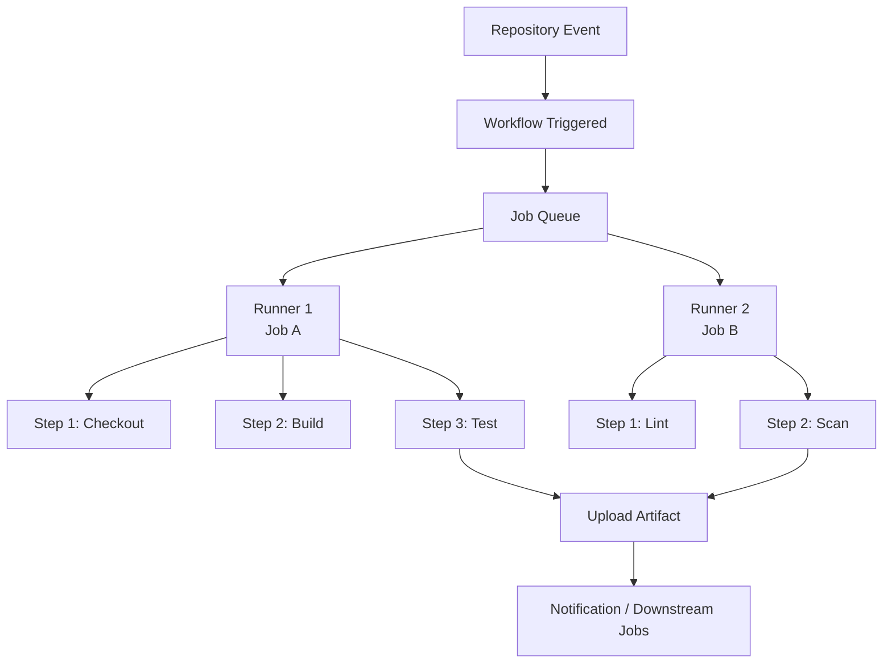

---
tags:
  - architecture
  - github-actions
---
# GitHub Actions — How It Works


<div class="kb-summary">
GitHub Actions is an event-driven CI/CD and automation platform embedded directly into GitHub repositories. It executes workflows in response to repository events, schedules, or external triggers.

*Applies to: GitHub Actions*
</div>

---

## Core Execution Model


```text
┌──────────────────────────────────── GitHub Actions — How It Works ────────────────────────────────────┐
│   ┌───────────────────────────────────────────────────────────────────────────────────────────────┐   │
│   │ Event fires → GitHub evaluates on: triggers → matching workflows queued → runner picks up job │   │
│   │     Runner clones repo, restores cache, executes steps, uploads artifacts, reports status     │   │
│   │          Secrets injected as env vars at runtime; masked in log output automatically          │   │
│   └───────────────────────────────────────────────────────────────────────────────────────────────┘   │
│                                                                                                       │
│   ┌─────────────────────────────┐  ┌─────────────────────────────┐  ┌─────────────────────────────┐   │
│   │        Trigger Phase        │  │       Execution Phase       │  │         Result Phase        │   │
│   │   Event: push/PR/schedule   │  │      Runner accepts job     │  │     Status check posted     │   │
│   │    on: filter evaluation    │  │        Repo checkout        │  │     Artifacts available     │   │
│   │     Workflow file parsed    │  │        Cache restore        │  │      Logs retained 90d      │   │
│   │     Jobs queued parallel    │  │      Steps run in order     │  │      Notify: PR, Slack      │   │
│   └─────────────────────────────┘  └─────────────────────────────┘  └─────────────────────────────┘   │
│                                                                                                       │
│   ┌───────────────────────────────────────────────────────────────────────────────────────────────┐   │
│   │     GITHUB_TOKEN    = auto-generated per-job token; scoped to repo; expires when job ends     │   │
│   │      permissions:    = restrict GITHUB_TOKEN scopes per job; principle of least privilege     │   │
│   │    needs:          = declare job dependency; forces sequential execution and output passing   │   │
│   │        if: condition   = conditional step/job execution; uses expression syntax ${{ }}        │   │
│   └───────────────────────────────────────────────────────────────────────────────────────────────┘   │
└───────────────────────────────────────────────────────────────────────────────────────────────────────┘
```

| Scope | Registration Level | Shared Across |
|---|---|---|
| Repository | Single repository settings | That repo only |
| Organisation | Organisation settings | All repos granted access |
| Enterprise | Enterprise settings | All orgs in the enterprise |

!!! warning "Self-Hosted Runner Security"
    Never run self-hosted runners on public repositories — a forked PR can execute arbitrary code on the host.

---

## Concurrency

Concurrency groups prevent duplicate workflow runs for the same logical scope.

```yaml
concurrency:
  group: ${{ github.workflow }}-${{ github.ref }}
  cancel-in-progress: true
```

---

## Artifacts

```yaml
- uses: actions/upload-artifact@v4
  with:
    name: dist-package
    path: dist/
    retention-days: 30

- uses: actions/download-artifact@v4
  with:
    name: dist-package
    path: dist/
```

| Limit | Value |
|---|---|
| Default retention | 90 days |
| Maximum size per artifact | 10 GB |

---

## Platform Limits

| Limit | GitHub Free | GitHub Team | GitHub Enterprise |
|---|---|---|---|
| Concurrent jobs (Linux, hosted) | 20 | 60 | 180 |
| Job execution timeout | 6 hours | 6 hours | 6 hours |
| Artifact storage included | 500 MB | 2 GB | 50 GB |
| Cache storage per repository | 10 GB | 10 GB | 10 GB |
| Secrets per repository | 100 | 100 | 100 |
