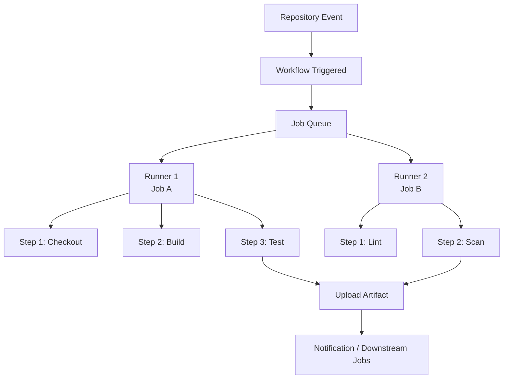
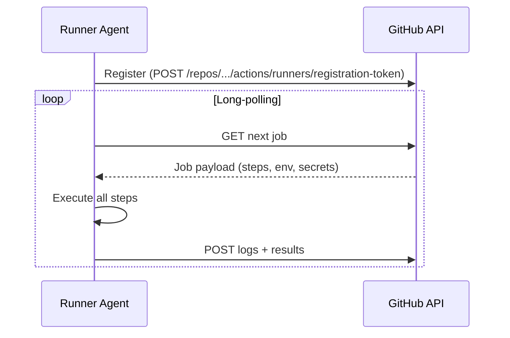

# GitHub Actions — How It Works

GitHub Actions is an event-driven CI/CD and automation platform embedded directly into GitHub repositories. It executes workflows in response to repository events, schedules, or external triggers.

---

## Core Execution Model


```

| Property | Purpose |
|---|---|
| `runs-on` | Specifies the runner label or group |
| `needs` | Declares upstream job dependencies |
| `if` | Conditional execution expression |
| `environment` | Links to a protected deployment environment |
| `concurrency` | Prevents duplicate runs for the same group |
| `timeout-minutes` | Hard deadline for the job (default 360) |
| `strategy.matrix` | Fan-out across multiple configurations |
| `outputs` | Key-value data passed to dependent jobs |

---

## Steps

```yaml
steps:
  - name: Checkout repository
    uses: actions/checkout@v4

  - name: Install dependencies
    run: npm ci

  - name: Run tests
    run: npm test
    env:
      NODE_ENV: test

  - name: Upload coverage
    uses: actions/upload-artifact@v4
    with:
      name: coverage
      path: coverage/
```

---

## Runners

### GitHub-Hosted Runners

| Label | OS | vCPU | RAM |
|---|---|---|---|
| `ubuntu-24.04` / `ubuntu-latest` | Ubuntu 24.04 LTS | 4 | 16 GB |
| `ubuntu-22.04` | Ubuntu 22.04 LTS | 4 | 16 GB |
| `windows-2022` / `windows-latest` | Windows Server 2022 | 4 | 16 GB |
| `macos-15` / `macos-latest` | macOS 15 (ARM, M1) | 4 | 14 GB |

### Self-Hosted Runners

Self-hosted runners poll GitHub via HTTPS long-polling for job assignments.



| Scope | Registration Level | Shared Across |
|---|---|---|
| Repository | Single repository settings | That repo only |
| Organisation | Organisation settings | All repos granted access |
| Enterprise | Enterprise settings | All orgs in the enterprise |

!!! warning "Self-Hosted Runner Security"
    Never run self-hosted runners on public repositories — a forked PR can execute arbitrary code on the host.

---

## Concurrency

Concurrency groups prevent duplicate workflow runs for the same logical scope.

```yaml
concurrency:
  group: ${{ github.workflow }}-${{ github.ref }}
  cancel-in-progress: true
```

---

## Artifacts

```yaml
- uses: actions/upload-artifact@v4
  with:
    name: dist-package
    path: dist/
    retention-days: 30

- uses: actions/download-artifact@v4
  with:
    name: dist-package
    path: dist/
```

| Limit | Value |
|---|---|
| Default retention | 90 days |
| Maximum size per artifact | 10 GB |

---

## Platform Limits

| Limit | GitHub Free | GitHub Team | GitHub Enterprise |
|---|---|---|---|
| Concurrent jobs (Linux, hosted) | 20 | 60 | 180 |
| Job execution timeout | 6 hours | 6 hours | 6 hours |
| Artifact storage included | 500 MB | 2 GB | 50 GB |
| Cache storage per repository | 10 GB | 10 GB | 10 GB |
| Secrets per repository | 100 | 100 | 100 |
