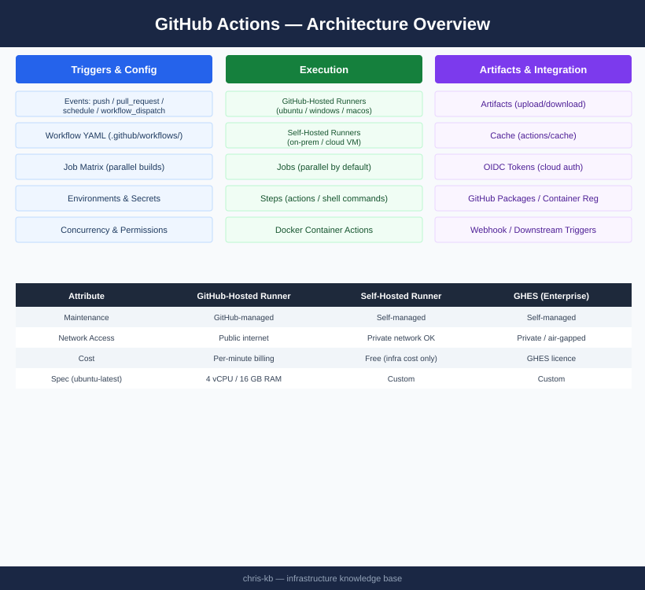
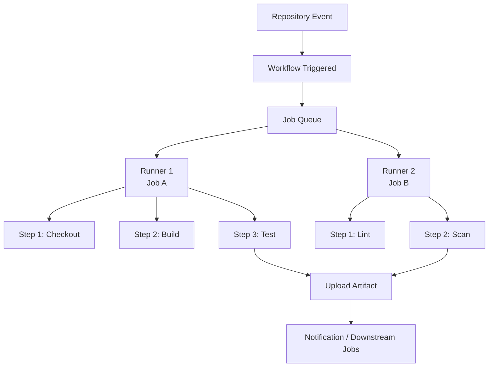

# GitHub Actions — Architecture

Event-driven CI/CD platform embedded in GitHub repositories; workflows defined in YAML trigger on push, PR, schedule, or API call; jobs run in parallel on hosted or self-hosted runners; artifacts and outputs bridge job data.

<a class="kb-card" href="how-it-works/">
  <strong>How It Works</strong>
  Events, workflows, jobs, steps, runners, concurrency, and artifacts.
</a>

<a class="kb-card" href="integrations/">
  <strong>Integrations</strong>
  Integration with other platforms and external systems.
</a>

<a class="kb-card" href="design-standards/">
  <strong>Design Standards</strong>
  Sizing guidelines, design standards, and best practices.
</a>

## GitHub-Hosted Runner Specs

| Label | OS | vCPU | RAM |
|---|---|---|---|
| `ubuntu-24.04` / `ubuntu-latest` | Ubuntu 24.04 LTS | 4 | 16 GB |
| `ubuntu-22.04` | Ubuntu 22.04 LTS | 4 | 16 GB |
| `windows-2022` / `windows-latest` | Windows Server 2022 | 4 | 16 GB |
| `macos-15` / `macos-latest` | macOS 15 (ARM, M1) | 4 | 14 GB |

## Core Execution Model

