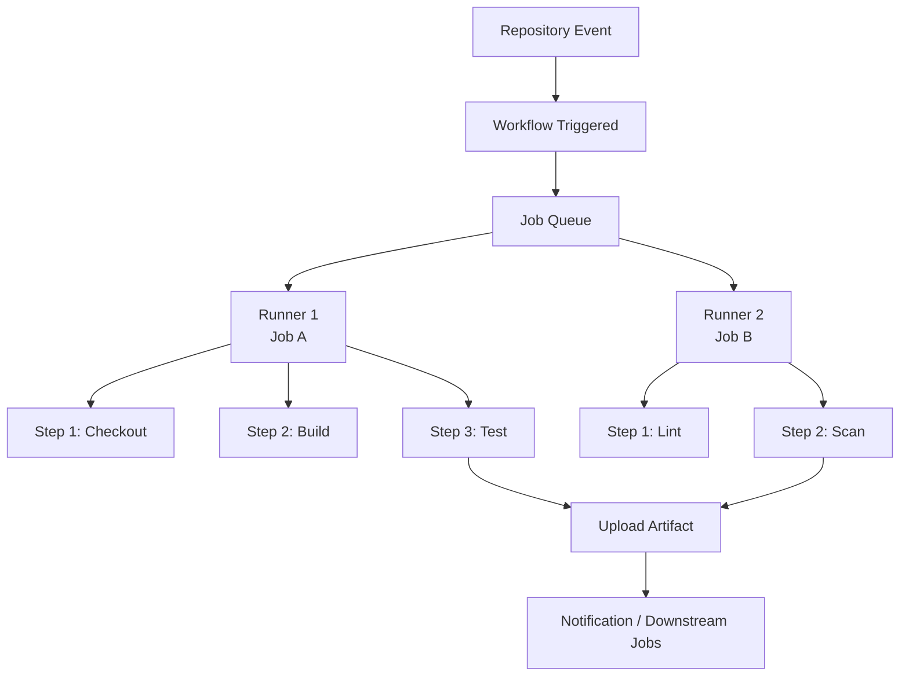
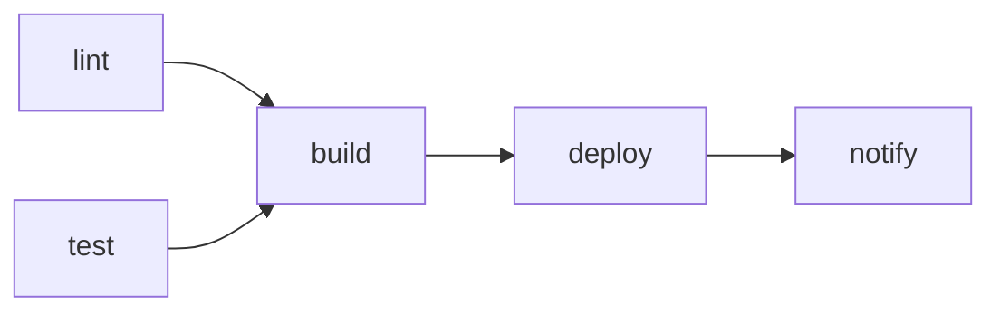
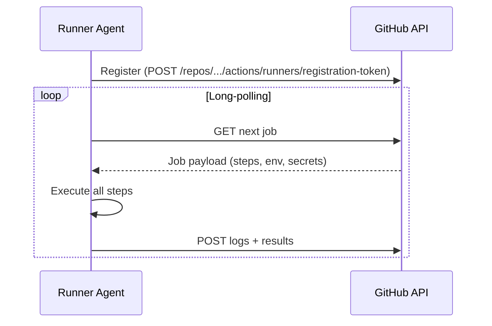

# GitHub Actions Architecture Overview

GitHub Actions is an event-driven CI/CD and automation platform embedded directly into GitHub repositories. It executes workflows in response to repository events, schedules, or external triggers. Understanding the execution model — from event to step — is essential for designing reliable, scalable pipelines.

## Core Execution Model



Events fire workflows. Workflows contain jobs. Jobs run on runners. Steps execute sequentially within a job. Artifacts bridge data between jobs.

## Events

Events are the triggers that cause a workflow to execute. GitHub supports over 35 distinct event types.

### Webhook Events

| Event | Description |
|-------|-------------|
| `push` | Commits pushed to a branch or tag |
| `pull_request` | PR opened, synchronized, or closed |
| `pull_request_target` | PR event running in the context of the base branch (elevated trust) |
| `release` | Release published, created, or deleted |
| `workflow_run` | Another workflow completes |
| `deployment` | A deployment is created |
| `registry_package` | Package published to GitHub Packages |
| `issue_comment` | Comment posted on an issue or PR |

### Non-Webhook Events

| Event | Description |
|-------|-------------|
| `schedule` | Cron-based timer (UTC, minimum 5-minute interval) |
| `workflow_dispatch` | Manual trigger via UI, API, or `gh` CLI |
| `repository_dispatch` | External HTTP POST to GitHub API |

!!! warning "pull_request_target Risk"
    `pull_request_target` runs in the context of the base branch and has access to repository secrets. Never checkout and execute code from the PR head without explicit validation — this is a known attack vector for privilege escalation.

## Workflows

A workflow is a YAML file stored in `.github/workflows/`. It defines the automation logic for a repository. Multiple workflows can run concurrently in the same repository.

**Key properties:**

- Stored as `.github/workflows/<name>.yaml`
- Evaluated at trigger time from the default branch (or the ref that fired the event)
- Can be disabled at the repository or organisation level
- Each workflow run gets its own run ID and is independently audited in the Actions tab

## Jobs

A job is a set of steps that executes on a single runner. Jobs within a workflow are independent by default and run in parallel. Sequential execution requires explicit `needs:` dependencies.



### Job Properties

| Property | Purpose |
|----------|---------|
| `runs-on` | Specifies the runner label or group |
| `needs` | Declares upstream job dependencies |
| `if` | Conditional execution expression |
| `environment` | Links to a protected deployment environment |
| `concurrency` | Prevents duplicate runs for the same group |
| `timeout-minutes` | Hard deadline for the job (default 360) |
| `continue-on-error` | Allow downstream jobs despite this job failing |
| `strategy.matrix` | Fan-out across multiple configurations |
| `outputs` | Key-value data passed to dependent jobs |

## Steps

Steps are the atomic units of execution within a job. Each step runs in sequence and shares the runner filesystem and environment with all other steps in the same job.

A step is one of two types:

1. **Run step** — Executes shell commands directly on the runner
2. **Action step** — Invokes a reusable action via `uses:`

```yaml
steps:
  - name: Checkout repository
    uses: actions/checkout@v4

  - name: Install dependencies
    run: npm ci

  - name: Run tests
    run: npm test
    env:
      NODE_ENV: test

  - name: Upload coverage
    uses: actions/upload-artifact@v4
    with:
      name: coverage
      path: coverage/
```

Steps share environment variables set with `$GITHUB_ENV`, path additions via `$GITHUB_PATH`, and produce outputs written to `$GITHUB_OUTPUT`.

## Runners

A runner is a virtual machine or physical host that executes jobs. GitHub provides managed runners, or you can operate your own self-hosted infrastructure.

### GitHub-Hosted Runners

GitHub-hosted runners are provisioned fresh for every job and torn down after completion. They include pre-installed toolchains for common languages and platforms.

| Label | OS | vCPU | RAM | Storage |
|-------|----|------|-----|---------|
| `ubuntu-24.04` / `ubuntu-latest` | Ubuntu 24.04 LTS | 4 | 16 GB | 14 GB SSD |
| `ubuntu-22.04` | Ubuntu 22.04 LTS | 4 | 16 GB | 14 GB SSD |
| `windows-2022` / `windows-latest` | Windows Server 2022 | 4 | 16 GB | 14 GB SSD |
| `macos-15` / `macos-latest` | macOS 15 (ARM, M1) | 4 | 14 GB | 14 GB SSD |
| `macos-13` | macOS 13 (Intel) | 3 | 14 GB | 14 GB SSD |

!!! note "ubuntu-latest Resolution"
    The `ubuntu-latest` label resolves to the current stable Ubuntu image. As of 2025, this maps to `ubuntu-24.04`. GitHub announces image promotions in the `actions/runner-images` repository at least 60 days in advance.

**Larger runners** (GitHub Team and Enterprise Cloud plans) offer configurations up to 64 vCPU / 256 GB RAM, GPU-powered (NVIDIA A10G) hosts, and ARM64 Linux runners. These are registered in organisation runner groups and targeted by custom labels.

### Self-Hosted Runners

Self-hosted runners give full control over the execution environment: OS, installed tools, network access, and hardware. The runner application is installed on a host and polls GitHub via HTTPS long-polling for job assignments.



**Runner scopes:**

| Scope | Registration Level | Shared Across |
|-------|--------------------|---------------|
| Repository | Single repository settings | That repo only |
| Organisation | Organisation settings | All repos granted access |
| Enterprise | Enterprise settings | All orgs in the enterprise |

**Runner labels** allow jobs to target specific runners by operating system, architecture, or capability:

```yaml
runs-on: [self-hosted, linux, x64, production]
```

!!! warning "Self-Hosted Runner Security"
    Never run self-hosted runners on public repositories — a forked PR can execute arbitrary code on the host. For public repos, use GitHub-hosted runners only. For private repos, use ephemeral runners via Actions Runner Controller and enforce environment protection rules on any job touching secrets.

### Actions Runner Controller (ARC)

ARC is the Kubernetes-native autoscaling solution for self-hosted runners. It provisions ephemeral runner pods on demand and terminates them after job completion, eliminating persistent runner state and reducing attack surface.

```yaml
apiVersion: actions.github.com/v1alpha1
kind: AutoscalingRunnerSet
metadata:
  name: arc-runner-set
  namespace: arc-systems
spec:
  githubConfigUrl: https://github.com/my-org/my-repo
  githubConfigSecret: arc-github-secret
  minRunners: 1
  maxRunners: 10
  template:
    spec:
      containers:
        - name: runner
          image: ghcr.io/actions/actions-runner:latest
          resources:
            requests:
              cpu: "1"
              memory: 2Gi
```

## Concurrency

Concurrency groups prevent duplicate workflow runs for the same logical scope (branch, PR, environment). When a new run is triggered for an existing group, the in-progress or queued run is cancelled (if `cancel-in-progress: true`).

```yaml
concurrency:
  group: ${{ github.workflow }}-${{ github.ref }}
  cancel-in-progress: true
```

| Setting | Effect |
|---------|--------|
| `group` | Unique string identifying the concurrency group |
| `cancel-in-progress: true` | Cancel the current queued or running job when a new run starts |
| `cancel-in-progress: false` | Queue the new run; wait for the existing run to complete |

Common patterns:

```yaml
# Per-branch — cancel superseded CI runs
group: ci-${{ github.ref_name }}
cancel-in-progress: true

# Per-PR — cancel stale runs when PR is force-pushed
group: pr-${{ github.event.pull_request.number }}
cancel-in-progress: true

# Environment-scoped — serialise deploys to production
group: production-deploy
cancel-in-progress: false
```

## Artifacts

Artifacts are files or directories uploaded from a job step and stored by GitHub for a configurable retention period. They are the primary mechanism for passing build outputs between jobs and for making files available to download after a run.

```yaml
# Upload in one job
- uses: actions/upload-artifact@v4
  with:
    name: dist-package
    path: dist/
    retention-days: 30

# Download in a subsequent job
- uses: actions/download-artifact@v4
  with:
    name: dist-package
    path: dist/
```

| Limit | Value |
|-------|-------|
| Default retention | 90 days |
| Maximum retention (configurable) | 400 days |
| Maximum size per artifact | 10 GB |
| Maximum total per run | 10 GB |

!!! tip "Artifact vs Cache"
    Use **artifacts** for build outputs, test reports, and binaries you want to persist or download. Use `actions/cache` for dependency directories (`.npm`, `.gradle`, `vendor/`) that accelerate repeated runs. Caches are keyed and shared across runs; artifacts are scoped to a single workflow run.

## Platform Limits

| Limit | GitHub Free | GitHub Team | GitHub Enterprise |
|-------|-------------|-------------|-------------------|
| Concurrent jobs (Linux, hosted) | 20 | 60 | 180 |
| Job execution timeout | 6 hours | 6 hours | 6 hours |
| Workflow run timeout | 35 days | 35 days | 35 days |
| Artifact storage included | 500 MB | 2 GB | 50 GB |
| Cache storage per repository | 10 GB | 10 GB | 10 GB |
| Secrets per repository | 100 | 100 | 100 |
| Secrets per organisation | 300 | 300 | 300 |

---

## In this section

<div class="kb-grid kb-grid-3">
<a class="kb-card" href="components/"><strong>Components</strong><span>Core components, services, and technical specifications.</span></a>
<a class="kb-card" href="integrations/"><strong>Integrations</strong><span>Integration with other platforms and external systems.</span></a>
<a class="kb-card" href="standards/"><strong>Standards</strong><span>Sizing guidelines, design standards, and best practices.</span></a>
</div>
