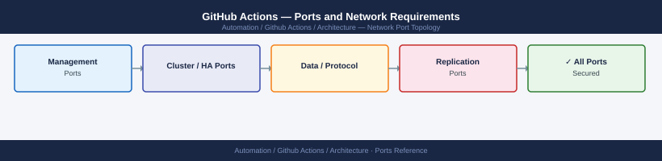

---
tags:
  - github-actions
  - automation
  - networking
  - firewall
  - ports
  - cicd
description: "Firewall port reference for GitHub Actions with self-hosted runners. GitHub-hosted runners run in GitHub's cloud — no on-premise firewall rules needed for..."
---
# GitHub Actions — Ports and Network Requirements

<div class="kb-summary">
Firewall port reference for GitHub Actions with self-hosted runners. GitHub-hosted runners run in GitHub's cloud — no on-premise firewall rules needed for those. Self-hosted runners require outbound 443 to github.com and any deployment target ports.

*Applies to: GitHub Actions with self-hosted runners*
</div>


## Self-Hosted Runner — Outbound to GitHub

Self-hosted runners connect **outbound** to GitHub — no inbound from GitHub to the runner is required.

| Port | Protocol | Destination | Purpose |
|---|---|---|---|
| 443 | TCP | github.com, api.github.com | Job polling, artifact upload/download, webhook processing |
| 443 | TCP | *.actions.githubusercontent.com | Action runner runtime and caches |
| 443 | TCP | ghcr.io, *.pkg.github.com | GitHub Container Registry (image pull for container jobs) |

## Self-Hosted Runner — Deployment Targets (Job-Specific)

Runners connect to deployment targets during jobs. Open from the runner's IP to each target type:

| Port | Protocol | Destination | Purpose |
|---|---|---|---|
| 22 | TCP | Linux deployment targets | SSH deployments, Ansible from runner |
| 443 | TCP | vCenter, AWS, Azure, GCP APIs | IaC and cloud deployment |
| 5986 | TCP | Windows deployment targets | WinRM HTTPS — Windows deployment |
| 443 | TCP | Self-hosted GitLab / package registries | Cross-platform integration |
| 443 | TCP | Docker Hub, GHCR, private registry | Container image pull/push |

## Inbound — Webhook Receiver (if repo is self-hosted GitHub Enterprise)

| Port | Protocol | Source | Purpose |
|---|---|---|---|
| 443 | TCP | GitHub.com or GitHub Enterprise | Webhook delivery to GitHub Enterprise server |
| 22 | TCP | GitHub Enterprise admin | GitHub Enterprise SSH access |

## Firewall Zone Summary

| From | To | Ports | Notes |
|---|---|---|---|
| Self-hosted runner | github.com | 443 | Job polling — must be open |
| Self-hosted runner | Deployment targets | 22, 443, 5986 | Job-specific — open per deployment type |
| GitHub (cloud) | GitHub Enterprise | 443 | Webhook delivery (if GHE) |

## Verify

```bash
# From self-hosted runner host — test GitHub connectivity
curl -sk -o /dev/null -w "%{http_code}" https://api.github.com/

# Test runner registration
./config.sh --url https://github.com/<org>/<repo> --token <token> --check

# From runner — test deployment target
nc -zv <linux-deploy-target> 22
```


```text title="Expected output"
200
Runner registration check: OK
Connection to 192.168.1.45 22 port [tcp/ssh] succeeded!
```

!!! warning "Common errors"
    | Error | Fix |
    |---|---|
    | `curl: (60) SSL certificate problem: self signed certificate` | Remove the `-k` flag if testing against a properly signed certificate, or ensure your corporate CA bundle is in the system trust store. |
    | `Error: Not found` | Verify the `<org>/<repo>` path is correct and the token has `repo` and `admin:org_self_hosted_runner` scopes. |
    | `nc: connect to 192.168.1.45 port 22 (tcp) failed: Connection refused` | Confirm the SSH service is running on the target host with `systemctl status ssh` and that firewall rules allow inbound port 22. |
## See also

- [GitHub Actions — Architecture](../how-it-works/)
- [Ansible — Ports](../../ansible/architecture/ports.md)
- [Terraform — Ports](../../terraform/architecture/ports.md)
- [Git — Ports](../../../itsm/git/architecture/ports.md)
