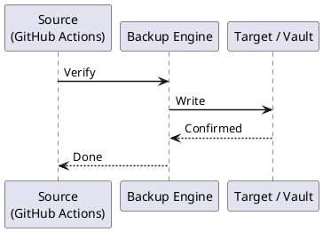

---
tags:
  - github-actions
  - operations
---
# GitHub Actions — Backup & Restore

```bash
# Mirror repository to backup location
git remote add backup git@backup-gitlab.example.com:org/repo.git
git push backup --mirror

# Automate daily mirror
cat > /usr/local/bin/github-repo-mirror.sh <<'EOF'
#!/bin/bash
set -euo pipefail
REPOS=(
  "git@github.com:org/infra.git"
  "git@github.com:org/app.git"
)
BACKUP_DIR="/backups/github"

for repo in "${REPOS[@]}"; do
  name=$(basename "$repo" .git)
  if [ -d "$BACKUP_DIR/$name.git" ]; then
    git -C "$BACKUP_DIR/$name.git" fetch --all
  else
    git clone --mirror "$repo" "$BACKUP_DIR/$name.git"
  fi
done
EOF
chmod +x /usr/local/bin/github-repo-mirror.sh
echo "0 2 * * * /usr/local/bin/github-repo-mirror.sh" | crontab -
```

```bash
# Recreate secrets from source systems
# SSH deploy keys — from control node
gh secret set DEPLOY_SSH_KEY < ~/.ssh/deploy_ed25519

# AWS credentials — from IAM (or use OIDC — no secret needed)
gh secret set AWS_ACCESS_KEY_ID --body "$AWS_ACCESS_KEY_ID"
gh secret set AWS_SECRET_ACCESS_KEY --body "$AWS_SECRET_ACCESS_KEY"

# Vault token — from HashiCorp Vault
gh secret set VAULT_TOKEN --body "$(vault token create -field=token -policy=github-actions)"

# Slack bot token — from Slack app settings
gh secret set SLACK_BOT_TOKEN --body "$SLACK_BOT_TOKEN"
```
```bash
# Create environment
gh api --method PUT repos/ORG/REPO/environments/production \
  --field wait_timer=0 \
  --field prevent_self_review=true

# Add required reviewers
gh api --method PUT repos/ORG/REPO/environments/production \
  -f 'reviewers[][type]=User' -f 'reviewers[][id]=123'

# Set environment secrets
gh secret set PROD_DB_PASSWORD --env production --body "$PROD_DB_PASSWORD"
```
```bash
# Get registration token
REG_TOKEN=$(gh api --method POST repos/ORG/REPO/actions/runners/registration-token | jq -r .token)

# Re-register runner
cd /home/github-runner/actions-runner
./config.sh \
  --url https://github.com/ORG/REPO \
  --token "$REG_TOKEN" \
  --name "prod-runner-01" \
  --labels "self-hosted,linux,prod" \
  --unattended

# Start service
sudo ./svc.sh install
sudo ./svc.sh start
```
```bash
# Export org-level secrets (names only)
gh secret list --org ORG > org-secret-names.txt

# Export org-level workflow files (stored in .github repo)
git clone git@github.com:ORG/.github.git /backups/github/org-github-repo

# Export runner groups
gh api orgs/ORG/actions/runner-groups | jq '.runner_groups[]' > runner-groups.json
```



## Before you begin

- **Access:** Admin credentials on all affected systems
- **Timing:** safe to run during business hours unless a step is marked ⚠ (causes interruption)
- **Dependencies:** no active upgrades or migrations on the same infrastructure
- **Logging:** capture command output — paste into the change record on completion

---

---

## Verify

- Confirm the operation completed without errors in the log or management UI
- Verify the expected state change is visible (service running, object created, config applied)
- Document the outcome in the change record

---

## See also

- [GitHub Actions — Procedures](../procedures/)
- [GitHub Actions — Health Checks](../health-checks/)
- [GitHub Actions — Common Issues](../../troubleshooting/common-issues/)
