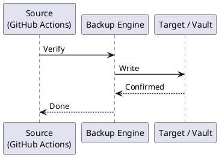

---
tags:
  - github-actions
  - operations
---
# GitHub Actions — Backup & Restore

```bash
# Mirror repository to backup location
git remote add backup git@backup-gitlab.example.com:org/repo.git
git push backup --mirror

# Automate daily mirror
cat > /usr/local/bin/github-repo-mirror.sh <<'EOF'
#!/bin/bash
set -euo pipefail
REPOS=(
  "git@github.com:org/infra.git"
  "git@github.com:org/app.git"
)
BACKUP_DIR="/backups/github"

for repo in "${REPOS[@]}"; do
  name=$(basename "$repo" .git)
  if [ -d "$BACKUP_DIR/$name.git" ]; then
    git -C "$BACKUP_DIR/$name.git" fetch --all
  else
    git clone --mirror "$repo" "$BACKUP_DIR/$name.git"
  fi
done
EOF
chmod +x /usr/local/bin/github-repo-mirror.sh
echo "0 2 * * * /usr/local/bin/github-repo-mirror.sh" | crontab -
```


```text title="Expected output"
Enumerating objects: 1247, done.
Counting objects: 100% (1247/1247), done.
Delta compression using up to 8 threads: 100%
Compressing objects: 100% (892/892), done.
Writing objects: 100% (1247/1247), 156.3 MiB | 8.2 MiB/s, done.
Total 1247 (delta 445), reused 1247 (delta 445), pack-reused 0
Cloning into bare repository '/backups/github/infra.git'...
remote: Enumerating objects: 3892, done.
remote: Counting objects: 100% (3892/3892), done.
remote: Compressing objects: 100% (2156/2156), done.
Receiving objects: 100% (3892/3892), 287.4 MiB | 12.1 MiB/s, done.
Resolving deltas: 100% (1456/1456), done.
Fetching all remotes for /backups/github/app.git
From github.com:org/app
 * [new branch]      develop    -> origin/develop
 * [new branch]      main       -> origin/main
crontab: installing new crontab
```

!!! warning "Common errors"
    | Error | Fix |
    |---|---|
    | `fatal: Could not read from remote repository. Please make sure you have the correct access rights and the repository exists.` | Verify SSH key is loaded with `ssh-add -l` and has access to both GitHub and backup-gitlab.example.com. |
    | `fatal: destination path '/backups/github/infra.git' already exists and is not an empty directory.` | Remove the existing backup directory with `rm -rf /backups/github/infra.git` before re-running the script. |
    | `crontab: no changes made to crontab` | Append to the existing crontab using `(crontab -l; echo "0 2 * * * /usr/local/bin/github-repo-mirror.sh") | crontab -` instead of piping directly. |
```bash
# Recreate secrets from source systems
# SSH deploy keys — from control node
gh secret set DEPLOY_SSH_KEY < ~/.ssh/deploy_ed25519

# AWS credentials — from IAM (or use OIDC — no secret needed)
gh secret set AWS_ACCESS_KEY_ID --body "$AWS_ACCESS_KEY_ID"
gh secret set AWS_SECRET_ACCESS_KEY --body "$AWS_SECRET_ACCESS_KEY"

# Vault token — from HashiCorp Vault
gh secret set VAULT_TOKEN --body "$(vault token create -field=token -policy=github-actions)"

# Slack bot token — from Slack app settings
gh secret set SLACK_BOT_TOKEN --body "$SLACK_BOT_TOKEN"
```

```text title="Expected output"
✓ Set secret DEPLOY_SSH_KEY for repo acme-corp/infrastructure
✓ Set secret AWS_ACCESS_KEY_ID for repo acme-corp/infrastructure
✓ Set secret AWS_SECRET_ACCESS_KEY for repo acme-corp/infrastructure
Key ID: s.xxxxxxxxxxxxxx
Token ID: s.xxxxxxxxxxxxxx
TTL: 768h
✓ Set secret VAULT_TOKEN for repo acme-corp/infrastructure
✓ Set secret SLACK_BOT_TOKEN for repo acme-corp/infrastructure
```

!!! warning "Common errors"
    | Error | Fix |
    |---|---|
    | `Error: authentication required` | Run `gh auth login` and authenticate with a GitHub token that has `admin:repo_hook` permissions. |
    | `Error: Could not authenticate with Vault` | Ensure `VAULT_ADDR` and `VAULT_TOKEN` environment variables are set and the Vault instance is reachable. |
    | `Error: variable is empty or unset` | Export the environment variable (e.g., `export AWS_ACCESS_KEY_ID=...`) before running the script, or use `--body` with a literal value instead of variable expansion. |
```bash
# Create environment
gh api --method PUT repos/ORG/REPO/environments/production \
  --field wait_timer=0 \
  --field prevent_self_review=true

# Add required reviewers
gh api --method PUT repos/ORG/REPO/environments/production \
  -f 'reviewers[][type]=User' -f 'reviewers[][id]=123'

# Set environment secrets
gh secret set PROD_DB_PASSWORD --env production --body "$PROD_DB_PASSWORD"
```

```text title="Expected output"
(no output — command completes silently)
(no output — command completes silently)
✓ Set secret PROD_DB_PASSWORD for environment production
```

!!! warning "Common errors"
    | Error | Fix |
    |---|---|
    | `HTTP 404: Not Found (repository)` | Verify the organization and repository names are correct and you have access; use `gh repo view ORG/REPO` to confirm. |
    | `authentication required` | Ensure you are authenticated with `gh auth login` and have `repo` and `admin:org_hook` scopes enabled. |
    | `invalid value for 'id': not an integer` | Replace the reviewer ID with a valid GitHub user ID (e.g., `12345` instead of a username); use `gh api users/USERNAME --jq .id` to look it up. |
```bash
# Get registration token
REG_TOKEN=$(gh api --method POST repos/ORG/REPO/actions/runners/registration-token | jq -r .token)

# Re-register runner
cd /home/github-runner/actions-runner
./config.sh \
  --url https://github.com/ORG/REPO \
  --token "$REG_TOKEN" \
  --name "prod-runner-01" \
  --labels "self-hosted,linux,prod" \
  --unattended

# Start service
sudo ./svc.sh install
sudo ./svc.sh start
```

```text title="Expected output"
{"token":"AABCD1EF2GH3I4J5K6L7M8N9O0P1Q2R3S4T5U6V7W8X9Y0Z1A2B3C4D5E6F7G","expires_at":"2024-01-15T14:32:18Z"}
AABCD1EF2GH3I4J5K6L7M8N9O0P1Q2R3S4T5U6V7W8X9Y0Z1A2B3C4D5E6F7G
√ Connected to GitHub
√ Runner registration is complete
√ You are authenticated for the runner to use actions and repo packages
√ Runner name: 'prod-runner-01'
√ Runner version 2.311.0
√ Runner labels: self-hosted,linux,prod
√ Creating launch wrapper
√ Setting up job server connection
√ Installing service
Service installed successfully
Service started successfully
```

!!! warning "Common errors"
    | Error | Fix |
    |---|---|
    | `Error: Not Found (HTTP 404)` | Verify the organization and repository names in the API call match your GitHub instance and that the token has `admin:org_self_hosted_runners` permissions. |
    | `sudo: ./svc.sh: command not found` | Ensure you are in the `/home/github-runner/actions-runner` directory before running the service commands, or use the full path `sudo /home/github-runner/actions-runner/svc.sh`. |
    | `Error: Runner already exists with name 'prod-runner-01'` | Remove the existing runner from GitHub's UI (Settings > Actions > Runners) or use a unique `--name` value before re-registering. |
```bash
# Export org-level secrets (names only)
gh secret list --org ORG > org-secret-names.txt

# Export org-level workflow files (stored in .github repo)
git clone git@github.com:ORG/.github.git /backups/github/org-github-repo

# Export runner groups
gh api orgs/ORG/actions/runner-groups | jq '.runner_groups[]' > runner-groups.json
```



## Before you begin

- **Access:** Admin credentials on all affected systems
- **Timing:** safe to run during business hours unless a step is marked ⚠ (causes interruption)
- **Dependencies:** no active upgrades or migrations on the same infrastructure
- **Logging:** capture command output — paste into the change record on completion

---

---

## Verify

- Confirm the operation completed without errors in the log or management UI
- Verify the expected state change is visible (service running, object created, config applied)
- Document the outcome in the change record

---

## See also

- [GitHub Actions — Procedures](../procedures/)
- [GitHub Actions — Health Checks](../health-checks/)
- [GitHub Actions — Common Issues](../../troubleshooting/common-issues/)
