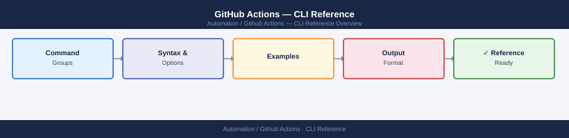

---
tags:
  - github-actions
  - operations
---
# GitHub Actions — CLI Reference



```bash
# macOS
brew install gh

# RHEL / Rocky / Fedora
dnf install gh

# Ubuntu / Debian
type -p curl >/dev/null || apt install curl -y
curl -fsSL https://cli.github.com/packages/githubcli-archive-keyring.gpg \
  | dd of=/usr/share/keyrings/githubcli-archive-keyring.gpg
echo "deb [arch=$(dpkg --print-architecture) signed-by=/usr/share/keyrings/githubcli-archive-keyring.gpg] https://cli.github.com/packages stable main" \
  | tee /etc/apt/sources.list.d/github-cli.list > /dev/null
apt update && apt install gh -y

# Verify
gh --version
gh auth login
```

```bash
# List environments
gh api repos/OWNER/REPO/environments | jq '.environments[].name'

# Create environment
gh api --method PUT repos/OWNER/REPO/environments/staging

# Create with wait timer (in minutes)
gh api --method PUT repos/OWNER/REPO/environments/production \
  --field wait_timer=5

# View environment details
gh api repos/OWNER/REPO/environments/production | jq .
```
```bash
# List runners
gh api repos/OWNER/REPO/actions/runners | jq '.runners[] | {id, name, status, labels}'
gh api orgs/ORG/actions/runners | jq '.runners[]'

# Get runner registration token
gh api --method POST repos/OWNER/REPO/actions/runners/registration-token \
  | jq -r .token

# Get runner removal token
gh api --method POST repos/OWNER/REPO/actions/runners/remove-token \
  | jq -r .token

# List runner groups (org)
gh api orgs/ORG/actions/runner-groups | jq '.runner_groups[] | {id, name, visibility}'

# Delete an offline runner
RUNNER_ID=123
gh api --method DELETE repos/OWNER/REPO/actions/runners/$RUNNER_ID
```
```bash
# List artifacts for a run
gh api repos/OWNER/REPO/actions/runs/RUN_ID/artifacts | jq '.artifacts[]'

# Download artifact
gh run download RUN_ID --name artifact-name --dir /tmp/

# Delete artifact
gh api --method DELETE repos/OWNER/REPO/actions/artifacts/ARTIFACT_ID

# List and delete expired artifacts (bulk cleanup)
gh api repos/OWNER/REPO/actions/artifacts | \
  jq -r '.artifacts[] | select(.expired == true) | .id' | \
  while read id; do
    gh api --method DELETE repos/OWNER/REPO/actions/artifacts/$id
    echo "Deleted artifact $id"
  done
```
```bash
# List caches
gh cache list
gh cache list --sort size --order desc

# Delete a specific cache
gh cache delete CACHE_KEY

# Delete all caches for a branch
gh cache delete --all --branch feature/my-branch

# View cache usage
gh api repos/OWNER/REPO/actions/cache/usage | jq .
```
```bash
# Check Actions minutes usage (org)
gh api orgs/ORG/settings/billing/actions | jq '{
  total_minutes_used,
  included_minutes,
  total_paid_minutes_used
}'

# Per-repo usage
gh api repos/OWNER/REPO/actions/cache/usage | jq .
```
```bash
# Find all failed runs in the last 7 days
gh run list --status failure --json databaseId,name,createdAt \
  | jq --arg cutoff "$(date -d '7 days ago' +%Y-%m-%dT%H:%M:%SZ)" \
    '.[] | select(.createdAt > $cutoff)'

# Trigger deploy workflow for current branch
gh workflow run deploy.yml --ref "$(git branch --show-current)"

# Watch most recent run until completion
gh run watch $(gh run list --limit 1 --json databaseId -q '.[0].databaseId')

# Bulk re-run all failed jobs across recent runs
gh run list --status failure --json databaseId -q '.[].databaseId' | \
  xargs -I{} gh run rerun {} --failed

# List workflow files that haven't run in 30 days (candidates for cleanup)
gh workflow list --json name,state,updatedAt | \
  jq --arg cutoff "$(date -d '30 days ago' +%Y-%m-%dT%H:%M:%SZ)" \
    '.[] | select(.updatedAt < $cutoff) | .name'
```
```yaml
# Workflow-level env
env:
  NODE_ENV: production
  APP_VERSION: ${{ github.sha }}

jobs:
  deploy:
    env:
      DEPLOY_TARGET: prod-cluster   # job-level override

    steps:
      - name: Set dynamic variable
        run: echo "TIMESTAMP=$(date +%s)" >> "$GITHUB_ENV"

      - name: Use it in next step
        run: echo "Built at $TIMESTAMP"

      - name: Set step output
        id: build
        run: echo "image-tag=ghcr.io/org/app:${{ github.sha }}" >> "$GITHUB_OUTPUT"

      - name: Use step output
        run: docker pull ${{ steps.build.outputs.image-tag }}
```

```d2
direction: right

center: "GitHub Actions" {shape: rectangle}
verify: "Verify" {shape: rectangle}

center -> verify
```

## Before you begin

- **Access:** Admin credentials on all affected systems
- **Timing:** safe to run during business hours unless a step is marked ⚠ (causes interruption)
- **Dependencies:** no active upgrades or migrations on the same infrastructure
- **Logging:** capture command output — paste into the change record on completion

---

---

## Verify

- Confirm the operation completed without errors in the log or management UI
- Verify the expected state change is visible (service running, object created, config applied)
- Document the outcome in the change record

---

## See also

- [GitHub Actions — Procedures](../procedures/)
- [GitHub Actions — Scripts](../scripts/)
- [GitHub Actions — Health Checks](../health-checks/)
