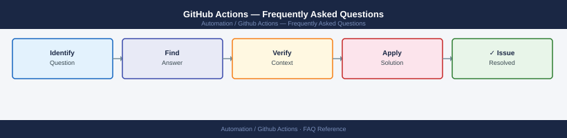

---
tags:
  - github-actions
  - faq
  - operations
---
# GitHub Actions — Frequently Asked Questions

Common questions about GitHub Actions operations, configuration, and troubleshooting. For step-by-step procedures, see the <a href="index.md">Operations</a> section.

## General

**Q: What runner version is in use and how do I check it?**
A: For GitHub-hosted runners, the version is managed by GitHub. For self-hosted runners, run `./actions-runner/config.sh --version` or check the runner's `_diag/` logs.

**Q: How do I check the current GitHub Actions version?**
A: `cat /usr/local/share/runner/version`

## Configuration

**Q: What is the default workflow trigger and when should it be changed?**
A: `on: push` is most common. Use `on: workflow_dispatch` for manual runs, `on: schedule` for cron jobs, and `on: pull_request` for CI gating. Combine triggers as needed.

**Q: How do I enable dependency caching to speed up workflows?**
A: Use the `actions/cache` action with a key based on the lockfile hash. For npm: `key: ${{ runner.os }}-node-${{ hashFiles('**/package-lock.json') }}`.

## Operations

**Q: How do I deploy to multiple environments in sequence without downtime?**
A: Use `needs:` to chain jobs sequentially. Use `environment:` with required reviewers for production gates. Use matrix strategy with `max-parallel: 1` for staged rollouts.

**Q: What is the correct procedure to add a new self-hosted runner?**
A: Go to Settings → Actions → Runners → New self-hosted runner. Follow the install steps. Add appropriate labels. Ensure the runner service starts on boot (`./svc.sh install && ./svc.sh start`).

## Troubleshooting

**Q: A workflow shows 'Resource not accessible by integration'. What does it mean?**
A: The `GITHUB_TOKEN` lacks permissions for the requested API. Add explicit `permissions:` block to the workflow (e.g., `pull-requests: write`) or grant the token broader scope in repository settings.

**Q: Workflow queuing time increased — where do I start?**
A: Check runner availability under Settings → Actions → Runners. Confirm self-hosted runners are online. Review concurrent job limits. Consider adding more runner capacity or using GitHub-hosted runners.

## Backup and Recovery

**Q: How often should I back up workflow definitions?**
A: Workflows live in `.github/workflows/` and are version-controlled with the repo. Ensure secrets are documented in a secrets manager (e.g., Vault) since they cannot be read back from GitHub.

**Q: Can I restore a deleted workflow run's logs?**
A: No — once a run is deleted or expired (default 90 days), logs are gone. Download artifacts and logs during the retention window using the GitHub API or `gh run download`.

## See Also

- [GitHub Actions Operations](index.md)
- [GitHub Actions Troubleshooting](../../troubleshooting/index.md)
