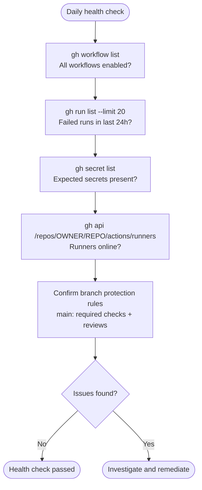

# GitHub Actions — Health Checks

> Part of the [GitHub Actions Operations](../index.md) reference.

---

## Daily Checks


┌─────────────────────────────────── GitHub Actions — Health Checks ────────────────────────────────────┐
│   ┌───────────────────────────────────────────────────────────────────────────────────────────────┐   │
│   │ Health checks for GitHub Actions: runner availability, job queue depth, workflow failure rate │   │
│   │          Monitor: Org Settings → Actions → Runners — check idle/active/offline count          │   │
│   │    Alert conditions: self-hosted runner offline >5 min, queue depth >10, failure rate >10%    │   │
│   └───────────────────────────────────────────────────────────────────────────────────────────────┘   │
│                                                                                                       │
│   ┌──────────────────────────────────────────────┐  ┌─────────────────────────────────────────────┐   │
│   │                Runner Health                 │  │               Workflow Health               │   │
│   │          gh api /orgs/{org}/runners          │  │         gh run list --status failure        │   │
│   │        Runner status: online/offline         │  │         Workflow failure rate trend         │   │
│   │      Runner version: check for updates       │  │          Queue wait time (Insights)         │   │
│   │         Runner disk and CPU on host          │  │           Billing minutes consumed          │   │
│   │         Runner labels match workflow         │  │             Secrets expiry dates            │   │
│   └──────────────────────────────────────────────┘  └─────────────────────────────────────────────┘   │
│                                                                                                       │
│   ┌───────────────────────────────────────────────────────────────────────────────────────────────┐   │
│   │  Runner labels   = tags assigned to self-hosted runners; workflows select runner via runs-on: │   │
│   │   Insights tab    = repo/org-level: workflow run history, duration trends, billing breakdown  │   │
│   │     Queue wait time = time from trigger to job start; high values = runner pool undersized    │   │
│   └───────────────────────────────────────────────────────────────────────────────────────────────┘   │
└───────────────────────────────────────────────────────────────────────────────────────────────────────┘
```

### Schema Validation

VS Code and JetBrains IDEs provide schema-based validation when the schema URL is declared.

```yaml
# Add to the top of any workflow file for IDE validation
# yaml-language-server: $schema=https://json.schemastore.org/github-workflow.json
---
name: CI
on: [push]
jobs:
  build:
    runs-on: ubuntu-24.04
    steps:
      - uses: actions/checkout@v4
```

```bash
# Validate using ajv-cli against the schema
npm install -g ajv-cli
ajv validate \
  -s https://json.schemastore.org/github-workflow.json \
  -d .github/workflows/ci.yml
```

### Required Status Checks

Configure branch protection to require workflow jobs to pass before merging.

```bash
# Enable branch protection with required checks via gh CLI
gh api --method PUT /repos/OWNER/REPO/branches/main/protection \
  --input - <<'EOF'
{
  "required_status_checks": {
    "strict": true,
    "contexts": ["build", "test (3.11)", "test (3.12)"]
  },
  "enforce_admins": true,
  "required_pull_request_reviews": {
    "required_approving_review_count": 1
  },
  "restrictions": null
}
EOF
```

### Validating Workflows in CI

Run actionlint automatically as part of the CI pipeline.

```yaml
# .github/workflows/lint-workflows.yml
name: Lint Workflows

on:
  pull_request:
    paths:
      - '.github/workflows/**'

jobs:
  actionlint:
    runs-on: ubuntu-24.04
    steps:
      - uses: actions/checkout@v4

      - name: Run actionlint
        uses: rhysd/actionlint@v1
        with:
          fail-on-error: true
```

### Common Validation Errors and Fixes

| Error | Cause | Fix |
|---|---|---|
| `unexpected key "enviroment"` | Typo in key name | Fix spelling — schema check catches this |
| `expression syntax error` | Malformed `${{ }}` expression | Validate expression brackets and quotes |
| `"on" is required` | Missing trigger | Add `on:` block |
| `job ID must match pattern` | Job name has spaces | Use hyphens: `my-job` not `my job` |
| `uses: action@` missing version | Unpinned action | Append version tag: `@v4` |
| Workflow never runs | `on.paths` filter mismatch | Test with `act` or temporarily broaden filter |

### Pinning Action Versions

```yaml
# Avoid using @main or @master — pin to a specific tag or SHA
steps:
  - uses: actions/checkout@v4           # semver tag (recommended)
  - uses: actions/setup-python@v5

  # For maximum security, pin to the commit SHA
  - uses: actions/checkout@11bd71901bbe5b1630ceea73d27597364c9af683  # v4.2.2
```

```yaml
# .github/dependabot.yml
version: 2
updates:
  - package-ecosystem: github-actions
    directory: /
    schedule:
      interval: weekly
    groups:
      actions:
        patterns: ["*"]
```
