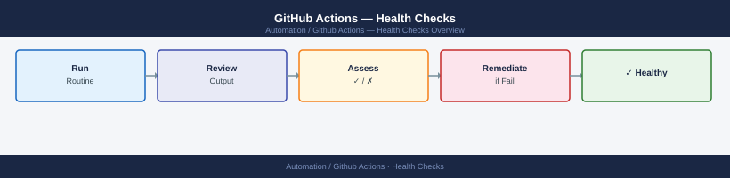

---
tags:
  - github-actions
  - operations
---
# GitHub Actions — Health Checks


<div class="kb-summary">
Health Checks reference covering Runner Health, Workflow Failures, Secrets and Credentials, Runner Resources.

*Applies to: GitHub Actions*
</div>



## Before you begin

- **Access:** Admin credentials on all affected systems
- **Timing:** safe to run during business hours unless a step is marked ⚠ (causes interruption)
- **Dependencies:** no active upgrades or migrations on the same infrastructure
- **Logging:** capture command output — paste into the change record on completion

---

## Run This Routine

```bash
# 1. Runner status
gh api /repos/<owner>/<repo>/actions/runners --jq '.runners[] | {name,status,busy}'

# 2. Failed workflows (last 24h)
gh run list --status failure --limit 20

# 3. Pending runs (stuck) — flag if any >30 min old
gh run list --status queued --limit 20

# 4. Secret expiry — review in UI
# Settings → Secrets and variables → Actions → check for expiring credentials

# 5. Runner disk space — SSH to self-hosted runner
df -h /

# 6. Workflow run minutes (billed plan)
gh api /repos/<owner>/<repo>/actions/billing/minutes
```


**List runners at the organisation level**

```bash
gh api /orgs/<org>/actions/runners --jq '.runners[] | {name,status,busy}'
```

**Check runner version (outdated runners may stop receiving jobs)**

```bash
gh api /repos/<owner>/<repo>/actions/runners --jq '.runners[] | {name,runner_version}'
```

**Remove a stale offline runner**

```bash
gh api --method DELETE /repos/<owner>/<repo>/actions/runners/<runner-id>
```

**Verify runner labels match workflow `runs-on` values**

```bash
# Compare runner labels from API output against runs-on values in workflow files
gh api /repos/<owner>/<repo>/actions/runners --jq '.runners[] | .labels[].name' | sort -u
grep -r "runs-on:" .github/workflows/ | awk '{print $NF}' | sort -u
```

**Key health indicators**

| Indicator | Healthy | Action Required |
|---|---|---|
| Runner status | `online` | Restart runner service on host |
| Runner busy | Some idle capacity | Add runners if all are perpetually busy |
| Runner version | Current | Update runner application on host |
| Runner labels | Match workflow `runs-on` | Fix labels or update workflow |
| Offline duration | <5 minutes | Investigate host availability |

---

## Workflow Failures

Workflow failures should be investigated promptly. Recurring failures in the same workflow indicate a systemic issue rather than a transient one.

**List recent failed runs**

```bash
gh run list --status failure --limit 20
```

**View details of a specific failed run**

```bash
gh run view <run-id>
```

**View logs for a failed run**

```bash
gh run view <run-id> --log-failed
```

**List failed runs for a specific workflow**

```bash
gh run list --workflow <workflow-filename.yml> --status failure --limit 20
```

**Check if a workflow is disabled**

```bash
gh workflow list
```

A workflow marked `disabled` will not trigger. Re-enable with `gh workflow enable <workflow-name>`.

**Key health indicators**

| Indicator | Healthy | Action Required |
|---|---|---|
| Failure rate | <5% over 7 days | Investigate recurring failures |
| Queued duration | <5 minutes | Check runner availability |
| Cancelled runs | Occasional (manual) | Investigate if systematic |
| Disabled workflows | None unexpected | Re-enable or document intentional disablement |

---

## Secrets and Credentials

Expired or missing secrets cause silent authentication failures during workflow runs. Secrets should be audited on a regular cadence.

**List secrets configured for a repository**

```bash
gh secret list
```

This shows secret names only — values are never returned by the API.

**List organisation-level secrets**

```bash
gh secret list --org <org>
```

**Check environment secrets**

```bash
gh secret list --env <environment-name>
```

**Identify expiring credentials (manual check)**

Navigate to **Settings → Secrets and variables → Actions** and review each secret's purpose and expected expiry date against your credential rotation schedule.

**Update a secret**

```bash
gh secret set <SECRET_NAME> --body "<new-value>"
```

**Key health indicators**

| Indicator | Healthy | Action Required |
|---|---|---|
| Required secrets present | All expected secrets listed | Add missing secrets |
| Credential expiry | >30 days remaining | Rotate and update secret value |
| Scope | Repo or environment scoped | Audit org-level secrets for over-broad access |
| Unused secrets | None | Remove orphaned secrets |

---

## Runner Resources

Self-hosted runner hosts require adequate disk, CPU, and memory. Resource exhaustion causes job failures and may leave workspace directories filling up the disk.

**Check disk space on runner host**

```bash
df -h /
```

Alert if usage exceeds 80%. Runner workspace directories at `_work/` accumulate artefacts from past runs.

**Clean up stale runner workspaces**

```bash
# List workspace directories older than 7 days
find /home/runner/_work -maxdepth 2 -type d -mtime +7

# Remove stale workspaces (run with caution — confirm no active jobs)
find /home/runner/_work -maxdepth 2 -type d -mtime +7 -exec rm -rf {} +
```

**Check runner service status**

```bash
# systemd-based runner
systemctl status actions.runner.<owner>.<repo>.<runner-name>.service
```

**Check runner process is active**

```bash
ps aux | grep Runner.Listener
```

**Key health indicators**

| Indicator | Healthy | Action Required |
|---|---|---|
| Disk usage | <80% | Clean `_work/` directories or expand disk |
| Runner service | `active (running)` | Restart service; check logs for crash reason |
| CPU during jobs | <90% sustained | Reduce job concurrency or upgrade host |
| Memory | No OOM events | Review job resource requirements |
| Network | Low latency to GitHub | Investigate if jobs are timing out on checkout |

---

## Daily Checks


```bash
# Validate using ajv-cli against the schema
npm install -g ajv-cli
ajv validate \
  -s https://json.schemastore.org/github-workflow.json \
  -d .github/workflows/ci.yml
```

### Required Status Checks

Configure branch protection to require workflow jobs to pass before merging.

```bash
# Enable branch protection with required checks via gh CLI
gh api --method PUT /repos/OWNER/REPO/branches/main/protection \
  --input - <<'EOF'
{
  "required_status_checks": {
    "strict": true,
    "contexts": ["build", "test (3.11)", "test (3.12)"]
  },
  "enforce_admins": true,
  "required_pull_request_reviews": {
    "required_approving_review_count": 1
  },
  "restrictions": null
}
EOF
```

### Validating Workflows in CI

Run actionlint automatically as part of the CI pipeline.

```yaml
# .github/workflows/lint-workflows.yml
name: Lint Workflows

on:
  pull_request:
    paths:
      - '.github/workflows/**'

jobs:
  actionlint:
    runs-on: ubuntu-24.04
    steps:
      - uses: actions/checkout@v4

      - name: Run actionlint
        uses: rhysd/actionlint@v1
        with:
          fail-on-error: true
```

### Common Validation Errors and Fixes

| Error | Cause | Fix |
|---|---|---|
| `unexpected key "enviroment"` | Typo in key name | Fix spelling — schema check catches this |
| `expression syntax error` | Malformed `${{ }}` expression | Validate expression brackets and quotes |
| `"on" is required` | Missing trigger | Add `on:` block |
| `job ID must match pattern` | Job name has spaces | Use hyphens: `my-job` not `my job` |
| `uses: action@` missing version | Unpinned action | Append version tag: `@v4` |
| Workflow never runs | `on.paths` filter mismatch | Test with `act` or temporarily broaden filter |

### Pinning Action Versions

```yaml
# Avoid using @main or @master — pin to a specific tag or SHA
steps:
  - uses: actions/checkout@v4           # semver tag (recommended)
  - uses: actions/setup-python@v5

  # For maximum security, pin to the commit SHA
  - uses: actions/checkout@11bd71901bbe5b1630ceea73d27597364c9af683  # v4.2.2
```

```yaml
# .github/dependabot.yml
version: 2
updates:
  - package-ecosystem: github-actions
    directory: /
    schedule:
      interval: weekly
    groups:
      actions:
        patterns: ["*"]
```

---

## Verify

- Confirm the operation completed without errors in the log or management UI
- Verify the expected state change is visible (service running, object created, config applied)
- Document the outcome in the change record

---

## See also

- [GitHub Actions — Procedures](../procedures/)
- [GitHub Actions — CLI Reference](../cli-reference/)
- [GitHub Actions — Common Issues](../../troubleshooting/common-issues/)
