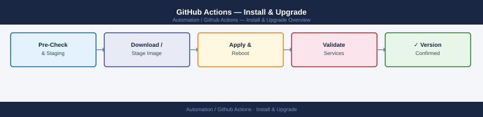

---
tags:
  - github-actions
  - operations
---
# GitHub Actions — Install & Upgrade



```bash
cd /opt/actions-runner   # or wherever the runner is installed
./config.sh --version
```

```yaml
on: workflow_dispatch
jobs:
  validate:
    runs-on: [self-hosted, <runner-label>]
    steps:
      - run: echo "Runner version check"
      - run: cat /opt/actions-runner/.runner
```

```d2
direction: right

plan: "Plan" {shape: oval}
verify: "Verify" {shape: rectangle}
validate: "Validate" {shape: oval}

plan -> verify
verify -> validate
```

## Before you begin

- **Access:** Admin credentials on all affected systems
- **Timing:** safe to run during business hours unless a step is marked ⚠ (causes interruption)
- **Dependencies:** no active upgrades or migrations on the same infrastructure
- **Logging:** capture command output — paste into the change record on completion

---

---

## Verify

- Confirm the operation completed without errors in the log or management UI
- Verify the expected state change is visible (service running, object created, config applied)
- Document the outcome in the change record

---

## See also

- [Github Actions — Deploy](../../deploy/)
