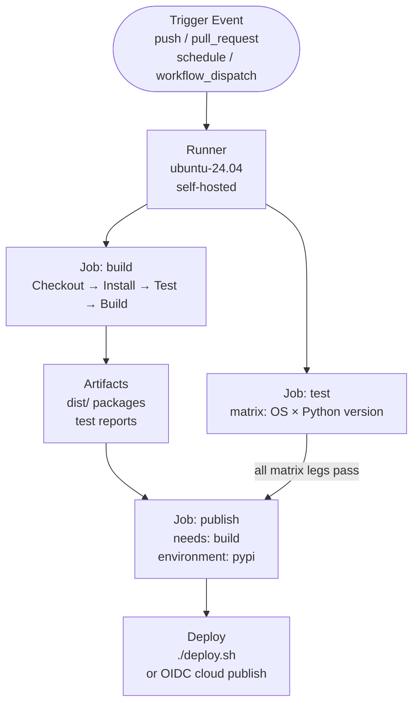
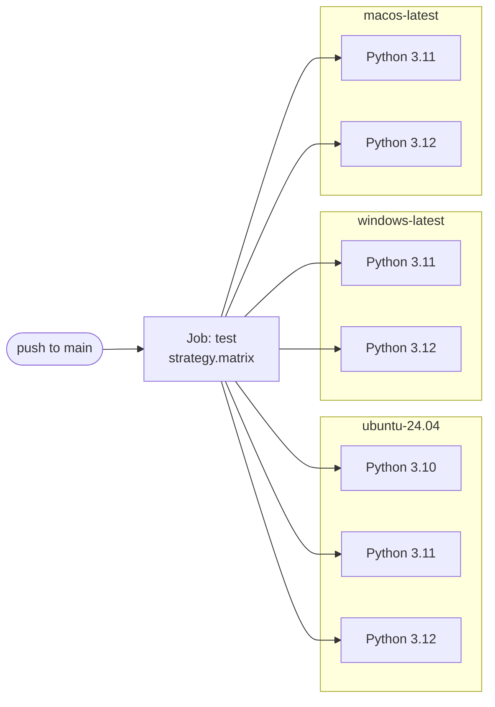

# GitHub Actions — Procedures

> Part of the [GitHub Actions Operations](../index.md) reference.

---

## Workflows


┌───────────────────────────────────── GitHub Actions — Procedures ─────────────────────────────────────┐
│   ┌───────────────────────────────────────────────────────────────────────────────────────────────┐   │
│   │ Common GitHub Actions procedures: secret rotation, runner re-registration, workflow migration │   │
│   │ Secret rotation: update secret value via gh CLI or UI; workflows pick up new value on next run│   │
│   │       Runner re-registration: remove stale runner, generate new token, re-run config.sh       │   │
│   └───────────────────────────────────────────────────────────────────────────────────────────────┘   │
│                                                                                                       │
│   ┌──────────────────────────────────────────────┐  ┌─────────────────────────────────────────────┐   │
│   │               Secret Rotation                │  │            Runner Re-registration           │   │
│   │          1. Generate new credential          │  │            1. Stop runner service           │   │
│   │        2. gh secret set NAME -b <val>        │  │               2. ./svc.sh stop              │   │
│   │             3. Test workflow run             │  │        3. ./config.sh remove --token        │   │
│   │           4. Revoke old credential           │  │        4. Get new registration token        │   │
│   │          5. Document rotation date           │  │         5. ./config.sh --url --token        │   │
│   └──────────────────────────────────────────────┘  └─────────────────────────────────────────────┘   │
│                                                                                                       │
│   ┌───────────────────────────────────────────────────────────────────────────────────────────────┐   │
│   │   Registration token = short-lived (1 hour) token from GitHub used to register a new runner   │   │
│   │      Remove token       = token used to cleanly deregister a runner from GitHub settings      │   │
│   │    Workflow migration  = copy YAML to new repo; re-inject secrets; test before retiring old   │   │
│   └───────────────────────────────────────────────────────────────────────────────────────────────┘   │
└───────────────────────────────────────────────────────────────────────────────────────────────────────┘

Reusable workflows reduce duplication by calling one workflow from another.

```yaml
# .github/workflows/reusable-deploy.yml (called workflow)
name: Reusable Deploy

on:
  workflow_call:
    inputs:
      environment:
        required: true
        type: string
    secrets:
      deploy_key:
        required: true

jobs:
  deploy:
    runs-on: ubuntu-24.04
    environment: ${{ inputs.environment }}
    steps:
      - uses: actions/checkout@v4
      - run: ./scripts/deploy.sh ${{ inputs.environment }}
        env:
          DEPLOY_KEY: ${{ secrets.deploy_key }}
```

```yaml
# .github/workflows/main.yml (calling workflow)
jobs:
  deploy-staging:
    uses: ./.github/workflows/reusable-deploy.yml
    with:
      environment: staging
    secrets:
      deploy_key: ${{ secrets.STAGING_DEPLOY_KEY }}
```

### Concurrency Control

Prevent duplicate workflow runs for the same branch or PR.

```yaml
concurrency:
  group: ${{ github.workflow }}-${{ github.ref }}
  cancel-in-progress: true   # cancel older runs when a new one starts

# Per-job concurrency
jobs:
  deploy:
    concurrency:
      group: deploy-${{ github.ref }}
      cancel-in-progress: false  # queue deploys rather than cancel
```

### workflow_dispatch and Manual Triggers

```yaml
on:
  workflow_dispatch:
    inputs:
      version:
        description: 'Version to deploy'
        required: true
        type: string
      dry_run:
        description: 'Perform a dry run'
        required: false
        type: boolean
        default: false
      environment:
        description: 'Target environment'
        type: choice
        options: [staging, production]
        default: staging

jobs:
  deploy:
    runs-on: ubuntu-24.04
    steps:
      - run: |
          echo "Deploying version ${{ inputs.version }}"
          echo "Dry run: ${{ inputs.dry_run }}"
          echo "Target: ${{ inputs.environment }}"
```

```bash
# Trigger manually via gh CLI
gh workflow run deploy.yml \
  --field version=1.2.3 \
  --field environment=staging \
  --field dry_run=false
```

### Workflow Feature Reference

| Feature | Syntax | Purpose |
|---|---|---|
| Job dependency | `needs: [build, test]` | Run after listed jobs succeed |
| Conditional | `if: github.ref == 'refs/heads/main'` | Skip job/step conditionally |
| Timeout | `timeout-minutes: 15` | Kill if job runs too long |
| Continue on error | `continue-on-error: true` | Mark step failure as warning |
| Strategy | `strategy.matrix` | Fan out across value combinations |
| Outputs | `outputs.key: ${{ steps.id.outputs.key }}` | Pass data between jobs |
| Composite action | `using: composite` | Bundle steps into a reusable action |

### Composite Actions

```yaml
# .github/actions/setup-env/action.yml
name: Setup Environment
description: Install tools and cache dependencies

inputs:
  python-version:
    description: Python version
    default: '3.12'

runs:
  using: composite
  steps:
    - uses: actions/setup-python@v5
      with:
        python-version: ${{ inputs.python-version }}
        cache: pip
    - run: pip install -r requirements.txt
      shell: bash
```

## Builds

### Workflow Triggers

Workflows are triggered by events defined under the `on:` key.

```yaml
on:
  push:
    branches: [main, develop]
    paths:
      - 'src/**'
      - 'tests/**'
  pull_request:
    branches: [main]
  schedule:
    - cron: '0 6 * * 1-5'   # weekdays at 06:00 UTC
  workflow_dispatch:          # manual trigger
    inputs:
      environment:
        description: 'Target environment'
        required: true
        default: staging
        type: choice
        options: [staging, production]
```

### Jobs and Steps

```yaml
jobs:
  build:
    name: Build application
    runs-on: ubuntu-24.04
    timeout-minutes: 30

    steps:
      - name: Checkout code
        uses: actions/checkout@v4

      - name: Set up Python
        uses: actions/setup-python@v5
        with:
          python-version: '3.12'
          cache: pip

      - name: Install dependencies
        run: pip install -r requirements.txt

      - name: Run tests
        run: pytest tests/ -v --tb=short

      - name: Build package
        run: python -m build
```

### Artifacts

Upload build outputs to persist them between jobs or download after a workflow run.

```yaml
      - name: Upload build artifacts
        uses: actions/upload-artifact@v4
        with:
          name: dist-packages
          path: dist/
          retention-days: 7
          if-no-files-found: error

  deploy:
    needs: build
    runs-on: ubuntu-24.04
    steps:
      - name: Download build artifacts
        uses: actions/download-artifact@v4
        with:
          name: dist-packages
          path: dist/
```

### Matrix Builds



Matrix strategy runs the same job across multiple combinations of parameters.

```yaml
jobs:
  test:
    strategy:
      fail-fast: false
      matrix:
        os: [ubuntu-24.04, windows-latest, macos-latest]
        python: ['3.10', '3.11', '3.12']
        exclude:
          - os: macos-latest
            python: '3.10'

    runs-on: ${{ matrix.os }}

    steps:
      - uses: actions/checkout@v4
      - uses: actions/setup-python@v5
        with:
          python-version: ${{ matrix.python }}
      - run: pip install -r requirements.txt && pytest
```

### Key Build Concepts

| Concept | Description |
|---|---|
| `needs` | Job dependency — wait for listed jobs to succeed |
| `if` | Conditional job/step execution |
| `timeout-minutes` | Kill job if it exceeds this duration |
| `continue-on-error` | Mark step failure as non-fatal |
| `env` | Environment variables for the job or step |
| `outputs` | Pass values from one job to another |

### Passing Outputs Between Jobs

```yaml
jobs:
  build:
    runs-on: ubuntu-24.04
    outputs:
      version: ${{ steps.get_version.outputs.version }}
    steps:
      - name: Get version
        id: get_version
        run: echo "version=$(cat VERSION)" >> "$GITHUB_OUTPUT"

  deploy:
    needs: build
    runs-on: ubuntu-24.04
    steps:
      - name: Use version
        run: echo "Deploying version ${{ needs.build.outputs.version }}"
```

## Publishing

### PyPI Publishing

Publish Python packages to PyPI using OIDC trusted publishing — no long-lived tokens required.

```yaml
# .github/workflows/publish-pypi.yml
name: Publish to PyPI

on:
  release:
    types: [published]

jobs:
  build:
    runs-on: ubuntu-24.04
    steps:
      - uses: actions/checkout@v4
      - uses: actions/setup-python@v5
        with:
          python-version: '3.12'
      - run: pip install build && python -m build
      - uses: actions/upload-artifact@v4
        with:
          name: dist
          path: dist/

  publish:
    needs: build
    runs-on: ubuntu-24.04
    environment: pypi
    permissions:
      id-token: write   # required for OIDC
    steps:
      - uses: actions/download-artifact@v4
        with:
          name: dist
          path: dist/
      - uses: pypa/gh-action-pypi-publish@release/v1
```

### Docker Hub Publishing

```yaml
# .github/workflows/docker-publish.yml
name: Build and Push Docker Image

on:
  push:
    tags: ['v*.*.*']

jobs:
  docker:
    runs-on: ubuntu-24.04
    steps:
      - uses: actions/checkout@v4

      - name: Set up Docker Buildx
        uses: docker/setup-buildx-action@v3

      - name: Log in to Docker Hub
        uses: docker/login-action@v3
        with:
          username: ${{ secrets.DOCKERHUB_USERNAME }}
          password: ${{ secrets.DOCKERHUB_TOKEN }}

      - name: Extract metadata
        id: meta
        uses: docker/metadata-action@v5
        with:
          images: myorg/myapp
          tags: |
            type=semver,pattern={{version}}
            type=semver,pattern={{major}}.{{minor}}

      - name: Build and push
        uses: docker/build-push-action@v5
        with:
          context: .
          push: true
          tags: ${{ steps.meta.outputs.tags }}
          cache-from: type=gha
          cache-to: type=gha,mode=max
```

### GitHub Packages (Container Registry)

```yaml
      - name: Log in to GHCR
        uses: docker/login-action@v3
        with:
          registry: ghcr.io
          username: ${{ github.actor }}
          password: ${{ secrets.GITHUB_TOKEN }}

      - name: Build and push to GHCR
        uses: docker/build-push-action@v5
        with:
          push: true
          tags: ghcr.io/${{ github.repository }}:${{ github.sha }}
```

### Release Workflows

Automate GitHub Release creation including changelog generation.

```yaml
name: Release

on:
  push:
    tags: ['v*']

jobs:
  release:
    runs-on: ubuntu-24.04
    permissions:
      contents: write
    steps:
      - uses: actions/checkout@v4
        with:
          fetch-depth: 0

      - name: Generate changelog
        id: changelog
        uses: orhun/git-cliff-action@v3
        with:
          config: cliff.toml
          args: --current --strip header

      - name: Create GitHub Release
        uses: softprops/action-gh-release@v2
        with:
          body: ${{ steps.changelog.outputs.content }}
          files: dist/*
          draft: false
          prerelease: ${{ contains(github.ref, '-rc') || contains(github.ref, '-beta') }}
```

### Publishing Target Comparison

| Target | Auth method | Trigger | Key action |
|---|---|---|---|
| PyPI | OIDC trusted publishing | Release published | `pypa/gh-action-pypi-publish` |
| Docker Hub | Username + access token secret | Tag push | `docker/build-push-action` |
| GHCR | `GITHUB_TOKEN` (built-in) | Tag push | `docker/build-push-action` |
| GitHub Release | `GITHUB_TOKEN` with `contents: write` | Tag push | `softprops/action-gh-release` |
| npm | `NODE_AUTH_TOKEN` secret | Release published | `npm publish` in run step |

## Validation

### Linting Workflow Files with actionlint

`actionlint` is a static analysis tool for GitHub Actions workflow YAML files.

```bash
# Install actionlint (macOS)
brew install actionlint

# Lint all workflows in the current repository
actionlint

# Lint a specific file
actionlint .github/workflows/ci.yml

# Output as JSON for integration with other tools
actionlint -format '{{json .}}'

# Ignore a specific rule
actionlint -ignore 'expression syntax error'

# Run inside a Docker container (no install required)
docker run --rm -v "$(pwd):/repo" --workdir /repo \
  rhysd/actionlint:latest
```

### Schema Validation

VS Code and JetBrains IDEs provide schema-based validation when the schema URL is declared.

```yaml
# Add to the top of any workflow file for IDE validation
# yaml-language-server: $schema=https://json.schemastore.org/github-workflow.json
---
name: CI
on: [push]
jobs:
  build:
    runs-on: ubuntu-24.04
    steps:
      - uses: actions/checkout@v4
```

```bash
# Validate using ajv-cli against the schema
npm install -g ajv-cli
ajv validate \
  -s https://json.schemastore.org/github-workflow.json \
  -d .github/workflows/ci.yml
```

### Required Status Checks

Configure branch protection to require workflow jobs to pass before merging.

```bash
# Enable branch protection with required checks via gh CLI
gh api --method PUT /repos/OWNER/REPO/branches/main/protection \
  --input - <<'EOF'
{
  "required_status_checks": {
    "strict": true,
    "contexts": ["build", "test (3.11)", "test (3.12)"]
  },
  "enforce_admins": true,
  "required_pull_request_reviews": {
    "required_approving_review_count": 1
  },
  "restrictions": null
}
EOF
```

### Validating Workflows in CI

Run actionlint automatically as part of the CI pipeline.

```yaml
# .github/workflows/lint-workflows.yml
name: Lint Workflows

on:
  pull_request:
    paths:
      - '.github/workflows/**'

jobs:
  actionlint:
    runs-on: ubuntu-24.04
    steps:
      - uses: actions/checkout@v4

      - name: Run actionlint
        uses: rhysd/actionlint@v1
        with:
          fail-on-error: true
```

### Common Validation Errors and Fixes

| Error | Cause | Fix |
|---|---|---|
| `unexpected key "enviroment"` | Typo in key name | Fix spelling — schema check catches this |
| `expression syntax error` | Malformed `${{ }}` expression | Validate expression brackets and quotes |
| `"on" is required` | Missing trigger | Add `on:` block |
| `job ID must match pattern` | Job name has spaces | Use hyphens: `my-job` not `my job` |
| `uses: action@` missing version | Unpinned action | Append version tag: `@v4` |
| Workflow never runs | `on.paths` filter mismatch | Test with `act` or temporarily broaden filter |

### Pinning Action Versions

```yaml
# Avoid using @main or @master — pin to a specific tag or SHA
steps:
  - uses: actions/checkout@v4           # semver tag (recommended)
  - uses: actions/setup-python@v5

  # For maximum security, pin to the commit SHA
  - uses: actions/checkout@11bd71901bbe5b1630ceea73d27597364c9af683  # v4.2.2
```

```yaml
# .github/dependabot.yml
version: 2
updates:
  - package-ecosystem: github-actions
    directory: /
    schedule:
      interval: weekly
    groups:
      actions:
        patterns: ["*"]
```
