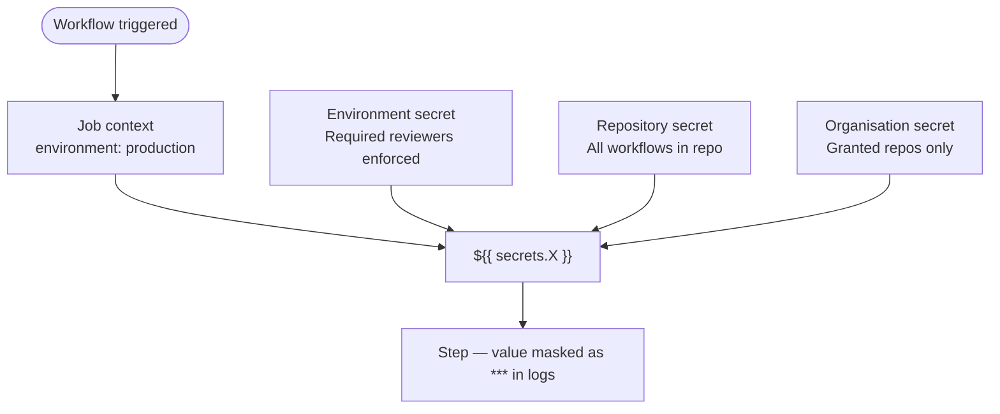

# GitHub Actions — Access Control


<div class="kb-summary">
> Part of the [GitHub Actions Security](../index.md) reference.
</div>

## Secrets Management


┌─────────────────────────────────── GitHub Actions — Access Control ───────────────────────────────────┐
│   ┌───────────────────────────────────────────────────────────────────────────────────────────────┐   │
│   │     GitHub Actions access: who can trigger workflows, approve deployments, manage secrets     │   │
│   │    Repo permissions: read (view logs), write (trigger/cancel runs), admin (manage settings)   │   │
│   │  Environment protection: required reviewers, wait timers, branch restrictions for deployments │   │
│   └───────────────────────────────────────────────────────────────────────────────────────────────┘   │
│                                                                                                       │
│   ┌──────────────────────────────────────────────┐  ┌─────────────────────────────────────────────┐   │
│   │             Workflow Permissions             │  │              Environment Gates              │   │
│   │         GITHUB_TOKEN scoped per job          │  │          Required reviewers (team)          │   │
│   │        permissions: read-all default         │  │            Wait timer: 10 min min           │   │
│   │         Fork PRs: no secrets access          │  │        Branch restriction: main only        │   │
│   │         workflow_dispatch: user auth         │  │          Deployment logs: auditable         │   │
│   └──────────────────────────────────────────────┘  └─────────────────────────────────────────────┘   │
│                                                                                                       │
│   ┌───────────────────────────────────────────────────────────────────────────────────────────────┐   │
│   │      CODEOWNERS     = file mapping code paths to review teams; auto-request review on PR      │   │
│   │     Branch protection = require PR + CI pass + review before merge; enforces pipeline gate    │   │
│   │        Deployment review = env requires named team approval; reviewer approves/rejects        │   │
│   └───────────────────────────────────────────────────────────────────────────────────────────────┘   │
└───────────────────────────────────────────────────────────────────────────────────────────────────────┘
```
```text

```yaml
permissions:
  id-token: write
  contents: read

steps:
  - uses: aws-actions/configure-aws-credentials@v4
    with:
      role-to-assume: arn:aws:iam::123456789012:role/github-actions-role
      aws-region: eu-west-1

  - uses: azure/login@v2
    with:
      client-id: ${{ secrets.AZURE_CLIENT_ID }}
      tenant-id: ${{ secrets.AZURE_TENANT_ID }}
      subscription-id: ${{ secrets.AZURE_SUBSCRIPTION_ID }}
```

## Workflow Permissions

```yaml
# Minimal permissions — default deny, grant explicitly
permissions:
  contents: read
  id-token: write    # only for OIDC jobs
  packages: write    # only for jobs pushing to GHCR

# Never use:
# permissions: write-all
```

!!! warning "Fork PRs and secrets"
    Workflows triggered by pull requests from forks do NOT have access to secrets by default. Only use `pull_request_target` (with extreme care) if secrets are needed from fork PRs. Prefer `pull_request` without secrets for untrusted code.

## Environment Protection Rules

```yaml
# Workflow — reference environment to trigger protection
jobs:
  deploy-prod:
    environment: production     # triggers protection rules + reviewer gate
    runs-on: ubuntu-24.04
    steps:
      - run: ./deploy.sh
        env:
          DB_PASSWORD: ${{ secrets.PROD_DB_PASSWORD }}
```

Configure in **Repo Settings → Environments → production**:

| Setting | Value |
|---|---|
| Required reviewers | 1–6 people who must approve |
| Wait timer | Minutes to wait before deployment starts |
| Allowed branches | `main` only (prevent deploy from feature branches) |
| Prevent self-review | Deployer cannot be their own approver |

## `GITHUB_TOKEN` Permissions

```yaml
# Restrict GITHUB_TOKEN to read-only by default (org or repo setting)
# Then grant write only where needed

permissions:
  contents: write       # only for release creation
  pull-requests: write  # only for PR comment bots
  issues: write         # only for issue management workflows
  packages: write       # only for container image publish
```

```bash
# Set default token permissions at org level
gh api --method PATCH orgs/ORG \
  -f members_can_create_repositories=false \
  --field default_workflow_permissions=read
```

## Self-Hosted Runner Security

```yaml
# Restrict which workflows can use self-hosted runners
# Settings → Actions → Runner groups → Restrict to selected repositories

# In workflow — target runner groups
runs-on:
  group: prod-runners          # named runner group
  labels: [self-hosted, linux]
```

!!! warning "Self-hosted runner risks"
    Self-hosted runners in public repositories are a high-risk attack surface. Malicious PRs can execute arbitrary code on the runner host. Restrict self-hosted runners to private repositories or trusted workflow triggers only.

```yaml
# Safe pattern — only run privileged jobs on self-hosted for protected branches
jobs:
  deploy:
    if: github.ref == 'refs/heads/main' && github.event_name == 'push'
    runs-on: [self-hosted, linux, prod]
```

### Runner Hardening

```bash
# Run runner as a dedicated non-root user
useradd -r -s /sbin/nologin -m -d /home/github-runner github-runner

# Ephemeral runners — register, run one job, deregister
./config.sh --ephemeral ...
# Prevents state accumulation between jobs

# Restrict runner network access (only allow required endpoints)
# github.com, api.github.com, objects.githubusercontent.com, *.actions.githubusercontent.com
```

## Secret Scanning

```bash
# Enable secret scanning and push protection via API
gh api --method PATCH repos/ORG/REPO \
  -f 'security_and_analysis[secret_scanning][status]=enabled' \
  -f 'security_and_analysis[secret_scanning_push_protection][status]=enabled'

# List alerts
gh api repos/ORG/REPO/secret-scanning/alerts | jq '.[] | {state, secret_type, html_url}'
```

## Audit Log

```bash
# Org audit log — all Actions-related events
gh api orgs/ORG/audit-log \
  --paginate \
  -f phrase="action:workflows" \
  -f per_page=100 \
  | jq '.[] | {action, actor, repo, created_at}'

# Filter for secret access events
gh api orgs/ORG/audit-log \
  -f phrase="action:org.actions_secret" \
  | jq '.[] | {action, actor, name: .config.secret_name}'
```

## Preventing Secret Leaks

```yaml
# Mask a dynamically generated value
- name: Generate and mask token
  id: auth
  run: |
    TOKEN=$(get-token.sh)
    echo "::add-mask::$TOKEN"
    echo "token=$TOKEN" >> "$GITHUB_OUTPUT"

# Never echo secrets directly — even masked, the pattern is bad
# run: echo ${{ secrets.MY_SECRET }}   # ← avoid

# Use intermediate env vars
- name: Use secret safely
  run: ./script.sh
  env:
    SECRET: ${{ secrets.MY_SECRET }}   # referenced as $SECRET in script
```
