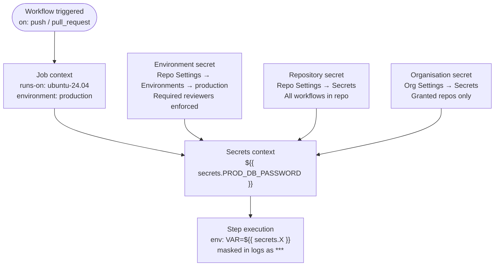
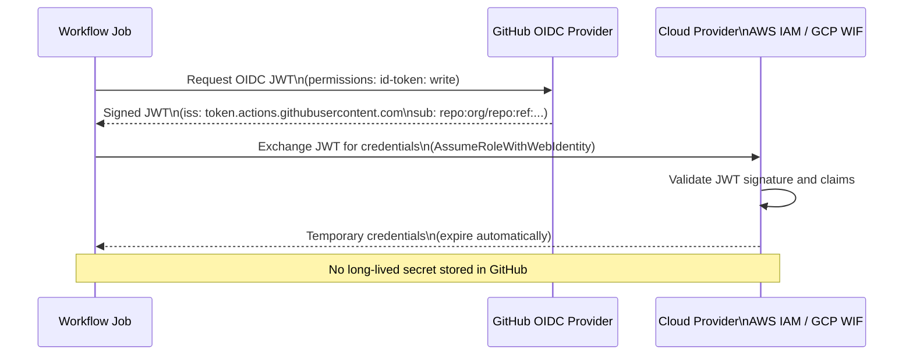

# GitHub Actions — Access Control

> Part of the [GitHub Actions Security](../) reference.

---

Content to be added.

## Secrets Management



```yaml
# Reference a secret in a workflow step
- name: Deploy to server
  run: ./deploy.sh
  env:
    SSH_KEY: ${{ secrets.DEPLOY_SSH_KEY }}
    API_TOKEN: ${{ secrets.API_TOKEN }}
    DB_URL: ${{ secrets.DATABASE_URL }}
```

Managing secrets via `gh` CLI:

```bash
# Set a repository secret
gh secret set DEPLOY_SSH_KEY < ~/.ssh/deploy_key

# Set from a value
echo "mytoken123" | gh secret set API_TOKEN

# List all secrets (names only — values are never shown)
gh secret list

# Delete a secret
gh secret delete OLD_TOKEN

# Set an organisation-level secret
gh secret set SHARED_TOKEN --org myorg
```

### OIDC — Keyless Authentication



OIDC lets workflows authenticate to cloud providers without storing long-lived credentials as secrets.

```yaml
# AWS OIDC setup
permissions:
  id-token: write
  contents: read

steps:
  - name: Configure AWS credentials via OIDC
    uses: aws-actions/configure-aws-credentials@v4
    with:
      role-to-assume: arn:aws:iam::123456789012:role/github-actions-role
      aws-region: eu-west-1

  - name: Use AWS CLI
    run: aws s3 ls s3://my-bucket
```

```yaml
# GCP OIDC setup
- name: Authenticate to GCP
  uses: google-github-actions/auth@v2
  with:
    workload_identity_provider: projects/123/locations/global/workloadIdentityPools/github/providers/github
    service_account: deploy@myproject.iam.gserviceaccount.com
```

### Environment Secrets

Environment secrets are only available to jobs that target a named environment. They support required reviewers and deployment gates.

```yaml
jobs:
  deploy:
    runs-on: ubuntu-24.04
    environment: production     # triggers protection rules

    steps:
      - name: Deploy
        run: ./deploy.sh
        env:
          PROD_DB_PASSWORD: ${{ secrets.PROD_DB_PASSWORD }}
```

### Secret Types and Scopes

| Scope | Where set | Accessible by |
|---|---|---|
| Repository secret | Repo Settings → Secrets | All workflows in that repo |
| Environment secret | Repo Settings → Environments | Jobs targeting that environment |
| Organisation secret | Org Settings → Secrets | Repos granted access |
| `GITHUB_TOKEN` | Auto-generated per run | All jobs, scoped to the run |

### Secret Scanning and Rotation

GitHub automatically scans pushed commits for common secret patterns and alerts when found.

```bash
# Enable secret scanning via CLI
gh api --method PATCH /repos/OWNER/REPO \
  -f security_and_analysis.secret_scanning.status=enabled \
  -f security_and_analysis.secret_scanning_push_protection.status=enabled

# List secret scanning alerts
gh api /repos/OWNER/REPO/secret-scanning/alerts
```

Best practices:

```yaml
# Mask a dynamically generated value in logs
- name: Get token
  id: auth
  run: |
    TOKEN=$(get-token.sh)
    echo "::add-mask::$TOKEN"
    echo "token=$TOKEN" >> "$GITHUB_OUTPUT"

# Never echo a secret directly — it will appear as ***
# but the pattern is still bad practice:
# run: echo ${{ secrets.MY_SECRET }}  # avoid this
```
